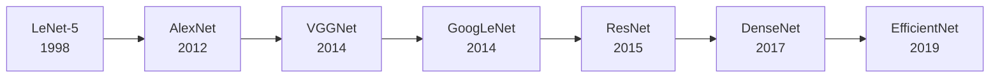

# 卷积神经网络 (CNN) 完全指南

卷积神经网络 (Convolutional Neural Network, CNN) 是深度学习在计算机视觉领域最重要的突破。本文从数学原理出发，系统介绍 CNN 的核心概念和经典架构。

---

## 一、为什么需要 CNN？

### 1.1 全连接网络的局限

对于一张 $224 \times 224 \times 3$ 的彩色图像：

$$
\text{参数数量} = 224 \times 224 \times 3 \times n_{\text{hidden}} = 150528 \times n_{\text{hidden}}
$$

假设隐藏层有 1000 个神经元，仅第一层就需要 **1.5 亿个参数**！

### 1.2 CNN 的三大设计理念

:::important[CNN 核心思想]

1. **局部连接**：每个神经元只连接输入的局部区域
2. **权值共享**：同一特征检测器在整个图像上共享
3. **空间下采样**：逐层降低分辨率，增加感受野

:::

---

## 二、卷积运算

### 2.1 离散卷积定义

二维离散卷积：

$$
(I * K)[i,j] = \sum_m \sum_n I[i-m, j-n] \cdot K[m, n]
$$

在深度学习中，实际使用的是**互相关 (Cross-correlation)**：

$$
(I \star K)[i,j] = \sum_m \sum_n I[i+m, j+n] \cdot K[m, n]
$$

### 2.2 卷积层参数

| 参数 | 符号 | 说明 |
|:-----|:-----|:-----|
| 输入尺寸 | $H_{in} \times W_{in}$ | 输入特征图大小 |
| 卷积核大小 | $k \times k$ | 常用 3×3, 5×5 |
| 步幅 | $s$ | 卷积核移动步长 |
| 填充 | $p$ | 边界零填充 |
| 输出通道 | $C_{out}$ | 卷积核数量 |

### 2.3 输出尺寸计算

$$
H_{out} = \left\lfloor \frac{H_{in} + 2p - k}{s} \right\rfloor + 1
$$

**常用配置**：

- `kernel=3, stride=1, padding=1`：输出尺寸不变
- `kernel=3, stride=2, padding=1`：输出尺寸减半

### 2.4 PyTorch 实现

```python
import torch
import torch.nn as nn

# 2D 卷积层
conv = nn.Conv2d(
    in_channels=3,      # 输入通道（RGB）
    out_channels=64,    # 输出通道（64个特征图）
    kernel_size=3,      # 3×3 卷积核
    stride=1,           # 步幅
    padding=1           # 填充
)

# 参数量计算
params = 3 * 64 * 3 * 3 + 64  # 权重 + 偏置
print(f"参数量: {params}")  # 1792
```

---

## 三、池化层

### 3.1 最大池化

$$
y_{i,j} = \max_{m,n \in \mathcal{R}_{i,j}} x_{m,n}
$$

选取局部区域的最大值，保留最显著特征。

### 3.2 平均池化

$$
y_{i,j} = \frac{1}{|\mathcal{R}_{i,j}|} \sum_{m,n \in \mathcal{R}_{i,j}} x_{m,n}
$$

### 3.3 全局平均池化 (GAP)

将整个特征图压缩为单个值：

$$
y_c = \frac{1}{H \times W} \sum_{i,j} x_{c,i,j}
$$

常用于替代全连接层，大幅减少参数。

```python
# 池化层
max_pool = nn.MaxPool2d(kernel_size=2, stride=2)
avg_pool = nn.AdaptiveAvgPool2d((1, 1))  # 全局平均池化
```

---

## 四、激活函数

### 4.1 ReLU 及其变体

| 函数 | 公式 | 优点 |
|:-----|:-----|:-----|
| **ReLU** | $\max(0, x)$ | 计算高效，缓解梯度消失 |
| **Leaky ReLU** | $\max(0.01x, x)$ | 解决死亡 ReLU |
| **ELU** | $x$ if $x>0$ else $\alpha(e^x-1)$ | 负值平滑 |
| **GELU** | $x \cdot \Phi(x)$ | Transformer 常用 |

### 4.2 PyTorch 激活函数

```python
relu = nn.ReLU(inplace=True)
leaky_relu = nn.LeakyReLU(0.1)
gelu = nn.GELU()
```

---

## 五、经典 CNN 架构

### 5.1 架构演进



### 5.2 LeNet-5 (1998)

手写数字识别的开山之作：

```python
class LeNet5(nn.Module):
    def __init__(self):
        super().__init__()
        self.conv1 = nn.Conv2d(1, 6, 5)
        self.conv2 = nn.Conv2d(6, 16, 5)
        self.fc1 = nn.Linear(16 * 4 * 4, 120)
        self.fc2 = nn.Linear(120, 84)
        self.fc3 = nn.Linear(84, 10)
    
    def forward(self, x):
        x = F.max_pool2d(F.relu(self.conv1(x)), 2)
        x = F.max_pool2d(F.relu(self.conv2(x)), 2)
        x = x.view(-1, 16 * 4 * 4)
        x = F.relu(self.fc1(x))
        x = F.relu(self.fc2(x))
        return self.fc3(x)
```

### 5.3 VGGNet (2014)

核心思想：使用 **3×3 小卷积核堆叠**

两个 3×3 卷积等效于一个 5×5：
$$
\text{感受野}: 3 + (3-1) = 5
$$

但参数更少：$2 \times 3^2 = 18 < 5^2 = 25$

### 5.4 ResNet (2015)

:::important[残差连接]
$$
\mathbf{y} = \mathcal{F}(\mathbf{x}, \{W_i\}) + \mathbf{x}
$$

让网络学习残差 $\mathcal{F}(\mathbf{x}) = \mathbf{y} - \mathbf{x}$，而非直接映射。
:::

```python
class ResidualBlock(nn.Module):
    def __init__(self, channels):
        super().__init__()
        self.conv1 = nn.Conv2d(channels, channels, 3, padding=1)
        self.bn1 = nn.BatchNorm2d(channels)
        self.conv2 = nn.Conv2d(channels, channels, 3, padding=1)
        self.bn2 = nn.BatchNorm2d(channels)
    
    def forward(self, x):
        residual = x
        out = F.relu(self.bn1(self.conv1(x)))
        out = self.bn2(self.conv2(out))
        out += residual  # 残差连接
        return F.relu(out)
```

---

## 六、现代技术

### 6.1 Batch Normalization

$$
\hat{x}_i = \frac{x_i - \mu_B}{\sqrt{\sigma_B^2 + \epsilon}}, \quad y_i = \gamma \hat{x}_i + \beta
$$

### 6.2 Dropout

训练时随机屏蔽神经元，防止过拟合。

### 6.3 数据增强

```python
from torchvision import transforms

augment = transforms.Compose([
    transforms.RandomHorizontalFlip(),
    transforms.RandomRotation(15),
    transforms.ColorJitter(0.2, 0.2, 0.2),
    transforms.RandomCrop(224, padding=4),
])
```

---

## 七、完整训练示例

```python
import torch
import torch.nn as nn
import torch.optim as optim
from torchvision import datasets, transforms
from torch.utils.data import DataLoader

# 💡 设备检测（支持 ROCm）
device = torch.device("cuda" if torch.cuda.is_available() else "cpu")

# 数据加载
transform = transforms.Compose([
    transforms.ToTensor(),
    transforms.Normalize((0.5,), (0.5,))
])

train_dataset = datasets.MNIST('./data', train=True, download=True, transform=transform)
train_loader = DataLoader(train_dataset, batch_size=64, shuffle=True)

# 模型
model = LeNet5().to(device)
criterion = nn.CrossEntropyLoss()
optimizer = optim.Adam(model.parameters(), lr=1e-3)

# 训练循环
for epoch in range(10):
    for images, labels in train_loader:
        images, labels = images.to(device), labels.to(device)
        
        optimizer.zero_grad()
        outputs = model(images)
        loss = criterion(outputs, labels)
        loss.backward()
        optimizer.step()
    
    print(f"Epoch {epoch+1}, Loss: {loss.item():.4f}")
```

---

## 总结

CNN 通过局部连接、权值共享和池化操作，高效提取图像特征：

| 组件 | 作用 |
|:-----|:-----|
| 卷积层 | 特征提取 |
| 池化层 | 降维、增大感受野 |
| BN 层 | 稳定训练 |
| 残差连接 | 解决深层网络退化 |

:::note[推荐阅读]

- [CS231n: CNN for Visual Recognition](http://cs231n.stanford.edu/)
- He et al. *Deep Residual Learning* (2016)
- Simonyan & Zisserman. *VGGNet* (2014)

:::
