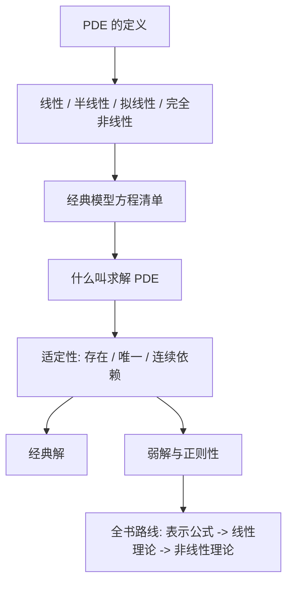

本文整理 Lawrence C. Evans, *Partial Differential Equations, Second Edition* 第 1 章 **Introduction**。这一章不是技术证明章，而是全书的入口：它给出 PDE 的抽象定义，列出一批现代 PDE 中常见的模型方程，说明“解 PDE”到底意味着什么，并解释全书三大部分的组织逻辑。

本文采用“中译 + 学习注释”的方式整理。公式、记号、小节结构和主要数学信息尽量保留；叙述部分做成适合博客阅读的译注式学习稿，而不是逐句复刻原文。

## 0. 本章导航

第 1 章可以看成 Evans 全书的地图：

阅读这一章时，应先熟悉附录 A 的记号，尤其是多重指标记号。后续所有公式都会反复使用

$$
D^\alpha u,\qquad |\alpha|,\qquad D^k u,\qquad Du,\qquad D^2u.
$$

其中 $Du$ 表示梯度，$D^2u$ 表示 Hessian，$D^k u$ 表示所有 $k$ 阶偏导组成的数组。

## 1.1 Partial Differential Equations

### 1.1.1 PDE 的基本定义

偏微分方程，简称 PDE，是含有未知多元函数及其若干偏导数的方程。若未知函数为

$$
u:U\subset \mathbb{R}^n\to\mathbb{R},
$$

其中 $U$ 是开集，那么一个 $k$ 阶 PDE 可以形式化写成

$$
F\left(D^k u(x),D^{k-1}u(x),\dots,Du(x),u(x),x\right)=0,\qquad x\in U.
$$

这里：

- $k\ge 1$ 是方程阶数；
- $x=(x_1,\dots,x_n)$ 是自变量；
- $u$ 是未知函数；
- $F$ 是给定函数或算子；
- $D^j u$ 表示 $u$ 的所有 $j$ 阶偏导。

求解 PDE 的理想目标是找出所有满足方程的 $u$。在实际问题中，通常还要配合边界条件，例如在 $\partial U$ 的某个部分 $\Gamma$ 上给出限制。

> **学习注释**
>
> PDE 不是一个单独方程就能完整表达的问题。真正的研究对象通常是“PDE + 区域 + 边界条件/初始条件 + 解的函数空间”。只写出微分方程本身，往往不足以确定唯一解。

### 1.1.2 “求解”的含义

Evans 对“求解”的理解很宽。最理想的情况是写出简单、显式的解公式；如果做不到，也要证明：

- 解是否存在；
- 解是否唯一；
- 解有哪些性质；
- 解如何依赖给定数据；
- 解是否具有额外正则性。

这为后面从“显式公式”过渡到“弱解理论”埋下伏笔。

### 1.1.3 线性、半线性、拟线性、完全非线性

对一个 $k$ 阶 PDE，分类的关键是看最高阶导数如何出现。

#### 线性方程

如果方程可写为

$$
\sum_{|\alpha|\le k}a_\alpha(x)D^\alpha u=f(x),
$$

其中 $a_\alpha$ 与 $f$ 是给定函数，那么它是线性 PDE。若 $f\equiv 0$，则称为齐次线性 PDE。

线性的核心要求是：$u$ 和它的各阶偏导都只以一次方式出现，而且系数不依赖 $u$。

#### 半线性方程

如果最高阶导数线性出现，而低阶项允许非线性，即

$$
\sum_{|\alpha|=k}a_\alpha(x)D^\alpha u
+a_0\left(D^{k-1}u,\dots,Du,u,x\right)=0,
$$

则称为半线性 PDE。

典型例子是

$$
-\Delta u=f(u),
$$

因为最高阶项 $-\Delta u$ 线性出现，非线性只落在零阶项 $f(u)$ 上。

#### 拟线性方程

如果最高阶导数仍然线性出现，但最高阶项的系数可以依赖低阶导数或 $u$，即

$$
\sum_{|\alpha|=k}
a_\alpha\left(D^{k-1}u,\dots,Du,u,x\right)D^\alpha u
+a_0\left(D^{k-1}u,\dots,Du,u,x\right)=0,
$$

则称为拟线性 PDE。

典型例子包括 $p$-Laplace 方程和极小曲面方程。它们在二阶导数上仍是线性的，但二阶项系数依赖 $Du$。

#### 完全非线性方程

如果方程对最高阶导数本身就是非线性的，则称为完全非线性 PDE。

典型例子是 Monge-Ampere 方程

$$
\det(D^2u)=f.
$$

这里最高阶导数 $D^2u$ 通过行列式非线性出现。

### 1.1.4 方程组

如果未知量是向量值函数

$$
\mathbf{u}:U\to\mathbb{R}^m,\qquad
\mathbf{u}=(u^1,\dots,u^m),
$$

那么 $k$ 阶 PDE 方程组可以写成

$$
\mathbf{F}\left(D^k\mathbf{u}(x),D^{k-1}\mathbf{u}(x),\dots,D\mathbf{u}(x),\mathbf{u}(x),x\right)=0,
\qquad x\in U.
$$

最常见的情形是 $m$ 个未知函数对应 $m$ 个标量方程，但实际模型也可能出现方程数与未知数不同的情况。

> **学习注释**
>
> 方程组通常比单个方程困难得多，因为不同分量之间会耦合。流体力学、弹性力学、电磁学中的核心模型几乎都是 PDE 方程组。

### 1.1.5 记号说明

Evans 用 “PDE” 同时指单数 partial differential equation 和复数 partial differential equations。后文中根据语境理解即可。

## 1.2 Examples

Evans 在 §1.2 给出一批重要 PDE 的名字和形式。这里的目的不是马上解释每个方程的来源，而是让读者先认识现代 PDE 中常见的模型。

本节默认：

$$
x\in U\subset\mathbb{R}^n,\qquad t\ge 0,
$$

并记

$$
Du=D_xu=(u_{x_1},\dots,u_{x_n}).
$$

变量 $t$ 总是表示时间。

> **学习注释**
>
> 这一节非常适合建立“方程名和方程形状”的索引。暂时不需要完全理解每个方程的解法，但要注意：最高阶导数在哪里、时间变量如何出现、非线性在哪里、是否是方程组。

### 1.2.1 单个 PDE

#### A. 线性方程

| 方程 | 公式 | 基本含义 |
|---|---|---|
| Laplace 方程 | $\Delta u=\sum_{i=1}^n u_{x_ix_i}=0$ | 调和函数、稳态势场、椭圆方程原型 |
| Helmholtz 方程，也称特征值方程 | $-\Delta u=\lambda u$ | 振动模态、谱问题 |
| 线性输运方程 | $u_t+\sum_{i=1}^n b_i u_{x_i}=0$ | 沿给定速度场传播 |
| Liouville 方程 | $u_t+\sum_{i=1}^n (b_i u)_{x_i}=0$ | 密度守恒、连续性方程形式 |
| 热方程，也称扩散方程 | $u_t-\Delta u=0$ | 扩散、平滑化、抛物方程原型 |
| Schrodinger 方程 | $iu_t+\Delta u=0$ | 量子力学线性模型、色散方程 |
| Kolmogorov 方程 | $u_t-\sum_{i,j=1}^n a_{ij}u_{x_ix_j}+\sum_{i=1}^n b_i u_{x_i}=0$ | 随机过程、扩散生成元 |
| Fokker-Planck 方程 | $u_t-\sum_{i,j=1}^n (a_{ij}u)_{x_ix_j}-\sum_{i=1}^n (b_i u)_{x_i}=0$ | 概率密度演化 |
| 波方程 | $u_{tt}-\Delta u=0$ | 波传播、双曲方程原型 |
| Klein-Gordon 方程 | $u_{tt}-\Delta u+m^2u=0$ | 相对论场方程的线性模型 |
| 电报方程 | $u_{tt}+2du_t-u_{xx}=0$ | 带阻尼的波传播 |
| 一般波方程 | $u_{tt}-\sum_{i,j=1}^n a_{ij}u_{x_ix_j}+\sum_{i=1}^n b_i u_{x_i}=0$ | 变系数双曲方程 |
| Airy 方程 | $u_t+u_{xxx}=0$ | 线性色散方程 |
| 梁方程 | $u_{tt}+u_{xxxx}=0$ | 弹性梁振动 |

这些方程都被称为线性，是因为未知函数 $u$ 及其导数只以一次方式出现。系数可以依赖 $x$ 或 $t$，但不能依赖 $u$。

#### B. 非线性方程

| 方程 | 公式 | 非线性位置 |
|---|---|---|
| Eikonal 方程 | $\lvert Du\rvert=1$ | 一阶导数非线性 |
| 非线性 Poisson 方程 | $-\Delta u=f(u)$ | 零阶项非线性 |
| $p$-Laplace 方程 | $\operatorname{div}(\lvert Du\rvert^{p-2}Du)=0$ | 最高阶系数依赖 $Du$ |
| 极小曲面方程 | $\operatorname{div}\left(\frac{Du}{(1+\lvert Du\rvert^2)^{1/2}}\right)=0$ | 最高阶系数依赖 $Du$ |
| Monge-Ampere 方程 | $\det(D^2u)=f$ | 二阶导数完全非线性 |
| Hamilton-Jacobi 方程 | $u_t+H(Du,x)=0$ | 一阶导数通过 Hamiltonian 非线性出现 |
| 标量守恒律 | $u_t+\operatorname{div}F(u)=0$ | 通量 $F(u)$ 非线性 |
| 无黏 Burgers 方程 | $u_t+uu_x=0$ | 速度依赖未知量本身 |
| 标量反应-扩散方程 | $u_t-\Delta u=f(u)$ | 反应项非线性 |
| 多孔介质方程 | $u_t-\Delta(u^\gamma)=0$ | 扩散项非线性 |
| 非线性波方程 | $u_{tt}-\Delta u+f(u)=0$ | 零阶恢复力非线性 |
| Korteweg-de Vries 方程 | $u_t+uu_x+u_{xxx}=0$ | 非线性输运 + 色散 |
| 非线性 Schrodinger 方程 | $iu_t+\Delta u=f(\lvert u\rvert^2)u$ | 振幅相关非线性 |

> **学习注释**
>
> 非线性 PDE 的困难不只是“公式更复杂”。真正的问题是：叠加原理失效，显式公式稀少，解可能爆破、形成间断、失去正则性，甚至需要重新定义“解”的概念。

### 1.2.2 PDE 方程组

#### A. 线性方程组

线性弹性力学的平衡方程：

$$
\mu\Delta \mathbf{u}+(\lambda+\mu)D(\operatorname{div}\mathbf{u})=0.
$$

线性弹性力学的演化方程：

$$
\mathbf{u}_{tt}-\mu\Delta \mathbf{u}-(\lambda+\mu)D(\operatorname{div}\mathbf{u})=0.
$$

Maxwell 方程组：

$$
\begin{cases}
\mathbf{E}_t=\operatorname{curl}\mathbf{B},\\
\mathbf{B}_t=-\operatorname{curl}\mathbf{E},\\
\operatorname{div}\mathbf{B}=\operatorname{div}\mathbf{E}=0.
\end{cases}
$$

#### B. 非线性方程组

守恒律方程组：

$$
\mathbf{u}_t+\operatorname{div}\mathbf{F}(\mathbf{u})=0.
$$

反应-扩散方程组：

$$
\mathbf{u}_t-\Delta\mathbf{u}=\mathbf{f}(\mathbf{u}).
$$

不可压无黏流体的 Euler 方程：

$$
\begin{cases}
\mathbf{u}_t+\mathbf{u}\cdot D\mathbf{u}=-Dp,\\
\operatorname{div}\mathbf{u}=0.
\end{cases}
$$

不可压黏性流体的 Navier-Stokes 方程：

$$
\begin{cases}
\mathbf{u}_t+\mathbf{u}\cdot D\mathbf{u}-\Delta\mathbf{u}=-Dp,\\
\operatorname{div}\mathbf{u}=0.
\end{cases}
$$

> **学习注释**
>
> Euler 和 Navier-Stokes 的未知量不仅有速度场 $\mathbf{u}$，还有压力 $p$。约束 $\operatorname{div}\mathbf{u}=0$ 表示不可压缩条件。非线性项 $\mathbf{u}\cdot D\mathbf{u}$ 是流体方程困难的核心来源之一。

### 1.2.3 按 Evans 分类的快速索引

下表不是原书正文中的表格，而是为了完成 §1.5 第 1 题并帮助复习而整理。分类按 Evans 在 §1.1 中给出的粗分类理解；某些方程在不同领域中可能有更精细的叫法。

| 方程 | 阶数 | 类型备注 |
|---|---:|---|
| Laplace | 2 | 线性齐次 |
| Helmholtz | 2 | 线性；可视为特征值问题 |
| Linear transport | 1 | 线性 |
| Liouville | 1 | 线性守恒形式 |
| Heat | 2 | 线性抛物型 |
| Schrodinger | 2 | 线性色散型 |
| Kolmogorov | 2 | 线性二阶 |
| Fokker-Planck | 2 | 线性二阶守恒形式 |
| Wave | 2 | 线性双曲型 |
| Klein-Gordon | 2 | 线性 |
| Telegraph | 2 | 线性阻尼波 |
| General wave | 2 | 线性变系数 |
| Airy | 3 | 线性色散 |
| Beam | 4 | 线性高阶 |
| Eikonal | 1 | 完全非线性一阶 |
| Nonlinear Poisson | 2 | 半线性 |
| $p$-Laplacian | 2 | 拟线性，通常退化或奇异 |
| Minimal surface | 2 | 拟线性 |
| Monge-Ampere | 2 | 完全非线性 |
| Hamilton-Jacobi | 1 | 通常完全非线性一阶 |
| Scalar conservation law | 1 | 守恒形式；非守恒写法常为拟线性 |
| Inviscid Burgers | 1 | 拟线性 |
| Scalar reaction-diffusion | 2 | 半线性 |
| Porous medium | 2 | 拟线性或非线性退化扩散 |
| Nonlinear wave | 2 | 半线性，若非线性只在 $f(u)$ |
| KdV | 3 | 半线性高阶色散 |
| Nonlinear Schrodinger | 2 | 半线性 |
| Linear elasticity equilibrium | 2 | 线性方程组 |
| Linear elasticity evolution | 2 | 线性方程组 |
| Maxwell | 1 | 线性一阶方程组 |
| System of conservation laws | 1 | 非线性方程组，常为拟线性 |
| Reaction-diffusion system | 2 | 半线性方程组 |
| Euler | 1 | 非线性拟线性方程组，带约束 |
| Navier-Stokes | 2 | 最高阶黏性项线性，但含非线性输运项 |

## 1.3 Strategies for Studying PDE

§1.3 是本章最重要的观念部分。Evans 在这里提醒：研究 PDE 的目标当然是找到解，但“什么叫解”本身并不总是显然的。不同方程的结构不同，适合的解概念也可能不同。

### 1.3.1 适定问题与经典解

Hadamard 意义下，一个 PDE 问题称为适定，通常需要满足三点：

1. 存在性：问题确实有解；
2. 唯一性：解是唯一的；
3. 连续依赖性：解连续依赖给定数据。

第三点在物理应用中特别重要。如果初始条件、边界条件或外力项发生微小扰动，解也应只发生微小变化。否则即使形式上存在唯一解，也很难认为模型在物理或数值上稳定。

当然，有些问题本来就不应期待唯一性。此时数学任务就会转向分类所有解、描述解集结构或寻找额外选择原则。

#### 经典解

对一个 $k$ 阶 PDE，最直接的解概念是要求 $u$ 至少具有连续的 $k$ 阶偏导数。这样方程中出现的所有偏导都有通常意义。

这类解称为经典解。

更形式化地说，如果一个 $k$ 阶 PDE 的解满足

$$
u\in C^k
$$

并且逐点满足方程，那么它就是经典意义下的解。

> **学习注释**
>
> 经典解是最直观的解，但不是最普遍、也不是最稳定的解概念。现代 PDE 的一个核心转向就是：先在弱意义下建立解，再研究这个弱解是否自动更光滑。

### 1.3.2 弱解与正则性

不是所有重要 PDE 都有经典解。Evans 用标量守恒律作为例子：

$$
u_t+F(u)_x=0.
$$

这类方程会出现在一维流体动力学中，并能描述激波的形成与传播。激波本质上是解的不连续曲线。因此如果坚持解必须连续可微，就会排除物理上真正需要研究的对象。

这说明：某些 PDE 的结构本身迫使我们放弃光滑经典解，转而引入广义解或弱解。

弱解的基本思想是：

- 不要求所有导数都按经典意义存在；
- 通过积分恒等式、测试函数、分布意义或变分形式来解释方程；
- 在更大的函数类中证明存在性、唯一性和连续依赖性；
- 再进一步研究弱解是否具有正则性。

#### 存在性与正则性分开处理

Evans 强调一个非常重要的策略：不要一开始就要求解非常光滑。

如果从一开始就要求 $u\in C^k$，那么证明存在性时必须同时证明构造出来的函数足够光滑，这通常很困难。更合理的做法是：

1. 先定义一个较宽的弱解概念；
2. 在弱解空间中证明存在性、唯一性和连续依赖性；
3. 如果方程结构允许，再证明弱解实际上更光滑。

这就是现代 PDE 中常见的路线：

#### 正则性问题

正则性问题问的是：一个弱解是否自动更光滑？

很多线性方程或结构良好的非线性方程中，弱解可以通过估计提升正则性。例如椭圆方程中，右端项更好、边界更好、系数更好，解往往也更好。但在守恒律、自由边界、退化方程或完全非线性方程中，正则性可能失败，甚至不应期待。

> **学习注释**
>
> 后续章节中，存在性往往依赖能量估计、紧性、泛函分析或变分法；正则性则更依赖精细的微积分估计。这也是为什么 Evans 说 PDE 不能被简单看成泛函分析的一个分支。

### 1.3.3 典型困难

Evans 给出若干经验性原则。它们不是定理，也有重要例外，但很适合建立初步判断：

1. 非线性方程通常比线性方程困难；
2. 非线性越影响高阶导数，方程通常越难；
3. 高阶 PDE 通常比低阶 PDE 困难；
4. 方程组通常比单个方程困难；
5. 自变量越多，问题通常越困难；
6. 大多数 PDE 不能写出显式解公式。

这些原则背后的原因是：非线性会破坏叠加原理，高阶方程需要更多边界条件和估计，方程组存在耦合，多维问题则会带来几何、紧性和奇性结构上的复杂性。

## 1.4 Overview

§1.4 是全书结构说明。Evans 将本书分为三大部分，这三部分大致反映 PDE 理论发展的历史路线。

### 1.4.1 Part I: Representation Formulas for Solutions

第一部分标题是 **Representation Formulas for Solutions**，可译为“解的表示公式”。

这一部分研究一些在特定条件下能够写出显式或半显式表示公式的 PDE。整体路线从线性方程的直接公式，逐渐走向非线性方程中较不具体的表示方式。

#### Chapter 2: Four Important Linear Partial Differential Equations

第 2 章研究四个基本线性方程：

$$
\text{transport equation},\qquad
\text{Laplace equation},\qquad
\text{heat equation},\qquad
\text{wave equation}.
$$

它们分别对应输运、稳态势场、扩散和波传播，是后续复杂方程的原型。若区域边界不造成额外困难，这些方程常有可直接计算的解公式。

第 2 章也会出现一些简单但重要的能量方法，为第 6、7 章以及之后的理论做铺垫。

#### Chapter 3: Nonlinear First-Order PDE

第 3 章继续寻找公式，但对象变成一般的一阶非线性 PDE。

核心思想是特征线方法：在局部情形下，一阶非线性 PDE 可以转化为常微分方程组，也就是特征方程。若能求解这个 ODE 系统，就可以在某种意义下求解原 PDE。

本章还会提前引入：

- Hamilton-Jacobi 方程的 Hopf-Lax 公式；
- 标量守恒律的 Lax-Oleinik 公式。

这为第 10 章和第 11 章的现代非线性理论做准备。

#### Chapter 4: Other Ways to Represent Solutions

第 4 章像一个方法工具箱，收录多种显式或半显式求解技术：

- 分离变量；
- 相似解；
- 变换方法；
- 将某些非线性 PDE 转化为线性 PDE；
- 渐近方法；
- 幂级数方法。

其中 Fourier 变换部分非常重要。章末出现 Cauchy-Kovalevskaya 定理，这是 PDE 中一个非常一般的存在性定理，但因为它依赖解析性和幂级数方法，在现代 PDE 实践中并不是最常用的主线。

### 1.4.2 Part II: Theory for Linear Partial Differential Equations

第二部分标题是 **Theory for Linear Partial Differential Equations**，可译为“线性偏微分方程理论”。

这一部分开始放弃普遍的显式公式，转而使用泛函分析和能量估计来证明线性 PDE 弱解的存在性、唯一性、正则性和其他性质。

#### Chapter 5: Sobolev Spaces

第 5 章介绍 Sobolev 空间。Sobolev 空间是能量方法处理线性和非线性 PDE 的基本场所。

这一章较难，而且价值往往要到后面才显现。读者需要一些 Lebesgue 测度论基础，但附录 E 的回顾基本够用。

Evans 特别指出，不必只关注指数 $p=2$ 的 Sobolev 空间。若只看 Hilbert 空间情形，会遮蔽两个中心不等式：

- Gagliardo-Nirenberg-Sobolev 不等式；
- Morrey 不等式。

#### Chapter 6: Second-Order Elliptic Equations

第 6 章把对 Laplace 方程的理解推广到一般二阶椭圆方程。

核心内容包括：

- 弱解存在性；
- 唯一性；
- 正则性；
- 极大值原理；
- 特征值与特征函数；
- 非自伴算子的主特征值。

这一章是线性椭圆 PDE 理论的主干。

#### Chapter 7: Linear Evolution Equations

第 7 章把能量方法扩展到随时间演化的线性 PDE：

- 二阶抛物方程，推广热方程；
- 二阶双曲方程，推广波方程；
- 一阶双曲方程组；
- 半群理论。

其中一阶双曲方程组为第 11 章非线性守恒律方程组做铺垫。半群理论则提供另一种用泛函分析构造解的方法。

#### Part II 中有意省略的内容

Evans 说明，第二部分没有系统讨论分布理论和势理论。它们当然重要，但对本书的主线而言可以暂时省略，这样可以为更多非线性理论腾出空间。

> **学习注释**
>
> 这也说明 Evans 的教材不是“PDE 百科全书”。它有明确取舍：用必要的分析工具支撑现代 PDE 主线，尤其是弱解、能量估计和非线性理论。

### 1.4.3 Part III: Theory for Nonlinear Partial Differential Equations

第三部分标题是 **Theory for Nonlinear Partial Differential Equations**，可译为“非线性偏微分方程理论”。

这一部分与第二部分类似，都是建立理论而不是追求显式公式。但非线性 PDE 没有统一方法，不同非线性结构要用不同工具处理。

#### Chapter 8: The Calculus of Variations

第 8 章从变分法开始研究非线性 PDE。

核心内容包括：

- 直接法；
- 极小子的存在性；
- 变分系统；
- 约束问题；
- minimax 方法；
- Noether 定理相关内容。

变分法是非线性 PDE 中最有用、最容易进入的一类方法，因此这一章非常关键。

#### Chapter 9: Nonvariational Techniques

第 9 章收集非变分技巧，主要用于非线性椭圆和抛物 PDE。

包括：

- 单调性方法；
- 不动点方法；
- 上下解方法；
- 极大值原理相关技巧；
- 非线性半群理论的一些内容。

#### Chapter 10: Hamilton-Jacobi Equations

第 10 章介绍 Hamilton-Jacobi 方程的现代理论，尤其是黏性解。

它还会讨论与 ODE 最优控制和动态规划的联系。

#### Chapter 11: Systems of Conservation Laws

第 11 章回到第 3 章中的守恒律，但对象变成守恒律方程组。

与第 5 到第 9 章依赖 Sobolev 空间的理论不同，守恒律方程组需要大量线性代数和微积分的直接计算。重点包括：

- Riemann 问题；
- 熵条件；
- 方程组解的选择原则。

#### Chapter 12: Nonlinear Wave Equations

第 12 章是第二版新增内容，介绍非线性波方程。

它包括：

- 某些拟线性波方程的长时间和短时间存在性；
- 半线性波方程；
- 三维空间中的次临界和临界幂非线性；
- 解不存在性的判据。

### 1.4.4 附录与参考书目

附录 A 到 E 提供若干背景材料：

- 记号；
- 不等式；
- 微积分；
- 泛函分析；
- 测度论。

参考书目则列出大量 PDE 教材和专著。Evans 说明本书是教材，不是参考专著，因此不会追踪每个思想和方法的原始来源；但书目可以作为继续查找原始文献的起点。

## 1.5 Problems

本节是第 1 章习题的中文整理，并附学习提示。原章共有 5 道题，重点是方程分类和多重指标记号。

### Problem 1

对 §1.2 中每个 PDE 进行分类：

1. 判断它是线性、半线性、拟线性还是完全非线性；
2. 判断它的阶数。

> **学习提示**
>
> 判断阶数时看最高阶偏导。判断线性类型时看最高阶偏导如何出现：
>
> - 最高阶项系数只依赖自变量，且低阶项也线性：线性；
> - 最高阶项线性，非线性只在低阶项：半线性；
> - 最高阶项线性，但系数依赖 $u$ 或低阶导数：拟线性；
> - 最高阶导数本身非线性出现：完全非线性。
>
> 上文 §1.2.3 的表格可作为参考答案索引。

### Problem 2

令 $k$ 为正整数。证明：定义在 $\mathbb{R}^n$ 上的光滑函数一般有

$$
\binom{n+k-1}{k}=\binom{n+k-1}{n-1}
$$

个不同的 $k$ 阶偏导数。

提示思想是：把 $k$ 个相同的求导符号分配给 $n$ 个变量，相当于在 $k$ 个圆点中插入 $n-1$ 个分隔符。

> **学习提示**
>
> 一个 $k$ 阶偏导对应一个多重指标
>
> $$
> \alpha=(\alpha_1,\dots,\alpha_n),\qquad |\alpha|=\alpha_1+\cdots+\alpha_n=k.
> $$
>
> 因此问题等价于数非负整数解
>
> $$
> \alpha_1+\cdots+\alpha_n=k
> $$
>
> 的个数。这就是经典的 stars and bars 计数。

### Problem 3

证明多项式定理：

$$
(x_1+\cdots+x_n)^k
=\sum_{|\alpha|=k}\binom{|\alpha|}{\alpha}x^\alpha,
$$

其中

$$
\binom{|\alpha|}{\alpha}:=\frac{|\alpha|!}{\alpha!},\qquad
\alpha!:=\alpha_1!\alpha_2!\cdots\alpha_n!,
$$

并且

$$
x^\alpha=x_1^{\alpha_1}\cdots x_n^{\alpha_n}.
$$

求和范围是所有满足 $|\alpha|=k$ 的多重指标。

> **学习提示**
>
> 展开 $(x_1+\cdots+x_n)^k$ 时，每一项来自 $k$ 次选择。若 $x_i$ 被选中 $\alpha_i$ 次，则得到 $x^\alpha$。对应排列数为
>
> $$
> \frac{k!}{\alpha_1!\cdots\alpha_n!}.
> $$

### Problem 4

证明 Leibniz 公式：

$$
D^\alpha(uv)
=\sum_{\beta\le \alpha}\binom{\alpha}{\beta}
D^\beta u\,D^{\alpha-\beta}v,
$$

其中 $u,v:\mathbb{R}^n\to\mathbb{R}$ 光滑，

$$
\binom{\alpha}{\beta}
:=\frac{\alpha!}{\beta!(\alpha-\beta)!},
$$

而 $\beta\le\alpha$ 表示

$$
\beta_i\le \alpha_i,\qquad i=1,\dots,n.
$$

> **学习提示**
>
> 这是多重指标形式的乘积求导公式。可以对 $|\alpha|$ 归纳，也可以把一维 Leibniz 公式逐个变量套用。它的组合系数表示：在 $\alpha_i$ 次对变量 $x_i$ 的求导中，有 $\beta_i$ 次落在 $u$ 上，其余落在 $v$ 上。

### Problem 5

设 $f:\mathbb{R}^n\to\mathbb{R}$ 光滑。证明对每个 $k=1,2,\dots$，

$$
f(x)=\sum_{|\alpha|\le k}\frac{1}{\alpha!}D^\alpha f(0)x^\alpha
+O(|x|^{k+1}),\qquad x\to 0.
$$

这就是多重指标记号下的 Taylor 公式。

提示：固定 $x\in\mathbb{R}^n$，考虑一元函数

$$
g(t):=f(tx).
$$

> **学习提示**
>
> 对 $g(t)$ 在 $t=0$ 使用一元 Taylor 公式，然后用链式法则计算 $g^{(j)}(0)$。多项式定理会把 $j$ 阶项整理成
>
> $$
> \sum_{|\alpha|=j}\frac{1}{\alpha!}D^\alpha f(0)x^\alpha.
> $$

## 1.6 References

Evans 在第 1 章最后给出若干参考文献建议。Klainerman 的文章被推荐为偏微分方程领域的现代概览。

一般 PDE 教材和专著包括 Arnold、Courant-Hilbert、Craig、DiBenedetto、Folland、Friedman、Garabedian、John、Jost、Levy-Shearer、McOwen、Mikhailov、Olver、Petrovsky、Rauch、Renardy-Rogers、Showalter、Smirnov、Smoller、Strauss、Taylor、Thoe-Zachmanoglou、Vasy、Zauderer 等作者或书目。

Evans 特别提到 Arnold 和 Bernstein 书中的前言值得阅读；Zwillinger 的微分方程手册则适合作为 PDE 方法索引。

> **学习注释**
>
> 这一节的阅读重点不是马上查完所有书，而是理解 Evans 的定位：本书是现代 PDE 入门教材，不是百科式参考书。若要补充显式解和方法手册，可以看 Zwillinger；若要补充经典理论，可以看 Courant-Hilbert、John、Strauss；若要深入现代分析路线，可以继续读 Taylor、Folland、Renardy-Rogers 等。

## 2. 本章核心概念回收

为了后续阅读，建议把第 1 章压缩成下面几个关键词：

| 关键词 | 应掌握的问题 |
|---|---|
| PDE | 未知函数、偏导数、自变量区域、边界/初始条件 |
| 阶数 | 方程中出现的最高阶偏导 |
| 线性 | 叠加原理成立，系数不依赖未知量 |
| 半线性 | 最高阶导数线性，低阶项可非线性 |
| 拟线性 | 最高阶导数线性，但系数依赖低阶导数或未知量 |
| 完全非线性 | 最高阶导数非线性出现 |
| 适定性 | 存在、唯一、连续依赖 |
| 经典解 | 至少具有方程阶数所需的连续偏导 |
| 弱解 | 在较弱函数空间或积分意义下满足方程 |
| 正则性 | 弱解是否自动更光滑 |
| 能量方法 | 后续线性和非线性理论的重要工具 |

## 3. 读完本章后应该形成的判断

读完第 1 章，不需要已经会解这些方程，但应该形成以下判断：

1. PDE 的难度不只来自计算，而来自“解的概念”和“函数空间”的选择。
2. 显式公式很重要，但它们只覆盖少数结构良好的方程。
3. 现代 PDE 的主线是先建立弱解，再研究唯一性、稳定性和正则性。
4. 非线性 PDE 不能指望统一理论，不同结构需要不同工具。
5. Evans 全书不是从简单公式一路平滑推进，而是在早期就引入现代 PDE 的核心困难。

如果后续继续整理，本章之后最自然的下一步是第 2 章：四类基本线性 PDE。它们分别提供输运、椭圆、抛物和双曲四种原型，是理解后面章节的最低必要直觉。
