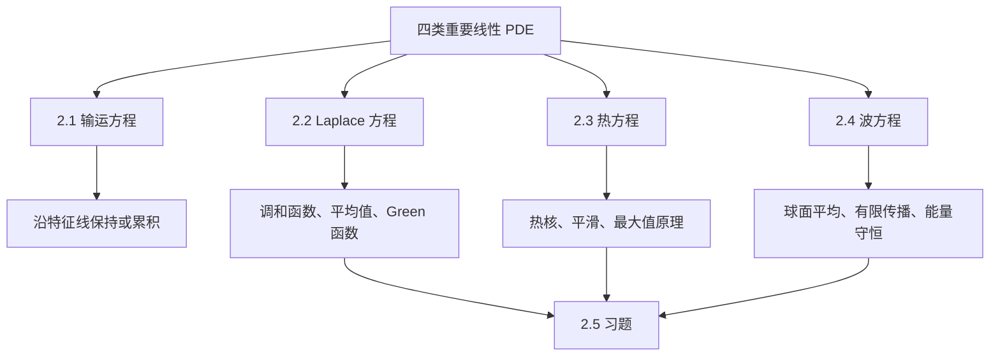

本文整理 Lawrence C. Evans, *Partial Differential Equations, Second Edition* 第 2 章 **Four Important Linear Partial Differential Equations**。这一章是全书第 I 部分的核心入口：Evans 先不急着发展抽象弱解理论，而是选取四类最重要的线性 PDE，展示“显式公式、最大值原理、能量方法、有限传播、正则化”等基本机制。

本文采用“中译 + 数学符号保留 + 学习注释”的方式整理。公式、定理结构、主要证明想法和习题信息尽量保留；叙述部分改写为适合博客阅读的译注式学习稿，不做逐句复刻。

## 0. 本章地图

第 2 章围绕四个模型方程展开：

从学习路线看，本章有两条主线：

1. **表示公式**：能写出显式解时，先写出解，并从公式读出性质。
2. **定性方法**：当显式公式不够用时，用最大值原理、能量法、Green 函数和积分恒等式控制解。

四类方程的行为差别很大：

| 方程 | 典型形式 | 主要机制 | 典型结论 |
| --- | --- | --- | --- |
| 输运方程 | $u_t+b\cdot Du=f$ | 沿直线特征传播 | 数据被搬运，非齐次项沿特征累积 |
| Laplace 方程 | $\Delta u=0$ 或 $-\Delta u=f$ | 平衡态、平均值性质 | 最大值原理、解析性、Green 表示 |
| 热方程 | $u_t-\Delta u=f$ | 扩散与平滑 | 无限传播、瞬时光滑、抛物型最大值原理 |
| 波方程 | $u_{tt}-\Delta u=f$ | 振动与有限传播 | 光锥、Huygens 原理、能量守恒 |

> **学习注释**
>
> 这一章最重要的不是背公式，而是辨认机制：Laplace 方程和热方程都有最大值原理，但热方程带有时间方向；热方程和波方程都有时间变量，但热方程会平滑，波方程通常不会；输运方程和波方程都体现传播，但输运沿特征线，波方程沿光锥。

### 0.1 记号与阅读约定

本章频繁使用以下记号：

| 记号 | 含义 |
| --- | --- |
| $B(x,r)$ | 以 $x$ 为中心、半径为 $r$ 的开球 |
| $\partial B(x,r)$ | 对应球面，$dS$ 表示球面测度 |
| $\alpha(n)$ | $\mathbb{R}^n$ 中单位球体积，因此 $\lvert\partial B(0,1)\rvert=n\alpha(n)$ |
| $\dfrac{1}{\lvert E\rvert}\int_E v$ | 集合 $E$ 上的平均积分 |
| $D u$、$D^2u$ | 对空间变量 $x$ 的梯度和 Hessian，除非特别说明 |
| $V\Subset U$ | $\overline V$ 是 $U$ 中的紧子集，即 $V$ 紧嵌入 $U$ |
| $C_1^2$ | 空间二阶、时间一阶连续可微的抛物型正则性 |

阅读时要区分三层结论：第一层是显式公式本身；第二层是公式推出的唯一性、最大值原理、正则性、传播速度等定性性质；第三层是证明这些性质的方法。Evans 这一章的真正目的，是让读者在进入 Sobolev 空间和弱解理论之前，先看清楚四类原型方程各自的数学机制。

## 2.1 Transport Equation

输运方程描述某个量沿给定速度场移动。第 2.1 节考虑最简单的常速度情形：

$$
u_t+b\cdot Du=0,
$$

其中 $b\in \mathbb{R}^n$ 是固定向量，$u=u(x,t)$，$x\in\mathbb{R}^n$，$t\ge 0$。

直观上，$u$ 的图像沿方向 $b$ 平移。若站在随速度 $b$ 运动的观察者视角中，$u$ 沿轨迹保持不变。

严格说，下面的经典公式需要 $g,f$ 至少有足够的连续可微性，才能逐点验证 PDE。若只要求弱意义或分布意义的解，公式仍是正确的起点，但证明要改写成积分恒等式。

### 2.1.1 Initial-value problem

初值问题为

$$
\begin{cases}
u_t+b\cdot Du=0 & \text{in }\mathbb{R}^n\times (0,\infty),\\
u=g & \text{on }\mathbb{R}^n\times\{t=0\}.
\end{cases}
$$

关键想法是考察穿过点 $(x,t)$ 的特征线。令

$$
z(s)=x+(s-t)b,\qquad 0\le s\le t.
$$

则 $z(t)=x$，$z(0)=x-tb$。沿这条线看函数

$$
v(s)=u(z(s),s).
$$

由链式法则，

$$
\dot v(s)
=Du(z(s),s)\cdot \dot z(s)+u_t(z(s),s)
=b\cdot Du(z(s),s)+u_t(z(s),s)=0.
$$

所以 $v$ 是常数，由初值可得

$$
u(x,t)=g(x-tb).
$$

这就是齐次输运方程的解公式。

> **学习注释**
>
> 输运方程是学习“特征线方法”的最干净例子。PDE 中的方向导数
> $u_t+b\cdot Du$ 正好等于沿空间-时间曲线 $(z(s),s)$ 的全导数。于是 PDE 被化成 ODE：$\dot v(s)=0$。

### 2.1.2 Nonhomogeneous problem

非齐次问题为

$$
\begin{cases}
u_t+b\cdot Du=f & \text{in }\mathbb{R}^n\times (0,\infty),\\
u=g & \text{on }\mathbb{R}^n\times\{t=0\}.
\end{cases}
$$

仍沿同一条特征线计算：

$$
\dot v(s)=f(z(s),s).
$$

积分得到

$$
u(x,t)=g(x-tb)+\int_0^t f(x+(s-t)b,s)\,ds.
$$

其中第一项是初值沿特征搬运，第二项是源项 $f$ 沿特征的累积贡献。

若方程带有零阶项，例如更一般的

$$
u_t+b\cdot Du+cu=f,
$$

沿特征得到的是一阶线性 ODE：

$$
\dot v(s)+c(z(s),s)v(s)=f(z(s),s).
$$

于是解会带上积分因子：

$$
\begin{aligned}
u(x,t)
&=\exp\left(-\int_0^t c(z(\tau),\tau)\,d\tau\right)g(x-tb)\\
&\quad+\int_0^t
\exp\left(-\int_s^t c(z(\tau),\tau)\,d\tau\right)
f(z(s),s)\,ds .
\end{aligned}
$$

这说明零阶项不会改变特征线本身，但会改变沿特征线传输的权重。这一点在后续一阶 PDE 和 Hamilton-Jacobi 方程中会反复出现。

> **本节要点**
>
> 输运方程的核心是“沿特征线降维”。齐次项给出保持不变，非齐次项给出积分累积，零阶项给出指数权重。

## 2.2 Laplace's Equation

Laplace 方程是

$$
\Delta u=0,
$$

其中

$$
\Delta u=\sum_{i=1}^n u_{x_i x_i}.
$$

满足 $\Delta u=0$ 的函数称为 **调和函数**。Poisson 方程则写成

$$
-\Delta u=f.
$$

Laplace 方程描述没有源项时的平衡态；Poisson 方程描述有源项时的静态响应。本节围绕五个主题展开：基本解、平均值公式、调和函数性质、Green 函数、能量方法。

### 2.2.1 Fundamental solution

为了构造 $-\Delta u=f$ 的解，Evans 先寻找 Laplace 算子的基本解。基本解是满足

$$
-\Delta \Phi=\delta_0
$$

的函数，其中 $\delta_0$ 是集中在原点的 Dirac 质量。对 $x\ne 0$，它应满足

$$
\Delta \Phi(x)=0.
$$

在 $\mathbb{R}^n$ 中，Laplace 方程的径向基本解为

$$
\Phi(x)=
\begin{cases}
-\dfrac{1}{2\pi}\log |x|, & n=2,\\[6pt]
\dfrac{1}{n(n-2)\alpha(n)}\dfrac{1}{|x|^{n-2}}, & n\ge 3,
\end{cases}
$$

其中 $\alpha(n)$ 表示 $\mathbb{R}^n$ 中单位球的体积。

这个常数不是任意归一化。由于 $|\partial B(0,r)|=n\alpha(n)r^{n-1}$，对 $n\ge 3$ 的径向函数计算通量时，正好得到

$$
-\int_{\partial B(0,r)}\frac{\partial \Phi}{\partial \nu}\,dS=1,
$$

这对应 $-\Delta\Phi$ 在原点集中了一个单位质量。

基本解有奇性。对 $x\ne 0$，可记住如下估计：

$$
|D\Phi(x)|\le \frac{C}{|x|^{n-1}},
\qquad
|D^2\Phi(x)|\le \frac{C}{|x|^n}.
$$

若 $f\in C_c^2(\mathbb{R}^n)$，定义 Newton potential：

$$
u(x)=\int_{\mathbb{R}^n}\Phi(x-y)f(y)\,dy.
$$

则

$$
-\Delta u=f\quad \text{in }\mathbb{R}^n.
$$

这里最值得注意的是：不能天真地把 $\Delta$ 直接移入积分并只计算 $x\ne y$ 的部分，因为 $\Phi$ 在 $x=y$ 有奇性。正确证明需要把奇点附近挖掉，再用积分估计控制边界项。

这里的 $C_c^2$ 假设也不是装饰：紧支撑保证无穷远处没有额外边界项，二阶连续可微性保证奇点附近的 Taylor 展开和误差估计可以闭合。后续弱解理论会把这些光滑假设降低。

> **学习注释**
>
> 基本解的意义是把微分方程转成卷积公式：
>
> $$
> u=\Phi*f.
> $$
>
> 这和常微分方程中用 Green 函数或冲激响应求解线性系统的思想一致。之后遇到热方程和波方程时，也会看到对应的基本解或传播核。

### 2.2.2 Mean-value formulas

调和函数最重要的性质之一是平均值公式。若 $u$ 在开集 $U$ 中调和，且闭球

$$
\overline{B(x,r)}\subset U,
$$

则

$$
u(x)=\frac{1}{|\partial B(x,r)|}\int_{\partial B(x,r)}u\,dS
$$

并且

$$
u(x)=\frac{1}{|B(x,r)|}\int_{B(x,r)}u(y)\,dy.
$$

第一条是球面平均值公式，第二条是球平均值公式。球平均公式可由球面平均公式对半径积分得到。

反过来，若连续函数满足局部平均值性质，则它是调和的。这给出调和函数的一个等价刻画。

平均值公式还有一个重要变体：若 $\Delta u\ge 0$，则 $u$ 是次调和函数，并满足

$$
u(x)\le \frac{1}{|\partial B(x,r)|}\int_{\partial B(x,r)}u\,dS.
$$

若 $\Delta u\le 0$，则不等号反向。这是最大值原理和比较原理的基本来源。

平均值公式的证明核心是：令

$$
\phi(r)=\frac{1}{|\partial B(x,r)|}\int_{\partial B(x,r)}u\,dS.
$$

通过换元到单位球面并求导，可得

$$
\phi'(r)=\frac{r}{n}\frac{1}{|B(x,r)|}\int_{B(x,r)}\Delta u\,dy.
$$

若 $\Delta u=0$，则 $\phi'(r)=0$，球面平均不随 $r$ 变化。令 $r\to 0$ 得到 $\phi(r)=u(x)$。

> **学习注释**
>
> 平均值性质说明调和函数不能在内部“单独抬高”或“单独压低”。一个点的值已经被周围任意小球面上的值完全决定。这是最大值原理、Harnack 不等式和解析性的基础。

### 2.2.3 Properties of harmonic functions

本小节从平均值公式出发，推出调和函数的一系列强性质。

#### Maximum principle

若 $u\in C^2(U)\cap C(\overline U)$，$U$ 有界且连通，并且

$$
\Delta u=0\quad \text{in }U,
$$

则

$$
\max_{\overline U}u=\max_{\partial U}u.
$$

强最大值原理进一步说：若调和函数在内部点达到最大值，则 $u$ 在连通区域内为常数。

同理也有最小值原理。对 Poisson 或 Dirichlet 问题，最大值原理立即给出唯一性。例如若

$$
\begin{cases}
-\Delta u=f & \text{in }U,\\
u=g & \text{on }\partial U,
\end{cases}
$$

存在两个解 $u,\tilde u$，令 $w=u-\tilde u$，则

$$
\Delta w=0,\qquad w=0\text{ on }\partial U.
$$

最大值和最小值原理给出 $w\equiv 0$。

#### Smoothness

调和函数具有强正则性。若 $u$ 连续并满足平均值性质，则

$$
u\in C^\infty(U).
$$

证明思路是用 mollifier。平均值性质允许把 $u$ 写成局部卷积形式，再把导数落到光滑核上。

这一点很反直觉：定义上只要求二阶可微或甚至只要求连续加平均值性质，但结论自动给出无限可微。

#### Derivative estimates

若 $u$ 在 $B(x_0,r)$ 中调和，则对任意多重指标 $\alpha$，$|\alpha|=k$，有估计

$$
|D^\alpha u(x_0)|
\le
\frac{C_k}{r^{n+k}}\|u\|_{L^1(B(x_0,r))}.
$$

这类估计说明：调和函数内部的高阶导数由低阶积分量控制，而且距离边界越远，控制越好。

#### Liouville theorem

若 $u$ 在整个 $\mathbb{R}^n$ 上调和且有界，则 $u$ 必为常数。

证明很短：对任意方向导数 $D_i u$ 使用导数估计，再令球半径 $r\to\infty$，得到

$$
D_i u=0.
$$

所以 $u$ 是常数。

一个相关结论是：若 $u$ 是 $\mathbb{R}^n$ 上的有界解，并满足

$$
-\Delta u=f,
$$

在适当条件下可表示为

$$
u(x)=\int_{\mathbb{R}^n}\Phi(x-y)f(y)\,dy+C.
$$

#### Analyticity

调和函数不仅 $C^\infty$，而且是实解析的。也就是说，在内部每一点附近，$u$ 可展开成收敛的幂级数。

学习时可把逻辑链条记为：

$$
\Delta u=0
\Longrightarrow
\text{mean-value formula}
\Longrightarrow
\text{derivative estimates}
\Longrightarrow
\text{analyticity}.
$$

#### Harnack inequality

若 $u\ge 0$ 且在连通区域 $U$ 中调和，若

$$
V\Subset U,
$$

则存在常数 $C$，只依赖于 $V$ 和 $U$，使得

$$
\sup_V u\le C\inf_V u.
$$

Harnack 不等式控制非负调和函数的振荡。它说明非负调和函数不能在内部某处非常大而在邻近区域非常小。

> **学习注释**
>
> 最大值原理控制边界与内部，Harnack 不等式控制内部不同点之间的相对大小。后续椭圆型 PDE 理论中，Harnack 不等式是通向 Hölder 正则性和紧性的关键工具。

### 2.2.4 Green's function

基本解 $\Phi$ 适合全空间，但有边界的区域需要把边界条件纳入表示公式。Green 函数就是为此构造的。

设 $U\subset\mathbb{R}^n$ 是有界开集。对固定的 $x\in U$，令 $\phi^x$ 解

$$
\begin{cases}
\Delta \phi^x=0 & \text{in }U,\\
\phi^x(y)=\Phi(y-x) & \text{on }\partial U.
\end{cases}
$$

定义

$$
G(x,y)=\Phi(y-x)-\phi^x(y).
$$

则形式上有

$$
\begin{cases}
-\Delta_y G(x,y)=\delta_x & \text{in }U,\\
G(x,y)=0 & \text{on }\partial U.
\end{cases}
$$

若 $u$ 解 Dirichlet 问题

$$
\begin{cases}
-\Delta u=f & \text{in }U,\\
u=g & \text{on }\partial U,
\end{cases}
$$

则 Green 表示公式为

$$
u(x)
=-\int_{\partial U}g(y)\frac{\partial G}{\partial \nu}(x,y)\,dS(y)
+\int_U f(y)G(x,y)\,dy.
$$

这里 $\nu$ 是外法向量。第一项由边界数据产生，第二项由内部源项产生。

因此 Dirichlet 问题的 Poisson 核应记为

$$
K(x,y)=-\frac{\partial G}{\partial \nu_y}(x,y),\qquad y\in\partial U.
$$

在良好区域中 $K(x,y)\ge 0$，并且边界积分项可写成 $\int_{\partial U}K(x,y)g(y)\,dS(y)$。这个负号很容易漏掉，因为外法向导数作用在边界变量 $y$ 上。

Green 函数还具有对称性：

$$
G(x,y)=G(y,x).
$$

#### Half-space

在上半空间

$$
\mathbb{R}^n_+=\{x=(x_1,\dots,x_n):x_n>0\},
$$

可用反射构造 Green 函数。记

$$
\tilde x=(x_1,\dots,x_{n-1},-x_n),
$$

则

$$
G(x,y)=\Phi(y-x)-\Phi(y-\tilde x).
$$

对应的 Poisson 核为

$$
K(x,y)=\frac{2x_n}{n\alpha(n)|x-y|^n},
\qquad y\in \partial\mathbb{R}^n_+.
$$

于是半空间 Dirichlet 问题的调和延拓写成

$$
u(x)=\int_{\partial\mathbb{R}^n_+}K(x,y)g(y)\,dS(y).
$$

#### Ball

对球 $B(0,r)$，Green 函数也有显式公式。单位球中，若

$$
\tilde x=\frac{x}{|x|^2},
$$

则反演点 $\tilde x$ 位于球外。半径为 $r$ 的球上，Poisson 核为

$$
K(x,y)=\frac{r^2-|x|^2}{n\alpha(n)r|x-y|^n},
\qquad y\in \partial B(0,r).
$$

因此

$$
u(x)=\int_{\partial B(0,r)}K(x,y)g(y)\,dS(y).
$$

这就是球内 Dirichlet 问题的 Poisson 公式。

> **学习注释**
>
> Green 函数把“PDE + 边界条件”合成一个核。基本解处理内部奇点，修正项处理边界条件。半空间用镜像法，球用反演法，这两个例子应重点掌握。

### 2.2.5 Energy methods

能量方法给出 Dirichlet 问题的变分解释。考虑

$$
\begin{cases}
-\Delta u=f & \text{in }U,\\
u=g & \text{on }\partial U.
\end{cases}
$$

定义能量泛函

$$
I[w]=\int_U\left(\frac12 |Dw|^2-wf\right)\,dx,
$$

并考虑满足边界条件的函数类

$$
\mathcal{A}=\{w\in C^2(\overline U):w=g\text{ on }\partial U\}.
$$

结论是：$u$ 解上述边值问题，当且仅当 $u$ 在 $\mathcal{A}$ 中使 $I$ 取最小。

更准确地说，变分时只允许在同一边界值类中移动：若 $v-u$ 在边界上为零，则 $v$ 才是合法竞争函数。第 5 章会把这个条件写成 $v-u\in H_0^1(U)$，从而把经典极小化问题转成弱解存在性问题。

方向之一很直观。若 $u$ 是解，对任意 $v\in\mathcal{A}$，令 $w=v-u$，则 $w=0$ 于边界，并且

$$
I[v]-I[u]
=\frac12\int_U |Dw|^2\,dx
+\int_U Du\cdot Dw\,dx-\int_U fw\,dx.
$$

利用分部积分和 $-\Delta u=f$，中间两项抵消，于是

$$
I[v]-I[u]=\frac12\int_U |Dw|^2\,dx\ge 0.
$$

反过来，若 $u$ 是极小点，对任意测试函数 $w$，考察

$$
i(\tau)=I[u+\tau w],
$$

极小性给出 $i'(0)=0$，从而

$$
\int_U Du\cdot Dw\,dx=\int_U fw\,dx.
$$

分部积分后得到 $-\Delta u=f$。

> **学习注释**
>
> 这一节是后续弱解理论的预告。能量泛函自然生活在 $H^1$ 中，而不是 $C^2$ 中。Evans 在第 5 章会把这里的形式计算升级为 Sobolev 空间中的存在性理论。

## 2.3 Heat Equation

热方程为

$$
u_t-\Delta u=0.
$$

它描述扩散过程。和 Laplace 方程相比，热方程多了时间方向；和波方程相比，它不是可逆传播，而是带有平滑和耗散的演化。

非齐次热方程写作

$$
u_t-\Delta u=f.
$$

### 2.3.1 Fundamental solution

热方程的基本解是热核：

$$
\Phi(x,t)=
\begin{cases}
\dfrac{1}{(4\pi t)^{n/2}}\exp\left(-\dfrac{|x|^2}{4t}\right), & t>0,\\[8pt]
0, & t<0.
\end{cases}
$$

它满足

$$
\int_{\mathbb{R}^n}\Phi(x,t)\,dx=1,\qquad t>0.
$$

同时它具有抛物型缩放与半群性质：

$$
\Phi(\lambda x,\lambda^2 t)=\lambda^{-n}\Phi(x,t),
\qquad
\Phi(\cdot,t)*\Phi(\cdot,s)=\Phi(\cdot,t+s).
$$

第一条解释了为什么热方程中时间尺度相当于空间尺度的平方；第二条说明先扩散 $s$ 时间再扩散 $t$ 时间，等价于一次扩散 $t+s$ 时间。

对初值问题

$$
\begin{cases}
u_t-\Delta u=0 & \text{in }\mathbb{R}^n\times (0,\infty),\\
u=g & \text{on }\mathbb{R}^n\times\{t=0\},
\end{cases}
$$

解公式为

$$
u(x,t)=\int_{\mathbb{R}^n}\Phi(x-y,t)g(y)\,dy.
$$

也就是

$$
u(\cdot,t)=\Phi(\cdot,t)*g.
$$

若 $g$ 有界且连续，则 $u$ 在 $t>0$ 时光滑，并在 $t\to 0^+$ 时回到初值：

$$
\lim_{\substack{(x,t)\to (x^0,0)\\ t>0}}u(x,t)=g(x^0).
$$

非齐次零初值问题

$$
\begin{cases}
u_t-\Delta u=f & \text{in }\mathbb{R}^n\times (0,\infty),\\
u=0 & \text{on }\mathbb{R}^n\times\{t=0\}
\end{cases}
$$

可由 Duhamel 原理得到

$$
u(x,t)=\int_0^t\int_{\mathbb{R}^n}\Phi(x-y,t-s)f(y,s)\,dy\,ds.
$$

带初值和源项的一般公式为

$$
u(x,t)
=\int_{\mathbb{R}^n}\Phi(x-y,t)g(y)\,dy
+\int_0^t\int_{\mathbb{R}^n}\Phi(x-y,t-s)f(y,s)\,dy\,ds.
$$

这里 $t-s$ 表示从源项注入时刻 $s$ 到观察时刻 $t$ 的传播时间，因此积分只涉及过去时间 $0\le s\le t$。这和热核定义中 $\Phi(x,t)=0$ for $t<0$ 是一致的。

> **学习注释**
>
> 热核是一个随时间变宽的 Gaussian。它的总质量为 $1$，表示热量守恒；它在任何 $t>0$ 都处处为正，表示无限传播速度。只要初值非负且不恒为零，任意正时间后解在全空间通常都会变正。

### 2.3.2 Mean-value formula

热方程也有平均值公式，但几何对象不再是球，而是 **heat ball**。定义

$$
E(x,t;r)=
\left\{(y,s):s\le t,\ \Phi(x-y,t-s)\ge \frac{1}{r^n}\right\}.
$$

如果 $u_t-\Delta u=0$，则在适当包含关系下有

$$
u(x,t)=
\frac{1}{4r^n}
\iint_{E(x,t;r)}
u(y,s)\frac{|x-y|^2}{(t-s)^2}\,dy\,ds.
$$

这说明热方程的平均值不是对普通欧氏球平均，而是对依赖热核水平集的时空区域平均，并带有权重

$$
\frac{|x-y|^2}{(t-s)^2}.
$$

> **学习注释**
>
> heat ball 的形状体现抛物型缩放：
>
> $$
> x\sim r,\qquad t\sim r^2.
> $$
>
> 后续抛物型 PDE 中，所有局部估计都会尊重这种缩放。

### 2.3.3 Properties of solutions

本小节讨论热方程解的最大值原理、唯一性、光滑性和导数估计。

#### Parabolic boundary

设

$$
U_T=U\times(0,T],
$$

其抛物边界定义为

$$
\Gamma_T=\overline{U_T}-U_T.
$$

这包括空间边界 $\partial U\times[0,T]$ 和初始面 $U\times\{0\}$，但不包括顶部 $U\times\{T\}$。

这是因为热方程向未来演化，初值和侧边界决定内部，不能从最终时刻反向稳定决定过去。

#### Maximum principle

若

$$
u_t-\Delta u=0\quad \text{in }U_T,
$$

并且 $u\in C_1^2(U_T)\cap C(\overline{U_T})$，则

$$
\max_{\overline{U_T}}u=\max_{\Gamma_T}u.
$$

强最大值原理说：若 $u$ 在内部点 $(x_0,t_0)\in U_T$ 达到最大值，则 $u$ 在更早的连通时空区域中为常数，具体可理解为在 $\overline U_{t_0}$ 内常数。

由最大值原理可得有界区域中初边值问题的唯一性。若两个解有相同的 $f$ 和相同的抛物边界数据，则差满足齐次热方程和零边界数据，因而恒为零。

#### Cauchy uniqueness and growth condition

在全空间 Cauchy 问题中，唯一性需要增长条件。典型条件是

$$
|u(x,t)|\le A e^{a|x|^2}.
$$

这里通常是在每个有限时间区间 $\mathbb{R}^n\times[0,T]$ 上要求这类上界。没有增长限制时，热方程可能出现非物理的零初值非零解。这反映热方程反向时间方向的病态性。

#### Smoothness

热方程具有瞬时平滑效果。即使初值不光滑，只要 $t>0$，热核卷积通常会得到光滑函数。

若 $u_t-\Delta u=0$，则内部有

$$
u\in C^\infty.
$$

这和波方程形成鲜明对比：波方程一般不会自动平滑初值。

#### Derivative estimates

令

$$
C(x,t;r)=B(x,r)\times(t-r^2,t]
$$

表示抛物柱。若 $u$ 在 $C(x,t;r)$ 中解热方程，则有内部估计

$$
\max_{C(x,t;r/2)}|D_x^kD_t^l u|
\le
\frac{C_{kl}}{r^{2l+k+n+2}}
\|u\|_{L^1(C(x,t;r))}.
$$

这里时间导数按二阶空间导数计数，所以指数中出现 $2l+k$。

使用这类估计时要检查几何包含关系：抛物柱 $C(x,t;r)$ 应紧包含在方程成立的时空区域内。否则靠近边界时需要额外边界估计，不能直接套用内部估计。

> **学习注释**
>
> 椭圆估计中的尺度是 $r^{-k}$，抛物估计中的尺度是 $r^{-(2l+k)}$。这正是 $t\sim r^2$ 的体现。

### 2.3.4 Energy methods

能量方法也能证明热方程的唯一性。考虑齐次差 $w$：

$$
\begin{cases}
w_t-\Delta w=0 & \text{in }U_T,\\
w=0 & \text{on }\Gamma_T.
\end{cases}
$$

定义

$$
e(t)=\int_U w(x,t)^2\,dx.
$$

则

$$
\begin{aligned}
e'(t)
&=2\int_U w w_t\,dx\\
&=2\int_U w\Delta w\,dx\\
&=-2\int_U |Dw|^2\,dx\\
&\le 0.
\end{aligned}
$$

由于 $e(0)=0$，且 $e(t)\ge 0$，可得 $e(t)\equiv 0$，从而 $w\equiv 0$。

本节还讨论了反向唯一性：若两个热方程解在最终时刻和侧边界相同，在适当条件下也可推出它们在更早时刻相同。证明不再是简单的最大值原理，而需要能量的对数凸性或相关估计。

> **本节要点**
>
> 热方程的能量会耗散：
>
> $$
> e'(t)=-2\int_U |Dw|^2\,dx\le 0.
> $$
>
> 这和波方程的能量守恒正好相对。

## 2.4 Wave Equation

波方程为

$$
u_{tt}-\Delta u=0.
$$

常记

$$
\Box u=u_{tt}-\Delta u.
$$

它描述振动和信号传播。与热方程不同，波方程有有限传播速度，并且不会自动平滑初始数据。

初值问题为

$$
\begin{cases}
u_{tt}-\Delta u=0 & \text{in }\mathbb{R}^n\times(0,\infty),\\
u=g,\quad u_t=h & \text{on }\mathbb{R}^n\times\{t=0\}.
\end{cases}
$$

其中 $g$ 是初始位移，$h$ 是初始速度。

本节的显式公式属于经典解层面，通常需要 $g,h$ 有足够高的光滑性。公式本身也揭示了一个重要事实：波方程不会像热方程那样自动抹平粗糙初值，解的正则性基本由初始数据和源项决定。

### 2.4.1 Solution by spherical means

#### 一维 d'Alembert formula

在 $n=1$ 时，波方程为

$$
u_{tt}-u_{xx}=0.
$$

其初值问题解为

$$
u(x,t)
=\frac12[g(x+t)+g(x-t)]
+\frac12\int_{x-t}^{x+t}h(y)\,dy.
$$

这就是 d'Alembert 公式。

齐次波方程的一般解可写为

$$
u(x,t)=F(x+t)+G(x-t).
$$

也就是说，一维波由向左和向右传播的波叠加而成。

> **学习注释**
>
> d'Alembert 公式直接体现有限传播速度：点 $(x,t)$ 的值只依赖初始区间 $[x-t,x+t]$ 上的数据。若初始扰动有紧支撑，则它只在以速度 $1$ 扩张的区域内产生影响。

#### Spherical means

高维波方程用球面平均处理。对函数 $u$ 定义球面平均

$$
U(x;r,t)=\frac{1}{|\partial B(x,r)|}
\int_{\partial B(x,r)}u(y,t)\,dS(y).
$$

相应地，令

$$
G(x;r)=\frac{1}{|\partial B(x,r)|}
\int_{\partial B(x,r)}g(y)\,dS(y),
$$

$$
H(x;r)=\frac{1}{|\partial B(x,r)|}
\int_{\partial B(x,r)}h(y)\,dS(y).
$$

球面平均 $U$ 满足 Euler-Poisson-Darboux 方程：

$$
U_{tt}-U_{rr}-\frac{n-1}{r}U_r=0.
$$

这把高维波方程转化为关于半径 $r$ 和时间 $t$ 的方程。

在 $r=0$ 处，球面平均满足 $U(x;0,t)=u(x,t)$ 且 $U_r(x;0,t)=0$。这个端点条件是把径向方程还原成原波方程解值的关键。

#### 三维 Kirchhoff formula

当 $n=3$ 时，有显式公式

$$
u(x,t)
=\frac{\partial}{\partial t}
\left(t\,\frac{1}{|\partial B(x,t)|}
\int_{\partial B(x,t)}g(y)\,dS(y)\right)
+t\,\frac{1}{|\partial B(x,t)|}
\int_{\partial B(x,t)}h(y)\,dS(y).
$$

等价地，可写成

$$
u(x,t)
=\frac{1}{|\partial B(x,t)|}
\int_{\partial B(x,t)}
\left[t h(y)+g(y)+Dg(y)\cdot(y-x)\right]\,dS(y).
$$

三维公式只涉及球面 $\partial B(x,t)$ 上的数据，而不是球内部数据。

#### 二维 Poisson formula

当 $n=2$ 时，解公式涉及圆盘内部：

$$
u(x,t)
=\frac12\frac{1}{|B(x,t)|}
\int_{B(x,t)}
\frac{t g(y)+t^2 h(y)+tDg(y)\cdot(y-x)}
{\sqrt{t^2-|y-x|^2}}\,dy.
$$

与三维不同，二维情形点 $(x,t)$ 的值依赖整个圆盘 $B(x,t)$ 内的数据。

#### Odd and even dimensions

更一般地，奇数维和偶数维的公式结构不同。

奇数维 $n\ge 3$ 时，解可由球面平均和算子

$$
\frac{1}{t}\frac{\partial}{\partial t}
$$

反复作用得到，常数中出现

$$
\gamma_n=1\cdot 3\cdot 5\cdots(n-2).
$$

偶数维 $n\ge 2$ 时，公式通过降维法得到，涉及球内部积分，常数中出现

$$
\gamma_n=2\cdot 4\cdot 6\cdots n.
$$

重要结论是：

- 奇数维 $n\ge 3$：解公式只涉及球面 $\partial B(x,t)$ 上的数据和有限阶导数，扰动通过光锥边界传递。
- 偶数维：解公式涉及球内部 $B(x,t)$ 上的数据，扰动会在光锥内部留下尾迹。

这就是 Huygens 原理在本章中的表现。

> **学习注释**
>
> 维数奇偶差异是波方程中非常重要的现象。三维空间中，理想点源波前过去后局部会安静下来；二维情形中，扰动会在光锥内部产生持续影响。

### 2.4.2 Nonhomogeneous problem

非齐次波方程为

$$
\begin{cases}
u_{tt}-\Delta u=f & \text{in }\mathbb{R}^n\times(0,\infty),\\
u=0,\quad u_t=0 & \text{on }\mathbb{R}^n\times\{t=0\}.
\end{cases}
$$

Duhamel 原理将非齐次问题化为一族齐次问题。对每个 $s$，令 $u(\cdot,\cdot;s)$ 解

$$
\begin{cases}
u_{tt}-\Delta u=0 & t>s,\\
u=0,\quad u_t=f(\cdot,s) & t=s.
\end{cases}
$$

则原问题解为

$$
u(x,t)=\int_0^t u(x,t;s)\,ds.
$$

在一维中，这给出

$$
u(x,t)=\frac12\int_0^t\int_{x-s}^{x+s}f(y,t-s)\,dy\,ds.
$$

等价地，把积分变量换回源项发生的时间，也可写成

$$
u(x,t)=\frac12\int_0^t
\int_{x-(t-s)}^{x+(t-s)}f(y,s)\,dy\,ds.
$$

在三维中，可得到 retarded potential：

$$
u(x,t)=\frac{1}{4\pi}
\int_{B(x,t)}
\frac{f(y,t-|y-x|)}{|y-x|}\,dy.
$$

这个公式说明，三维非齐次波方程在 $(x,t)$ 的响应由过去光锥内的源项决定；被积函数中的时间 $t-|y-x|$ 则对应从 $(y,t-|y-x|)$ 以速度 $1$ 传播到 $(x,t)$ 的光锥边界。

> **学习注释**
>
> Duhamel 原理的统一理解是：源项 $f(\cdot,s)$ 在每个时刻 $s$ 注入一份新的初速度，然后按齐次波方程传播到时间 $t$，最后对 $s$ 累加。

### 2.4.3 Energy methods

波方程的能量方法体现守恒律。设 $w$ 满足齐次波方程，并具有零边界条件。定义

$$
E(t)=\frac12\int_U\left(w_t^2+|Dw|^2\right)\,dx.
$$

则

$$
\begin{aligned}
E'(t)
&=\int_U w_t w_{tt}\,dx+\int_U Dw\cdot Dw_t\,dx\\
&=\int_U w_t\Delta w\,dx+\int_U Dw\cdot Dw_t\,dx\\
&=0,
\end{aligned}
$$

其中最后一步使用分部积分和边界条件。因此

$$
E(t)=E(0).
$$

如果初始数据相同，则差的初始能量为 $0$，于是差恒为 $0$。这给出唯一性。

#### Cone of dependence

波方程还具有有限传播速度。给定点 $(x_0,t_0)$，定义向后光锥

$$
K(x_0,t_0)
=\{(x,t):0\le t\le t_0,\ |x-x_0|\le t_0-t\}.
$$

若初始位移 $g$ 和初始速度 $h$ 在球 $B(x_0,t_0)$ 上为零，则解在整个光锥 $K(x_0,t_0)$ 中为零。

证明思路是对截断光锥内的局部能量求导，得到局部能量随时间单调不增。若初始局部能量为零，则光锥内部能量一直为零。

> **本节要点**
>
> 热方程的能量耗散，波方程的能量守恒；热方程有无限传播，波方程有有限传播。两者都带时间变量，但数学性质完全不同。

## 2.5 Problems

本节习题覆盖第 2 章的主要技术点。下面按题号整理主题，后续可以继续扩展为逐题题解。

| 题号 | 主题 | 建议关注点 |
| --- | --- | --- |
| 1 | 带零阶项的输运方程 | 沿特征线得到一阶线性 ODE，注意指数因子 |
| 2 | Laplace 方程的旋转不变性 | 计算正交变换下的二阶导数 |
| 3 | Poisson 球公式的推导 | 从平均值公式和 Green 表示理解球内 Dirichlet 问题 |
| 4 | 最大值原理的直接证明 | 对 $u+\varepsilon \lvert x\rvert^2$ 使用严格次调和扰动 |
| 5 | 次调和函数 | 比较平均值性质、最大值原理和 $\Delta u\ge 0$ |
| 6 | Poisson 公式的最大估计 | 用 Poisson 核正性和归一性 |
| 7 | Harnack 不等式 | 由 Poisson 核上下界推出球内版本 |
| 8 | 球上 Poisson 公式证明 | 重点检查核的边界逼近性质 |
| 9 | 半空间 Poisson 公式例子 | 观察边界附近梯度可能无界 |
| 10 | 反射原理 | 边界为零时做奇反射，Neumann 情形常做偶反射 |
| 11 | Kelvin 变换 | 研究调和函数在反演下的变换规律 |
| 12 | 热方程缩放 | 验证 $x\sim r,\ t\sim r^2$ 与无穷小生成元 |
| 13 | 自相似热解 | 推出一维热核的 Gaussian 形式 |
| 14 | 带反应项的热方程 | 对 $u_t-\Delta u+cu=f$ 做指数变换或最大值估计 |
| 15 | 半直线热方程边界输入 | 通过奇反射和热核构造公式 |
| 16 | 热方程最大值原理直接证明 | 加入小扰动让最大值不能出现在内部 |
| 17 | 热方程次解 | 抛物型版本的比较原理 |
| 18 | Stokes 规则与波方程 | 用积分恒等式处理波方程公式 |
| 19 | d'Alembert 公式重推 | 变量 $\xi=x+t,\ \eta=x-t$，分解左右行波 |
| 20 | 径向波的衰减和延迟 | 只有特定维数允许简单无失真传播形式 |
| 21 | Maxwell 与弹性方程 | 从物理系统推出波方程 |
| 22 | Telegraph equation | 两状态输运模型导出阻尼波型方程 |
| 23 | 方形区域上的波源 | 分析一维波在给定时间后的形状 |
| 24 | 一维波的能量均分 | 长时间平均下动能和势能的关系 |

> **学习注释**
>
> 这组习题不是单纯计算。第 1、12、19 题训练“换变量和特征”；第 4、5、16、17 题训练最大值原理；第 6、7、8、9、10、11 题围绕 Poisson 核和调和函数；第 18 到 24 题帮助把波方程公式、能量和物理模型连起来。

## 2.6 References

Evans 在本章参考文献中按主题给出进一步阅读：

- Laplace 方程可参考 Gilbarg-Trudinger、Mikhailov、J. Cooper 等资料。
- 热方程可参考 John、Friedman、Watson、Payne、Mikhailov 等资料。
- 波方程可参考 Antman、Folland、Strauss 等资料。
- 第 24 题的能量均分问题来自 J. Goldstein 的贡献。

对初学者来说，读完本章后可以先不急着扩展参考文献，而是回到四类模型方程，确认自己能说清楚每个公式背后的机制。

## 3. 本章核心对比

### 3.1 表示公式对比

输运方程：

$$
u(x,t)=g(x-tb)+\int_0^t f(x+(s-t)b,s)\,ds.
$$

Poisson 方程：

$$
u(x)=\int_{\mathbb{R}^n}\Phi(x-y)f(y)\,dy.
$$

热方程：

$$
u(x,t)=\int_{\mathbb{R}^n}\Phi(x-y,t)g(y)\,dy
+\int_0^t\int_{\mathbb{R}^n}\Phi(x-y,t-s)f(y,s)\,dy\,ds.
$$

一维波方程：

$$
u(x,t)
=\frac12[g(x+t)+g(x-t)]
+\frac12\int_{x-t}^{x+t}h(y)\,dy.
$$

三维波方程：

$$
u(x,t)
=\frac{1}{|\partial B(x,t)|}
\int_{\partial B(x,t)}
\left[t h(y)+g(y)+Dg(y)\cdot(y-x)\right]\,dS(y).
$$

### 3.2 定性性质对比

| 性质 | Laplace | Heat | Wave | Transport |
| --- | --- | --- | --- | --- |
| 最大值原理 | 有 | 有，抛物边界版本 | 一般无 | 一般无 |
| 能量行为 | Dirichlet 能量极小 | 能量耗散 | 能量守恒 | 沿特征传递 |
| 传播速度 | 静态问题 | 无限传播 | 有限传播 | 沿速度场传播 |
| 平滑效应 | 内部解析 | 正时间瞬时光滑 | 不自动平滑 | 不自动平滑 |
| 典型几何 | 球和边界 | 抛物柱、heat ball | 光锥、球面 | 特征线 |

### 3.3 方法对比

| 方法 | 在本章中的作用 |
| --- | --- |
| 特征线 | 解输运方程，理解一阶 PDE |
| 基本解 | 把线性 PDE 转成卷积或积分表示 |
| 平均值公式 | 推出调和函数和热方程解的定性性质 |
| 最大值原理 | 证明唯一性和比较原理 |
| Green 函数 | 把边界条件纳入积分表示 |
| 能量方法 | 证明唯一性、守恒、耗散和有限传播 |
| Duhamel 原理 | 把非齐次演化方程化为齐次问题叠加 |

## 4. 阅读建议

读第 2 章时，可以按以下顺序消化：

1. 先掌握四个显式公式：输运公式、Newton potential、热核公式、d'Alembert 或 Kirchhoff 公式。
2. 再比较三类原则：最大值原理、能量方法、传播机制。
3. 最后做习题时，把每道题归入某个方法，而不是孤立计算。

最容易混淆的点有三个：

1. **Laplace 的平均值公式和热方程的平均值公式不是同一个几何对象**。前者是球或球面，后者是 heat ball。
2. **热方程和波方程都有 Duhamel 原理，但传播核不同**。热方程用热核向未来扩散，波方程用齐次波传播沿光锥传递。
3. **最大值原理不是所有 PDE 都有**。椭圆型和抛物型方程中它非常强，波方程主要依靠能量和光锥。

第 2 章的价值在于建立一套“模型方程词典”。后续学习弱解、Sobolev 空间、二阶椭圆方程和非线性方程时，本章的公式和直觉会反复作为参照。
