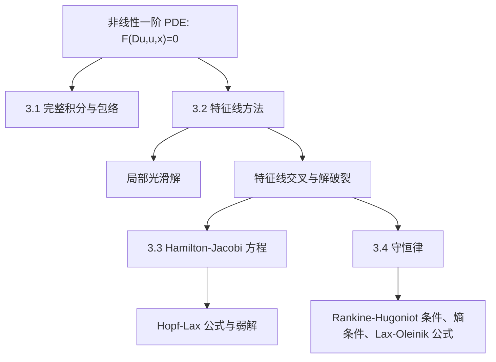

本文整理 Lawrence C. Evans, *Partial Differential Equations, Second Edition* 第 3 章 **Nonlinear First-Order PDE**。这一章从线性 PDE 的显式公式转入非线性 PDE：核心问题不再是卷积核或 Green 函数，而是如何把一阶非线性方程局部化为 ODE，并在光滑解破裂后寻找合适的弱解公式。

本文是学习整理与讲解稿，不是逐句翻译。保留主要记号、公式、定理角色和证明思路，叙述上重点解释“为什么这样做”和“后续章节会怎样继续使用这些工具”。

## 0. 本章地图

第 3 章研究一般非线性一阶方程

$$
F(Du,u,x)=0,\qquad x\in U\subset\mathbb{R}^n,
$$

其中

$$
F=F(p,z,x),\qquad p\in\mathbb{R}^n,\ z\in\mathbb{R},\ x\in \overline U.
$$

这里 $p$ 用来代入 $Du(x)$，$z$ 用来代入 $u(x)$。本章默认 $F$ 足够光滑，并记

$$
D_pF=(F_{p_1},\dots,F_{p_n}),\qquad
D_xF=(F_{x_1},\dots,F_{x_n}).
$$

本章结构可以概括为：

这一章有两条主线：

| 主线 | 内容 | 解决的问题 |
| --- | --- | --- |
| 局部经典理论 | 完整积分、包络、特征线、局部存在 | 如何从边界数据出发构造局部光滑解 |
| 全局弱解理论 | Hopf-Lax、Lax-Oleinik、熵条件 | 光滑解破裂后，什么才是正确的全局解 |

> **学习注释**
>
> 第 2 章的四类线性 PDE 强调“显式公式推出性质”。第 3 章仍然追求公式，但非线性使得公式只能局部成立。真正的新主题是：特征线可能交叉，经典解会失效；这迫使我们引入弱解、熵条件和变分公式。

## 3.1 Complete Integrals, Envelopes

### 3.1.1 完整积分

考虑非线性一阶 PDE

$$
F(Du,u,x)=0.
$$

设 $A\subset\mathbb{R}^n$ 是开集。若对每个参数

$$
a=(a_1,\dots,a_n)\in A
$$

都有一个 $C^2$ 解

$$
u=u(x;a),
$$

并且这个 $n$ 参数族真正依赖全部参数，那么它称为 **完整积分**。Evans 用秩条件表达“真正依赖全部参数”：

$$
\operatorname{rank}(D_a u,D^2_{xa}u)=n.
$$

这里矩阵 $(D_a u,D^2_{xa}u)$ 的每一行对应对某个参数 $a_i$ 的导数：

$$
(u_{a_i},u_{x_1a_i},\dots,u_{x_na_i}).
$$

这个条件排除了“看起来有 $n$ 个参数，其实只依赖 $n-1$ 个参数”的退化情况。

典型例子：

| 方程 | 完整积分 | 说明 |
| --- | --- | --- |
| Clairaut 方程 $x\cdot Du+f(Du)=u$ | $u(x;a)=a\cdot x+f(a)$ | 一族仿射函数 |
| Eikonal 方程 $|Du|=1$ | $u(x;a,b)=a\cdot x+b,\ |a|=1$ | 平面波前 |
| Hamilton-Jacobi 方程 $u_t+H(Du)=0$ | $u(x,t;a,b)=a\cdot x-tH(a)+b$ | 常动量对应的线性相位 |

完整积分的意义是：它提供了一个“足够大的显式解族”。后面通过包络，可以从有限参数族生成更复杂的解。

### 3.1.2 从包络生成新解

设 $u(x;a)$ 是一族解。若可以从方程

$$
D_a u(x;a)=0
$$

解出参数

$$
a=\phi(x),
$$

那么定义

$$
v(x)=u(x;\phi(x)).
$$

这个 $v$ 称为原解族的 **包络**。

关键结论是：如果 $u(\cdot;a)$ 对每个 $a$ 都解 $F(Du,u,x)=0$，且包络 $v$ 存在并足够光滑，那么 $v$ 仍然解同一个 PDE。

证明只有一行链式法则的核心：

$$
Dv(x)=D_xu(x;\phi(x))+D_a u(x;\phi(x))D\phi(x).
$$

由于包络条件给出 $D_a u(x;\phi(x))=0$，所以

$$
Dv(x)=D_xu(x;\phi(x)).
$$

于是代回 PDE：

$$
F(Dv(x),v(x),x)
=F(D_xu(x;\phi(x)),u(x;\phi(x)),x)=0.
$$

> **学习注释**
>
> 包络构造的几何意义是：$v$ 的图像在每个点都与某个族成员 $u(\cdot;a)$ 的图像相切。PDE 是一阶的，只看函数值和一阶导数；相切保证两者代入 PDE 时得到同样结果。

### 3.1.3 一般积分的思想

完整积分依赖 $n$ 个常数。为了得到依赖任意函数的解，Evans 固定一个函数

$$
h:A'\subset\mathbb{R}^{n-1}\to\mathbb{R},
$$

把参数限制在图像

$$
a=(a',h(a')).
$$

然后对新的 $(n-1)$ 参数族

$$
u'(x;a')=u(x;a',h(a'))
$$

取包络。若构造成功，就得到依赖任意函数 $h$ 的解，这称为 **一般积分**。

这个思想类似 ODE 中“通解包含任意常数”，但 PDE 中“一阶方程的通解通常依赖一个任意函数”。不过 Evans 也提醒：这种构造不一定给出所有解，尤其当方程可以因式分解时，一个分支的完整积分可能漏掉另一个分支的解。

## 3.2 Characteristics

### 3.2.1 特征线方程的推导

现在考虑边界问题

$$
\begin{cases}
F(Du,u,x)=0 & \text{in }U,\\
u=g & \text{on }\Gamma.
\end{cases}
$$

特征线方法的目标是：从边界点出发，沿某条曲线进入区域 $U$，在这条曲线上同时计算

$$
x(s),\qquad z(s)=u(x(s)),\qquad p(s)=Du(x(s)).
$$

若 $u$ 是 $C^2$ 解，那么沿曲线有

$$
\dot z(s)=Du(x(s))\cdot \dot x(s)=p(s)\cdot \dot x(s).
$$

对 $p_i(s)=u_{x_i}(x(s))$ 求导会出现 $D^2u$。为了消掉这些二阶导数，Evans 选择

$$
\dot x(s)=D_pF(p(s),z(s),x(s)).
$$

再对 PDE 本身关于 $x_i$ 求导，可得到闭合的 ODE 系统：

$$
\begin{cases}
\dot p(s)=-D_xF(p(s),z(s),x(s))-F_z(p(s),z(s),x(s))p(s),\\
\dot z(s)=D_pF(p(s),z(s),x(s))\cdot p(s),\\
\dot x(s)=D_pF(p(s),z(s),x(s)).
\end{cases}
$$

并且沿特征线保持约束

$$
F(p(s),z(s),x(s))\equiv 0.
$$

这组 $2n+1$ 个一阶 ODE 就是非线性一阶 PDE 的特征方程。

> **学习注释**
>
> 推导的关键不是“猜曲线”，而是选择 $\dot x=D_pF$。这个选择让 $D^2u$ 项和对 PDE 求导得到的项精确匹配，从而把 PDE 降为闭合 ODE。

### 3.2.2 典型特例

#### 线性齐次一阶方程

若

$$
F(Du,u,x)=b(x)\cdot Du+c(x)u,
$$

则

$$
D_pF=b(x).
$$

特征线满足

$$
\dot x=b(x),
$$

而函数值满足

$$
\dot z=-c(x(s))z.
$$

这就是第 2 章输运方程的几何版本：沿向量场 $b$ 的流线传播，只是多了零阶项的指数权重。

#### 拟线性方程

若

$$
F(Du,u,x)=b(x,u)\cdot Du+c(x,u),
$$

则投影特征线依赖解值：

$$
\dot x=b(x,z).
$$

同时 $z$ 的演化由 PDE 约束决定。与线性情形相比，特征线可能因为不同初值对应不同 $z$ 而交叉，光滑解可能只局部存在。

#### Hamilton-Jacobi 方程

对

$$
u_t+H(Du,x)=0,
$$

特征方程给出 Hamilton 系统

$$
\dot x=D_pH(p,x),\qquad
\dot p=-D_xH(p,x),
$$

而函数值沿特征满足

$$
\dot z=D_pH(p,x)\cdot p-H(p,x).
$$

这解释了 Hamilton-Jacobi 方程和经典力学之间的关系：位置 $x$ 与动量 $p$ 沿 Hamilton ODE 演化，$u$ 则记录作用量。

#### 标量守恒律

对一维或多维标量守恒律

$$
u_t+\operatorname{div}F(u)=0,
$$

光滑情况下可写成

$$
u_t+F'(u)\cdot Du=0.
$$

特征线满足

$$
\dot x=F'(z),\qquad \dot z=0.
$$

因此 $u$ 沿特征线保持常数，特征线是直线：

$$
x(t)=x_0+tF'(g(x_0)).
$$

若不同初始点发出的特征线相交，而对应初值不同，就无法继续保持单值光滑解。这正是冲击波和弱解理论出现的原因。

### 3.2.3 边界条件与非特征条件

设边界 $\Gamma$ 附近可用参数 $y=(y_1,\dots,y_{n-1})$ 表示：

$$
x=r(y).
$$

已知边界条件

$$
u(r(y))=g(y).
$$

在边界上，初始函数值为

$$
z(0)=g(y).
$$

初始梯度 $p(0)=q(y)$ 不能任意选。它必须同时满足：

1. PDE 约束：

   $$
   F(q(y),g(y),r(y))=0.
   $$

2. 切向导数兼容：

   $$
   q(y)\cdot r_{y_i}(y)=g_{y_i}(y),\qquad i=1,\dots,n-1.
   $$

这些方程用来确定边界上的初始动量 $q(y)$。若边界是非特征的，即

$$
D_pF(q(y),g(y),r(y))\cdot \nu(r(y))\ne 0,
$$

其中 $\nu$ 是边界法向量，那么特征线横穿边界，局部构造可行。

### 3.2.4 局部存在定理的机制

在非特征条件下，从边界点出发解特征 ODE：

$$
(p(s,y),z(s,y),x(s,y)).
$$

若映射

$$
(s,y)\mapsto x(s,y)
$$

在 $(0,y_0)$ 附近可逆，就可以把 $s,y$ 写成 $x$ 的函数。随后定义

$$
u(x)=z(s(x),y(x)).
$$

Evans 的局部存在定理说明：这个 $u$ 是一个 $C^2$ 的局部解，且满足边界条件。

证明的核心是验证

$$
Du(x)=p(s(x),y(x)).
$$

一旦这个等式成立，PDE 自动成立，因为沿特征线有

$$
F(p,z,x)=0.
$$

> **学习注释**
>
> 特征线方法不是只给“公式”，而是一个局部存在定理。边界数据先给出初始 $z$ 和切向信息，再由 PDE 补足法向导数，最后用 ODE 流把边界附近的一小块区域填满。

### 3.2.5 为什么只得到局部解

非线性一阶 PDE 的困难在于：即使每条特征线作为 ODE 解都存在，投影到物理空间后也可能相交。一旦交叉，不同特征线可能要求同一点取不同函数值，经典解就破裂。

典型现象：

- 线性方程中，特征线由固定向量场决定，流线不交叉，主要问题来自边界是否特征、流线是否覆盖区域。
- 拟线性方程中，特征速度依赖 $u$，不同初值会改变传播速度，交叉更容易出现。
- 守恒律中，特征交叉对应 shock；特征发散对应 rarefaction。
- Hamilton-Jacobi 方程中，特征交叉对应值函数失去光滑性，但仍可用弱解或黏性解描述。

## 3.3 Introduction to Hamilton-Jacobi Equations

### 3.3.1 从变分法到 Hamilton ODE

Hamilton-Jacobi 初值问题写作

$$
\begin{cases}
u_t+H(Du)=0 & \text{in }\mathbb{R}^n\times(0,\infty),\\
u=g & \text{on }\mathbb{R}^n\times\{t=0\}.
\end{cases}
$$

Evans 先回顾变分法。给定 Lagrangian

$$
L=L(v,x),
$$

考虑连接 $y$ 到 $x$ 的曲线 $w:[0,t]\to\mathbb{R}^n$，作用量为

$$
I[w]=\int_0^t L(\dot w(s),w(s))\,ds.
$$

若 $x(\cdot)$ 是极小曲线，则满足 Euler-Lagrange 方程：

$$
-\frac{d}{ds}D_vL(\dot x(s),x(s))+D_xL(\dot x(s),x(s))=0.
$$

定义动量

$$
p(s)=D_vL(\dot x(s),x(s)).
$$

若可从 $p=D_vL(v,x)$ 解出 $v=v(p,x)$，定义 Hamiltonian

$$
H(p,x)=p\cdot v(p,x)-L(v(p,x),x).
$$

则 Euler-Lagrange 方程等价于 Hamilton ODE：

$$
\dot x=D_pH(p,x),\qquad
\dot p=-D_xH(p,x).
$$

这正好和前面 Hamilton-Jacobi 方程的特征方程一致。

### 3.3.2 Legendre 变换与 Hopf-Lax 公式

为了得到全局弱解公式，Evans 先简化到 $H=H(p)$，不显含 $x$。

若 $L:\mathbb{R}^n\to\mathbb{R}$ 凸且超线性，则定义 Legendre 变换

$$
L^*(p)=\sup_{v\in\mathbb{R}^n}\{p\cdot v-L(v)\}.
$$

在 Hamilton-Jacobi 理论中，通常令

$$
H=L^*,\qquad L=H^*.
$$

直观上，$H$ 是动量变量里的能量，$L$ 是速度变量里的作用量密度。

若 $H$ 凸，$L=H^*$，Hopf-Lax 公式给出候选解：

$$
u(x,t)=\min_{y\in\mathbb{R}^n}
\left\{
tL\left(\frac{x-y}{t}\right)+g(y)
\right\}.
$$

这可以理解为：从初始点 $y$ 走到终点 $x$，用常速度 $(x-y)/t$ 走完时间 $t$，总代价为路径作用量加初始代价 $g(y)$。对所有起点取最小。

当 $H(p)=\frac12|p|^2$ 时，$L(v)=\frac12|v|^2$，公式变成

$$
u(x,t)=\min_y\left\{\frac{|x-y|^2}{2t}+g(y)\right\}.
$$

这就是 Moreau-Yosida 型的下包络公式，常用于理解 Hamilton-Jacobi 方程的正则化和半凹性。

> **学习注释**
>
> Hopf-Lax 公式不是普通的卷积公式，而是“最小化卷积”。线性热方程用积分平均产生平滑；Hamilton-Jacobi 方程用最小作用量选择最优路径，可能产生尖点和不可微点。

### 3.3.3 弱解与唯一性

Hopf-Lax 公式给出的 $u$ 通常不是 $C^1$，所以不能逐点满足 PDE。Evans 在本章先采用一种弱解框架：要求 $u$ Lipschitz，并且几乎处处满足

$$
u_t+H(Du)=0.
$$

为了得到唯一性，还需要额外的单侧控制条件。对凸 Hamiltonian，Hopf-Lax 解具有半凹性：

$$
u(x+z,t)-2u(x,t)+u(x-z,t)\le \frac{C}{t}|z|^2.
$$

这个估计限制了不可微点的形状，排除不物理的弱解。

本章证明的结论可以概括为：

| 结论 | 含义 |
| --- | --- |
| Hopf-Lax 公式给出 Lipschitz 函数 | 公式在全局时间上有意义 |
| 函数几乎处处满足 PDE | 是 Hamilton-Jacobi 方程的弱解 |
| 半凹估计成立 | 弱解满足正确的选择原则 |
| 满足该选择原则的弱解唯一 | 公式选出了正确解 |

Evans 后续在第 10 章会引入更强、更现代的 **黏性解** 理论。第 3 章的弱解处理是一个入口：先让读者看到，特征线破裂后仍可以用变分公式和不等式选择唯一解。

## 3.4 Introduction to Conservation Laws

### 3.4.1 积分解、冲击波与 Rankine-Hugoniot 条件

本节研究一维标量守恒律

$$
\begin{cases}
u_t+F(u)_x=0 & \text{in }\mathbb{R}\times(0,\infty),\\
u=g & \text{on }\mathbb{R}\times\{t=0\}.
\end{cases}
$$

光滑解可能不存在全局时间，因此先把 PDE 改写成积分恒等式。取紧支撑光滑测试函数 $\varphi$，若 $u$ 光滑，则分部积分得到

$$
\int_0^\infty\int_{-\infty}^{\infty}
\left(u\varphi_t+F(u)\varphi_x\right)\,dxdt
+\int_{-\infty}^{\infty}g(x)\varphi(x,0)\,dx=0.
$$

即使 $u$ 只有 $L^\infty$，这个式子仍有意义。因此 Evans 定义：满足该积分恒等式的有界函数称为积分解。

若解在一条曲线 $x=s(t)$ 两侧光滑、沿曲线有跳跃，积分解必须满足 Rankine-Hugoniot 条件：

$$
[F(u)]=\sigma [u],
$$

其中

$$
[u]=u_l-u_r,\qquad [F(u)]=F(u_l)-F(u_r),\qquad \sigma=\dot s(t).
$$

也就是说，冲击波速度必须等于通量跳跃和状态跳跃的比值：

$$
\sigma=\frac{F(u_l)-F(u_r)}{u_l-u_r}.
$$

但 Rankine-Hugoniot 条件只保证“守恒”，不保证唯一。一个守恒律可能有多个积分解，其中一些不是物理上正确的。为此需要熵条件。

### 3.4.2 熵条件

当通量 $F$ 凸时，物理上可接受的 shock 应满足压缩特征的方向要求。对跳跃 $u_l,u_r$，熵条件可理解为

$$
F'(u_l)\ge \sigma \ge F'(u_r).
$$

若 $F$ 严格凸，这通常意味着

$$
u_l\ge u_r.
$$

直观上，特征线从两侧进入冲击曲线，信息被压缩到 shock 上；相反的跳跃会产生非唯一或非物理的解，应该由稀疏波取代。

Evans 后面把熵条件写成更适合弱解的单侧估计：

$$
u(x+z,t)-u(x,t)\le C\left(1+\frac1t\right)z,\qquad z>0.
$$

这个估计排除向上跳跃，保留向下跳跃，是一维凸守恒律中选择唯一熵解的核心条件。

### 3.4.3 Lax-Oleinik 公式

守恒律和 Hamilton-Jacobi 方程有一个关键联系。若

$$
h(x)=\int_0^x g(y)\,dy,
$$

并令 $w$ 解 Hamilton-Jacobi 方程

$$
w_t+F(w_x)=0,\qquad w(x,0)=h(x),
$$

那么形式上

$$
u=w_x
$$

就应该解守恒律

$$
u_t+F(u)_x=0.
$$

因此 Evans 用 Hopf-Lax 公式先定义

$$
w(x,t)=\min_y\left\{
tL\left(\frac{x-y}{t}\right)+h(y)
\right\},
$$

其中

$$
L=F^*
$$

是通量 $F$ 的 Legendre 变换。若 $F$ 一致凸，$F'$ 可逆，记

$$
G=(F')^{-1}.
$$

设 $y(x,t)$ 是上式中达到最小的点，则 Lax-Oleinik 公式写为

$$
u(x,t)=G\left(\frac{x-y(x,t)}{t}\right)
$$

在几乎处处意义下成立。

这个公式给出的 $u$ 是积分解，并且满足熵条件，因此是正确的熵解。

> **学习注释**
>
> Hopf-Lax 与 Lax-Oleinik 是同一个变分思想的两个层次：先对 Hamilton-Jacobi 方程求值函数 $w$，再取空间导数得到守恒律解 $u=w_x$。这也是 Hamilton-Jacobi 方程和守恒律之间最重要的桥梁之一。

### 3.4.4 Riemann 问题

Riemann 问题是守恒律的分段常数初值问题：

$$
g(x)=
\begin{cases}
u_l, & x<0,\\
u_r, & x>0.
\end{cases}
$$

对凸通量，解分两类：

| 初值关系 | 解的形态 | 说明 |
| --- | --- | --- |
| $u_l>u_r$ | shock | 两侧特征线相交，形成跳跃 |
| $u_l<u_r$ | rarefaction | 特征线发散，中间由自相似连续扇形填充 |

shock 的速度由 Rankine-Hugoniot 条件给出：

$$
\sigma=\frac{F(u_l)-F(u_r)}{u_l-u_r}.
$$

rarefaction 解通常写成自相似形式 $u(x,t)=U(x/t)$，中间状态由

$$
F'(U(\xi))=\xi
$$

决定。

Riemann 问题之所以重要，是因为它是第 11 章系统守恒律的基本局部模型。复杂初值可以看作许多小 Riemann 问题相互作用。

### 3.4.5 长时间行为

第 3.4 节最后讨论一维凸守恒律解的渐近行为。粗略地说，Lax-Oleinik 公式不仅给出存在唯一性，也能描述大时间下解如何接近某个自相似轮廓。

这部分的重点不是具体估计，而是方法：

- 通过变分公式定位最小点；
- 用凸性控制最小点随 $x,t$ 的变化；
- 把解与显式自相似剖面对比；
- 在 $L^\infty$ 或 $L^1$ 范数下证明收敛。

这说明弱解公式不仅是存在性工具，也是定量渐近分析工具。

## 3.5 Problems 学习路线

第 3 章习题可以按主题分组：

| 习题方向 | 训练内容 |
| --- | --- |
| 完整积分与包络 | 验证 Hamilton-Jacobi 完整积分，计算直线/平面族包络 |
| 特征线方法 | 写出特征 ODE，求解线性和拟线性一阶 PDE |
| 边界非特征条件 | 验证 $D_pF\cdot\nu\ne 0$ 的几何意义 |
| Hamilton-Jacobi | Legendre 变换、Hopf-Lax 公式、有限传播速度、$L^\infty$ 收缩 |
| 守恒律 | 熵解、单侧估计、质量守恒、Riemann 问题 |

推荐练习顺序：

1. 先做完整积分和包络题，理解“参数族 -> 包络 -> 新解”。
2. 再做特征线题，尤其是把第 2 章输运方程公式重新推出。
3. 然后做 Hopf-Lax 与 Legendre 变换题，熟悉凸对偶。
4. 最后做守恒律和 Riemann 问题，理解弱解唯一性为什么需要熵条件。

## 6. 本章总结

第 3 章的核心可以压缩成四句话：

1. 一阶非线性 PDE 的局部经典理论来自特征线 ODE。
2. 特征线方法的关键闭合机制是选择 $\dot x=D_pF$。
3. 光滑解通常会因特征线交叉而失效，所以必须引入弱解。
4. Hamilton-Jacobi 方程和守恒律的正确弱解分别由 Hopf-Lax 公式、Lax-Oleinik 公式和熵条件选择。

从全书结构看，本章提前展示了后续两条重要路线：

- 第 10 章会系统发展 Hamilton-Jacobi 方程和黏性解。
- 第 11 章会从标量守恒律进入一阶双曲守恒律系统。

因此，第 3 章不是孤立的计算章，而是从显式公式走向现代非线性 PDE 理论的入口。
