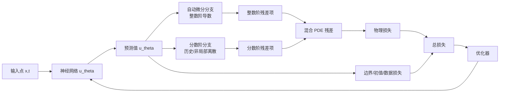
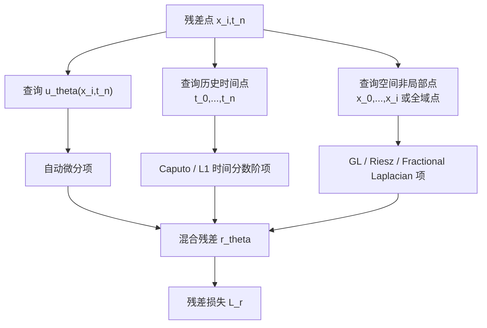

fPINN（Fractional Physics-Informed Neural Network）可以理解为 PINN 在分数阶偏微分方程上的扩展。标准 PINN 主要依赖自动微分计算整数阶导数；而分数阶导数通常是非局部算子，带有历史记忆或空间长程相互作用，不能简单地用局部自动微分替代。

因此，fPINN 的关键不是“把 PINN 的导数阶数改成小数”，而是构造一个混合残差：整数阶部分用自动微分，分数阶部分用数值离散、积分求积或谱方法近似，然后一起进入物理损失。

## 1. 为什么需要分数阶模型

很多物理过程不能被经典整数阶 PDE 很好描述。例如：

- 多孔介质中的异常扩散；
- 黏弹性材料中的记忆效应；
- 湍流、复杂介质中的非局部输运；
- 具有长尾等待时间或长程跳跃的随机过程；
- 地下水、污染物输运和生物组织扩散等多尺度问题。

整数阶扩散方程通常对应局部、Markov 型动力学。分数阶模型则常常引入非局部性：

- 时间分数阶导数描述历史记忆；
- 空间分数阶导数描述长程相互作用；
- 分数阶 Laplacian 描述非局部扩散或 Levy 型跳跃过程。

这类模型更灵活，但数值计算也更困难。fPINN 的目标就是把分数阶物理规律嵌入神经网络训练中。

## 2. 从 PINN 到 fPINN

标准 PINN 的残差一般写成

$$
r_\theta(x,t)=\mathcal{N}[u_\theta](x,t).
$$

如果 $\mathcal{N}$ 只包含整数阶导数，例如 $u_t,u_x,u_{xx}$，可以直接用自动微分计算。

但分数阶 PDE 可能包含

$$
{}_{0}^{C}D_t^\alpha u,\qquad
{}_{a}D_x^\beta u,\qquad
(-\Delta)^{\beta/2}u,
$$

其中 $\alpha,\beta$ 不一定是整数。它们通常依赖一个区间、一段历史或整个空间区域，不是某个点附近的局部导数。

于是 fPINN 的残差通常具有如下形式：

$$
r_\theta
=
\underbrace{\mathcal{N}_{\mathrm{AD}}[u_\theta]}_{\text{整数阶项：自动微分}}
+
\underbrace{\mathcal{N}_{\mathrm{frac}}^h[u_\theta]}_{\text{分数阶项：数值离散}}
-f.
$$

这里 $h$ 表示分数阶算子的数值近似尺度，例如网格步长、时间步长或求积节点间距。



## 3. 时间分数阶导数：Caputo 形式

常见的时间分数阶导数是 Caputo 导数。对 $0<\alpha<1$，其形式为

$$
{}_{0}^{C}D_t^\alpha u(t)
=
\frac{1}{\Gamma(1-\alpha)}
\int_0^t
\frac{u'(s)}{(t-s)^\alpha}\,ds.
$$

它与普通一阶导数不同：当前时刻的导数依赖从 $0$ 到 $t$ 的整个历史。核函数

$$
(t-s)^{-\alpha}
$$

在 $s=t$ 附近有弱奇异性，并且给近期历史更高权重。

对 fPINN 来说，这意味着如果要在 $t_n$ 处计算

$$
{}_{0}^{C}D_t^\alpha u_\theta(t_n),
$$

不能只看网络在 $t_n$ 附近的局部变化，而要访问之前多个时间点的网络输出。

一种常见 L1 型离散可以写成

$$
{}_{0}^{C}D_t^\alpha u(t_n)
\approx
\frac{1}{\Gamma(2-\alpha)\tau^\alpha}
\sum_{j=0}^{n-1}
a_j
\left[u(t_{n-j})-u(t_{n-j-1})\right],
$$

其中

$$
a_j=(j+1)^{1-\alpha}-j^{1-\alpha}.
$$

把 $u$ 换成 $u_\theta$ 后，该近似仍然可以对网络参数 $\theta$ 反向传播，因为每一项都是网络输出的可微组合。

## 4. 空间分数阶导数与非局部性

空间分数阶导数有多种定义。常见选择包括 Riemann-Liouville、Grunwald-Letnikov、Riesz 导数和分数阶 Laplacian。

以一维 Grunwald-Letnikov 型离散为例，左侧分数阶导数可以近似为

$$
{}_{a}D_x^\beta u(x_i)
\approx
\frac{1}{h^\beta}
\sum_{k=0}^{i}
(-1)^k
\binom{\beta}{k}
u(x_{i-k}).
$$

这里

$$
\binom{\beta}{k}
=
\frac{\Gamma(\beta+1)}
{\Gamma(k+1)\Gamma(\beta-k+1)}.
$$

这个公式展示了分数阶空间导数的核心特征：$x_i$ 处的导数不仅依赖 $x_i$ 附近的几个点，而是依赖一串历史空间点。对多维问题，非局部性会更明显，计算成本也更高。

分数阶 Laplacian 常写成

$$
(-\Delta)^{\beta/2}u
=
\mathcal{F}^{-1}
\left(
|\xi|^\beta \mathcal{F}[u](\xi)
\right),
$$

其中 $\mathcal{F}$ 是 Fourier 变换。这个定义强调它是全局算子：频域中乘上 $|\xi|^\beta$，物理空间里对应非局部相互作用。

## 5. fPINN 的典型方程：分数阶对流扩散

一个代表性问题是分数阶对流扩散方程：

$$
{}_{0}^{C}D_t^\alpha u(x,t)
+v\frac{\partial u}{\partial x}(x,t)
-\kappa\,{}_{a}D_x^\beta u(x,t)
=f(x,t),
$$

其中

$$
0<\alpha\le 1,\qquad 1<\beta\le 2.
$$

当 $\alpha=1,\beta=2$ 时，它退化为经典整数阶对流扩散方程。若 $\alpha<1$，系统具有时间记忆；若 $\beta<2$，空间扩散不再是普通 Laplacian，而带有长程效应。

fPINN 令神经网络近似

$$
u_\theta(x,t)\approx u(x,t),
$$

并构造残差

$$
r_\theta(x,t)
=
{}_{0}^{C}D_t^\alpha u_\theta(x,t)
+v\frac{\partial u_\theta}{\partial x}(x,t)
-\kappa\,{}_{a}D_x^\beta u_\theta(x,t)
-f(x,t).
$$

其中：

- $\partial u_\theta/\partial x$ 可以用自动微分；
- ${}_{0}^{C}D_t^\alpha u_\theta$ 需要历史时间离散；
- ${}_{a}D_x^\beta u_\theta$ 需要空间非局部离散。

## 6. fPINN 的损失函数

令残差点集合为

$$
\{(x_r^i,t_r^i)\}_{i=1}^{N_r},
$$

边界点、初值点和观测点分别为 $\mathcal{S}_b,\mathcal{S}_0,\mathcal{S}_d$。fPINN 的损失通常仍然是

$$
\mathcal{L}
=w_r\mathcal{L}_r
+w_b\mathcal{L}_b
+w_0\mathcal{L}_0
+w_d\mathcal{L}_d,
$$

但残差损失变为

$$
\mathcal{L}_r
=
\frac{1}{N_r}
\sum_{i=1}^{N_r}
\left\|
\mathcal{N}_{\mathrm{AD}}[u_\theta](x_r^i,t_r^i)
+\mathcal{N}_{\mathrm{frac}}^h[u_\theta](x_r^i,t_r^i)
-f(x_r^i,t_r^i)
\right\|^2.
$$

这个表达式看起来与 PINN 很像，但计算图更复杂：每个残差点可能要访问一组历史点或空间邻域点。



## 7. 正问题与反问题

与 PINN 一样，fPINN 也可以做正问题和反问题。

### 正问题

如果 $\alpha,\beta,v,\kappa$ 已知，目标是求解 $u$：

$$
\theta^\*=\arg\min_\theta \mathcal{L}(\theta).
$$

### 反问题

如果分数阶阶数或物理系数未知，可以把它们作为可训练参数：

$$
(\theta^\*,\alpha^\*,\beta^\*,v^\*,\kappa^\*)
=
\arg\min_{\theta,\alpha,\beta,v,\kappa}
\mathcal{L}(\theta,\alpha,\beta,v,\kappa).
$$

这在分数阶模型中尤其重要。很多实际系统中，分数阶阶数 $\alpha,\beta$ 本身就是需要从数据中识别的有效参数，代表记忆强度或非局部扩散程度。

实现时通常会对阶数做约束参数化。例如为了保证 $0<\alpha<1$，可以令

$$
\alpha=\sigma(a),
$$

其中 $\sigma$ 是 sigmoid 函数，$a$ 是无约束可训练变量。若要求 $1<\beta<2$，可以令

$$
\beta=1+\sigma(b).
$$

## 8. fPINN 与 PINN 的区别

| 维度 | PINN | fPINN |
|---|---|---|
| 方程类型 | 整数阶 ODE/PDE 为主 | 分数阶 ODE/PDE、分数阶对流扩散、非局部模型 |
| 导数计算 | 自动微分为主 | 自动微分 + 分数阶数值离散 |
| 算子性质 | 多数是局部算子 | 常见为非局部算子 |
| 计算图 | 残差点之间相对独立 | 残差点可能依赖历史或全域点 |
| 计算成本 | 主要来自网络和高阶 AD | 还包括历史卷积、非局部矩阵或谱变换 |
| 主要难点 | 损失平衡、优化病态、采样 | 以上全部 + 奇异核、非局部边界、分数阶离散误差 |

因此 fPINN 的难度通常高于标准 PINN。它既继承了 PINN 的优化问题，又叠加了分数阶算子的数值分析问题。

## 9. 实现 fPINN 时的关键细节

### 9.1 分数阶算子不能随便替换

不同定义的分数阶导数对应不同物理含义。Caputo、Riemann-Liouville、Riesz 和分数阶 Laplacian 不是简单的记号差异。写 fPINN 前必须先明确：

- 方程使用哪一种分数阶导数；
- 阶数范围是什么；
- 边界条件如何定义；
- 离散公式是否与该定义一致；
- 数据是否足以识别分数阶阶数。

### 9.2 非局部算子会带来边界问题

普通二阶导数 $u_{xx}(x)$ 是局部的；而分数阶空间导数可能依赖区域外延拓或整个区域上的函数值。因此边界条件的处理比整数阶 PDE 更敏感。

常见处理方式包括：

- 在有限区间上使用单侧 Riemann-Liouville 或 Grunwald-Letnikov 导数；
- 使用 Riesz 分数阶导数并配合合适的边界条件；
- 对区域外函数值设定延拓；
- 使用谱方法并假设周期边界。

这些选择会改变问题本身，不能只作为实现细节处理。

### 9.3 计算成本可能很高

时间分数阶导数通常需要历史累加。如果有 $N_t$ 个时间点，朴素计算可能达到 $O(N_t^2)$。空间分数阶导数在多维问题中也可能形成稠密矩阵或全局求积。

实践中可以考虑：

- 预计算分数阶权重；
- 把分数阶离散写成矩阵乘法；
- 使用 FFT 处理周期区域上的分数阶 Laplacian；
- 对长时间问题使用短记忆近似或快速卷积；
- 在反问题中谨慎处理阶数参数对权重的影响。

### 9.4 残差误差包含两部分

标准 PINN 的残差误差主要来自网络近似和优化误差。fPINN 还多了分数阶算子的离散误差：

$$
\text{误差}
\approx
\text{网络逼近误差}
+\text{优化误差}
+\text{分数阶离散误差}.
$$

因此，即使网络训练得很好，如果分数阶离散太粗，最终结果仍然可能不准确。

## 10. 一个 fPINN 训练流程


伪代码如下：

```text
precompute fractional_weights

for epoch in training:
    x, t = sample_points()

    u = net(x, t)

    integer_terms = autograd_terms(u, x, t)
    fractional_terms = fractional_operator(net, x, t, fractional_weights)

    residual = integer_terms + fractional_terms - forcing(x, t)

    loss_r = mean(residual ** 2)
    loss_b = boundary_loss(net)
    loss_0 = initial_loss(net)
    loss_d = data_loss(net)

    loss = w_r * loss_r + w_b * loss_b + w_0 * loss_0 + w_d * loss_d
    optimizer.step(loss)
```

这里 `fractional_operator` 通常不是普通自动微分调用，而是一个可微的数值算子。它输入网络或网络在一组节点上的输出，返回分数阶导数近似。

## 11. 常见失败模式

fPINN 训练失败时，原因可能来自 PINN，也可能来自分数阶离散：

- 残差点太少，无法覆盖非局部影响；
- 时间历史点过稀，Caputo 导数近似误差大；
- 空间步长过粗，分数阶导数权重不准确；
- 边界延拓与真实物理不一致；
- 分数阶阶数和扩散系数同时反演时出现不可辨识性；
- 损失权重让数据项压过物理项，或让物理项压过边界项；
- 单精度下长历史卷积或高阶权重带来数值误差。

一个实用判断方式是分开监控：

$$
\mathcal{L}_r,\quad
\mathcal{L}_b,\quad
\mathcal{L}_0,\quad
\mathcal{L}_d,
$$

并额外检查分数阶离散本身在解析测试函数上的误差。如果离散算子对已知函数都不准，fPINN 的训练结果就不可能可靠。

## 12. 什么时候适合使用 fPINN

fPINN 适合以下场景：

- 已知系统服从分数阶 PDE，但数据稀疏；
- 需要从数据中反演分数阶阶数；
- 观测点不规则，传统网格方法使用不方便；
- 希望得到一个连续可微 surrogate；
- 方程中存在黑箱源项或散乱观测数据。

不适合的场景也很明确：

- 只需要在规则网格上高精度求一个标准分数阶 PDE；
- 分数阶算子定义和边界条件尚未明确；
- 数据不足以识别阶数和系数；
- 问题规模很大，但没有快速非局部算子实现。

在这些情况下，专门的分数阶有限差分、有限元、谱方法或快速卷积方法可能更稳定、更高效。

## 13. 小结

fPINN 的核心是把分数阶物理约束写进神经网络训练，但它不是标准 PINN 的简单替换。真正的 fPINN 至少包含三层结构：

$$
\text{神经网络近似}
+\text{整数阶自动微分}
+\text{分数阶非局部离散}.
$$

它的数学难点来自分数阶算子的非局部性，计算难点来自历史或全局耦合，优化难点则继承自 PINN 的多目标损失。

理解 fPINN 时，最重要的问题不是“网络用几层”，而是：

1. 分数阶导数定义是否与物理问题一致；
2. 分数阶离散是否准确且可微；
3. 残差损失是否真正约束了非局部物理；
4. 数据是否足以同时识别解、阶数和物理参数。

只有这几件事同时成立，fPINN 才能成为可靠的科学机器学习工具。

## 参考文献

1. Guofei Pang, Lu Lu, George Em Karniadakis. [fPINNs: Fractional Physics-Informed Neural Networks](https://doi.org/10.1137/18M1229845). SIAM Journal on Scientific Computing, 41(4), 2019.
2. Guofei Pang, Lu Lu, George Em Karniadakis. [fPINNs: Fractional Physics-Informed Neural Networks](https://arxiv.org/abs/1811.08967). arXiv:1811.08967, 2018.
3. Maziar Raissi, Paris Perdikaris, George Em Karniadakis. [Physics-informed neural networks: A deep learning framework for solving forward and inverse problems involving nonlinear partial differential equations](https://doi.org/10.1016/j.jcp.2018.10.045). Journal of Computational Physics, 378:686-707, 2019.
4. DeepXDE Documentation. [Scientific machine learning and physics-informed learning](https://deepxde.readthedocs.io/en/stable/).
5. Sifan Wang, Yujun Teng, Paris Perdikaris. [Understanding and mitigating gradient pathologies in physics-informed neural networks](https://arxiv.org/abs/2001.04536). arXiv:2001.04536, 2020.
