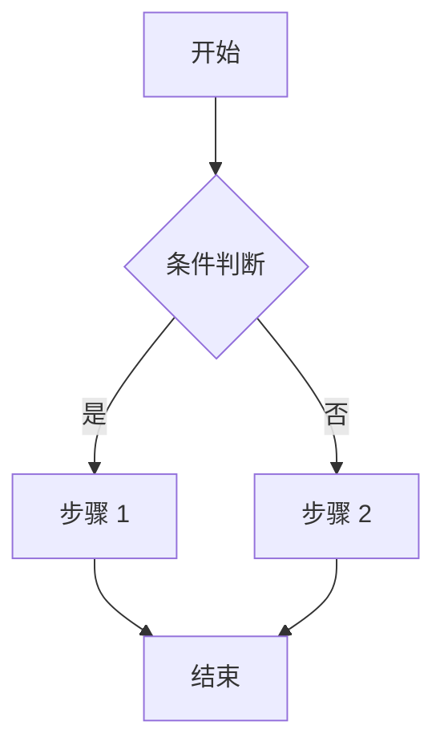
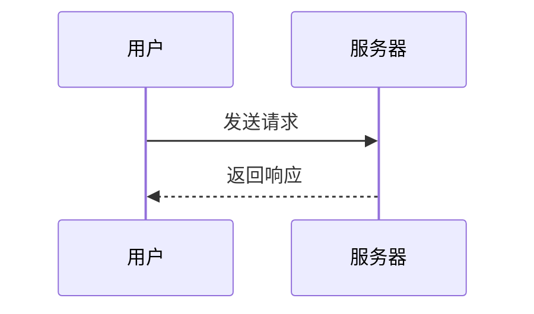
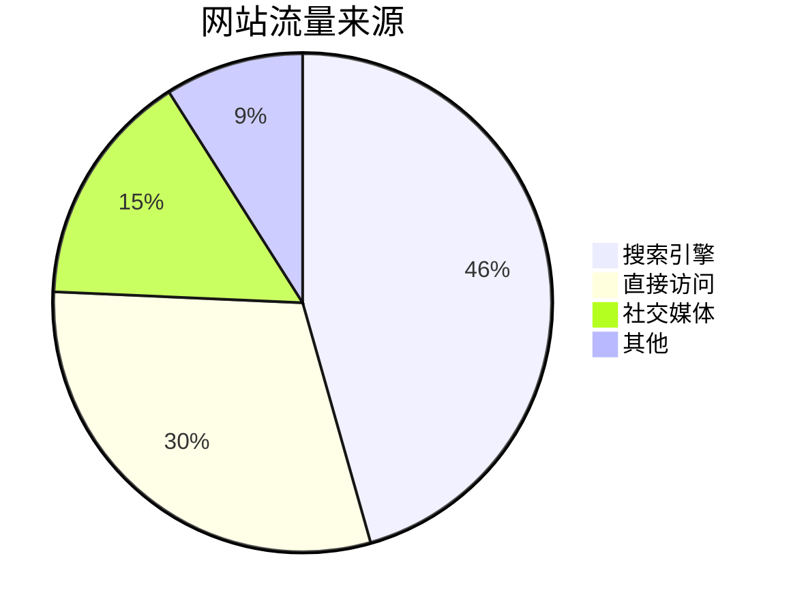

本文整合了博客模板的所有功能演示，包括文章管理、LaTeX 数学公式、Mermaid 图表、视频嵌入等。

:::note[密码提示]
如果你能看到这个内容，说明你已经正确输入了密码！
:::

---

# 第一部分：文章管理

## Front-matter 配置

```yaml
---
title: My First Blog Post
published: 2020-02-02
description: This is the first post of my new Astro blog.
cover: ./cover.jpg
tags: [Foo, Bar]
category: Front-end
draft: false
---
```

| 属性 | 说明 |
|------|------|
| `title` | 文章标题 |
| `published` | 发布日期 |
| `pinned` | 是否置顶 |
| `description` | 文章描述 |
| `cover` | 封面图片路径 |
| `tags` | 标签列表 |
| `category` | 分类 |
| `draft` | 是否为草稿 |
| `encrypted` | 是否加密 |
| `password` | 加密密码 |

## 文件放置位置

```
src/content/posts/
├── post-1.md
└── post-2/
    ├── cover.jpg
    └── index.md
```

---

# 第二部分：扩展功能

## GitHub 仓库卡片

::github{repo="goblinunde/goblinunde.github.io"}

使用 `::github{repo="用户名/仓库名"}` 语法创建仓库卡片。

## Admonitions 提示框

:::note
这是一个注释提示框，用于提供额外信息。
:::

:::tip
这是一个技巧提示框，用于分享最佳实践。
:::

:::important
这是一个重要提示框，用于强调关键信息。
:::

:::warning
这是一个警告提示框，用于提醒潜在问题。
:::

:::caution
这是一个危险提示框，用于警示严重风险。
:::

### 自定义标题

:::note[自定义标题]
可以使用 `:::note[自定义标题]` 语法。
:::

### Spoiler 隐藏文本

隐藏内容 :spoiler[这里是隐藏的文字]！

---

# 第三部分：LaTeX 数学公式

## 行内公式

著名的质能方程 $E = mc^2$ 由爱因斯坦提出。

欧拉公式 $e^{i\pi} + 1 = 0$ 被誉为数学中最美丽的公式。

## 块级公式

### 高斯积分

$$
\int_{-\infty}^{\infty} e^{-x^2} dx = \sqrt{\pi}
$$

### 傅里叶变换

$$
\hat{f}(\xi) = \int_{-\infty}^{\infty} f(x) e^{-2\pi i x \xi} dx
$$

### 热传导方程

$$
\frac{\partial u}{\partial t} = \alpha \nabla^2 u
$$

### 矩阵乘法

$$
\begin{pmatrix}
a_{11} & a_{12} \\
a_{21} & a_{22}
\end{pmatrix}
\begin{pmatrix}
b_{11} & b_{12} \\
b_{21} & b_{22}
\end{pmatrix}
=
\begin{pmatrix}
a_{11}b_{11} + a_{12}b_{21} & a_{11}b_{12} + a_{12}b_{22} \\
a_{21}b_{11} + a_{22}b_{21} & a_{21}b_{12} + a_{22}b_{22}
\end{pmatrix}
$$

---

# 第四部分：Mermaid 图表

## 流程图



## 时序图



## 饼图



---

# 第五部分：视频嵌入

## YouTube

<iframe width="100%" height="468" src="https://www.youtube.com/embed/yrn7eInApnc?si=gGZeFbPcfMpJ1uV3_" title="YouTube video player" frameborder="0" allow="accelerometer; autoplay; clipboard-write; encrypted-media; gyroscope; picture-in-picture; web-share" allowfullscreen></iframe>

## Bilibili

<iframe width="100%" height="468" src="//player.bilibili.com/player.html?bvid=BV14QpMeSEuD&p=1&autoplay=0" scrolling="no" border="0" frameborder="no" framespacing="0" allowfullscreen="true" &autoplay=0> </iframe>

---

# 第六部分：代码高亮

```python
import torch
import torch.nn as nn

class PINN(nn.Module):
    """Physics-Informed Neural Network"""
    def __init__(self, layers):
        super().__init__()
        self.network = nn.Sequential(*[
            nn.Linear(layers[i], layers[i+1])
            for i in range(len(layers) - 1)
        ])
    
    def forward(self, x, t):
        # 💡 Input: spatial coordinate x, temporal coordinate t
        inputs = torch.cat([x, t], dim=1)
        return self.network(inputs)
```

---

更多信息请参考 [Astro 文档](https://docs.astro.build/)。
