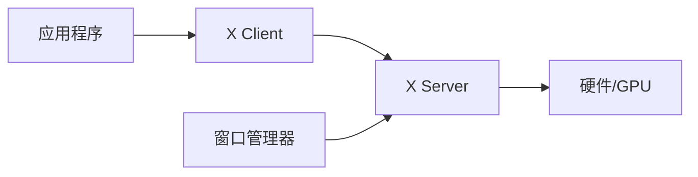
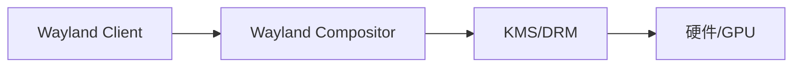
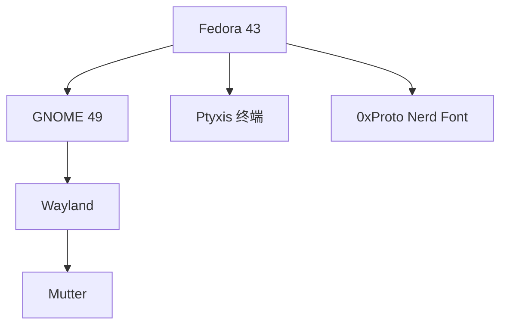

# Linux 桌面系统与显示协议总结

Linux 桌面生态丰富多样，从完整的桌面环境到极简的窗口管理器，从传统的 X11 到现代的 Wayland。本文系统梳理这些技术的特点与选择。

---

## 一、显示协议：X11 vs Wayland

### 1.1 X Window System (X11)

X11 是 Unix/Linux 传统的显示系统，诞生于 1984 年。

**架构**：



**特点**：

| 优点 | 缺点 |
|:-----|:-----|
| 成熟稳定，40 年历史 | 架构过时，安全性差 |
| 网络透明，支持远程显示 | 每个应用可以监听其他窗口 |
| 兼容性好 | 合成器外置，撕裂问题 |
| 所有软件都支持 | 无法正确处理 HiDPI |

### 1.2 Wayland

Wayland 是下一代显示协议，设计目标是简化和安全。

**架构**：



**特点**：

| 优点 | 缺点 |
|:-----|:-----|
| 安全，应用隔离 | 部分旧软件需要 XWayland |
| 内置合成，无撕裂 | 屏幕共享需要 Portal |
| 更好的 HiDPI 支持 | 部分专有驱动支持不完善 |
| 更低延迟 | 远程桌面方案不同 |

### 1.3 当前状态 (2026)

:::important[Wayland 已是主流]

- **Fedora**: 默认 Wayland (GNOME 40+)
- **Ubuntu**: 24.04 默认 Wayland
- **Arch**: 大多数 DE 支持 Wayland
- **NVIDIA**: 驱动已完善支持

:::

---

## 二、桌面环境 (Desktop Environment)

桌面环境是完整的图形界面解决方案，包括窗口管理器、面板、文件管理器、设置工具等。

### 2.1 GNOME

:::note[GNOME 概览]
**风格**：现代、简洁、触屏友好

**官网**：[https://www.gnome.org/](https://www.gnome.org/)
:::

| 特性 | 描述 |
|:-----|:-----|
| 工具包 | GTK4 / libadwaita |
| Wayland 支持 | ⭐⭐⭐⭐⭐ 最佳 |
| 资源占用 | 中等偏高 |
| 可定制性 | 通过扩展 (Extensions) |
| 文件管理器 | Nautilus (Files) |

**GNOME Shell 扩展**：

- [extensions.gnome.org](https://extensions.gnome.org/)
- 推荐：Dash to Dock, AppIndicator, Blur my Shell

**适合用户**：喜欢现代设计、触控板用户、专注工作流

### 2.2 KDE Plasma

:::note[KDE Plasma 概览]
**风格**：功能丰富、高度可定制

**官网**：[https://kde.org/plasma-desktop/](https://kde.org/plasma-desktop/)
:::

| 特性 | 描述 |
|:-----|:-----|
| 工具包 | Qt6 |
| Wayland 支持 | ⭐⭐⭐⭐ 良好 |
| 资源占用 | 中等 |
| 可定制性 | ⭐⭐⭐⭐⭐ 极高 |
| 文件管理器 | Dolphin |

**KDE 特色**：

- KDE Connect：手机电脑互联
- Konsole：强大的终端模拟器
- Kate：高级文本编辑器

**适合用户**：喜欢定制、Windows 迁移用户、功能控

### 2.3 Xfce

:::note[Xfce 概览]
**风格**：轻量、传统、稳定

**官网**：[https://xfce.org/](https://xfce.org/)
:::

| 特性 | 描述 |
|:-----|:-----|
| 工具包 | GTK3 |
| Wayland 支持 | ⭐⭐ 开发中 |
| 资源占用 | 低 |
| 可定制性 | 中等 |
| 特点 | 稳定，适合老旧硬件 |

### 2.4 其他桌面环境

| 桌面环境 | 特点 | 适合场景 |
|:---------|:-----|:---------|
| **Cinnamon** | 传统布局，Linux Mint 默认 | Windows 用户迁移 |
| **MATE** | GNOME 2 继承者 | 传统布局爱好者 |
| **LXQt** | Qt 版轻量桌面 | 低配硬件 |
| **Budgie** | 现代优雅 | 美观优先 |
| **Pantheon** | macOS 风格 (elementary OS) | 设计爱好者 |
| **Deepin DE** | 国产美观桌面 | 国产软件生态 |

---

## 三、窗口管理器 (Window Manager)

窗口管理器只负责窗口管理，不包含完整桌面功能，适合极客用户。

### 3.1 平铺式窗口管理器

**特点**：窗口自动铺满屏幕，无重叠，键盘驱动

| WM | 协议 | 语言 | 特点 |
|:---|:-----|:-----|:-----|
| **i3** | X11 | C | 经典，文档丰富 |
| **Sway** | Wayland | C | i3 的 Wayland 版 |
| **Hyprland** | Wayland | C++ | 动画华丽，热门 |
| **dwm** | X11 | C | 极简，源码配置 |
| **bspwm** | X11 | C | 二叉树布局 |
| **awesome** | X11 | Lua | 可扩展性强 |

### 3.2 Sway 示例配置

```bash
# ~/.config/sway/config

# 设置 mod 键
set $mod Mod4

# 启动终端
bindsym $mod+Return exec foot

# 关闭窗口
bindsym $mod+Shift+q kill

# 切换工作区
bindsym $mod+1 workspace 1
bindsym $mod+2 workspace 2

# 移动窗口到工作区
bindsym $mod+Shift+1 move container to workspace 1

# 分割方向
bindsym $mod+h splith
bindsym $mod+v splitv

# 状态栏
bar {
    status_command waybar
}
```

### 3.3 Hyprland 配置示例

```bash
# ~/.config/hypr/hyprland.conf

# 显示器配置
monitor=,preferred,auto,1

# 输入配置
input {
    kb_layout = us
    follow_mouse = 1
    touchpad {
        natural_scroll = yes
    }
}

# 窗口动画
animations {
    enabled = yes
    bezier = myBezier, 0.05, 0.9, 0.1, 1.05
    animation = windows, 1, 7, myBezier
    animation = fade, 1, 7, default
}

# 快捷键
bind = SUPER, Return, exec, kitty
bind = SUPER, Q, killactive
bind = SUPER, 1, workspace, 1
```

---

## 四、显示服务器与合成器

### 4.1 X11 合成器

| 合成器 | 特点 |
|:-------|:-----|
| **Picom** | 轻量，支持透明模糊 |
| **Compton** | Picom 前身 |
| **xcompmgr** | 极简 |

### 4.2 Wayland 合成器

Wayland 中，合成器 = 显示服务器 + 窗口管理器

| 合成器 | 类型 | 描述 |
|:-------|:-----|:-----|
| **Mutter** | 堆叠式 | GNOME 使用 |
| **KWin** | 堆叠式 | KDE 使用 |
| **Sway** | 平铺式 | i3 兼容 |
| **Hyprland** | 平铺式 | 动态平铺，动画丰富 |
| **wlroots** | 库 | 多个 WM 的底层库 |
| **Cage** | 单应用 | Kiosk 模式 |

---

## 五、关键组件

### 5.1 显示管理器 (登录界面)

| DM | 特点 | 推荐桌面 |
|:---|:-----|:---------|
| **GDM** | GNOME 默认，Wayland 支持好 | GNOME |
| **SDDM** | Qt 基础，主题丰富 | KDE |
| **LightDM** | 轻量，GTK/Qt 主题 | Xfce, 通用 |
| **Ly** | TUI 显示管理器 | 极简主义 |

### 5.2 终端模拟器

| 终端 | 协议 | 特点 |
|:-----|:-----|:-----|
| **GNOME Terminal** | 两者 | GNOME 集成 |
| **Konsole** | 两者 | KDE 功能丰富 |
| **Alacritty** | 两者 | GPU 加速，Rust |
| **Kitty** | 两者 | 功能丰富，GPU 加速 |
| **Foot** | Wayland | 轻量，Wayland 原生 |
| **Wezterm** | 两者 | Lua 配置，分屏 |

### 5.3 应用启动器

| 启动器 | 协议 | 特点 |
|:-------|:-----|:-----|
| **Rofi** | X11 | 功能丰富，可扩展 |
| **Wofi** | Wayland | Rofi 替代 |
| **Fuzzel** | Wayland | 轻量 |
| **tofi** | Wayland | 极简 |

---

## 六、我的配置 (Fedora 43)



| 组件 | 选择 |
|:-----|:-----|
| 桌面环境 | GNOME 49 |
| 显示协议 | Wayland |
| 终端 | Ptyxis |
| 字体 | 0xProto Nerd Font Mono |
| Shell 工具 | bat, lsd, fd, rg |

---

## 总结

Linux 桌面选择取决于个人需求：

| 需求 | 推荐 |
|:-----|:-----|
| 开箱即用 | GNOME, KDE |
| 极致定制 | KDE, i3/Sway |
| 低资源占用 | Xfce, LXQt, Sway |
| 现代体验 | GNOME + Wayland |
| 键盘驱动 | Sway, Hyprland |

:::tip[Wayland 迁移建议]
2026 年，Wayland 已经足够成熟：

- NVIDIA 用户：使用 555+ 驱动
- 屏幕录制：使用 OBS + PipeWire
- 远程桌面：RDP 或 VNC (wlroots)

:::
