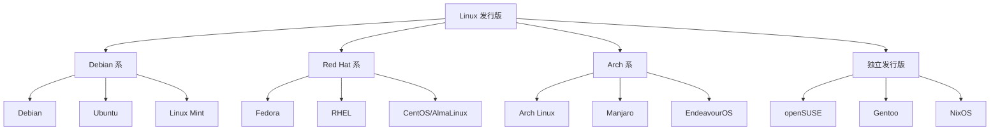

# Linux 发行版详细介绍

Linux 发行版（Distribution）是基于 Linux 内核构建的完整操作系统。本文详细介绍主流发行版的特点、优势和适用场景。

---

## 一、发行版概述

### 1.1 什么是 Linux 发行版？

Linux 发行版 = Linux 内核 + 软件包 + 包管理器 + 桌面环境 + 配置工具

不同发行版的主要区别在于：

- **包管理系统**：apt、dnf、pacman 等
- **发布策略**：滚动更新 vs 固定版本
- **默认软件选择**
- **目标用户群体**

### 1.2 主要分支



---

## 二、主流发行版详解

### 2.1 Fedora

:::important[Fedora 概览]
**定位**：社区驱动的前沿发行版，Red Hat 的上游实验场

**官网**：[https://fedoraproject.org/](https://fedoraproject.org/)
:::

| 特性 | 描述 |
|:-----|:-----|
| 包管理器 | DNF (RPM) |
| 发布周期 | 每 6 个月，支持 13 个月 |
| 内核版本 | 最新稳定版 |
| 默认桌面 | GNOME (原版体验) |
| 特色 | Wayland 默认，SELinux 开箱即用 |

**适合人群**：

- 开发者和技术爱好者
- 想体验最新 GNOME 的用户
- Red Hat 技术栈学习者

**版本选择**：

- **Fedora Workstation**：桌面版，GNOME 体验
- **Fedora Server**：服务器版
- **Fedora Spins**：KDE、Xfce 等桌面变体
- **Fedora Silverblue**：不可变系统，容器化工作流

---

### 2.2 Ubuntu

:::important[Ubuntu 概览]
**定位**：最流行的桌面 Linux，易用性优先

**官网**：[https://ubuntu.com/](https://ubuntu.com/)
:::

| 特性 | 描述 |
|:-----|:-----|
| 包管理器 | APT (DEB) + Snap |
| 发布周期 | 每 6 个月，LTS 每 2 年 |
| 支持周期 | 常规版 9 个月，LTS 5 年 |
| 默认桌面 | GNOME (定制版) |
| 特色 | 庞大的软件生态，广泛的硬件支持 |

**版本类型**：

- **Ubuntu Desktop**：桌面版
- **Ubuntu Server**：服务器版
- **Ubuntu LTS**：长期支持版（22.04, 24.04）

**衍生版本**：

- **Kubuntu**：KDE 桌面
- **Xubuntu**：Xfce 桌面
- **Ubuntu MATE**：MATE 桌面
- **Pop!_OS**：System76 定制版

---

### 2.3 Arch Linux

:::important[Arch Linux 概览]
**定位**：简洁、灵活的滚动更新发行版

**官网**：[https://archlinux.org/](https://archlinux.org/)

**Wiki**：[https://wiki.archlinux.org/](https://wiki.archlinux.org/) （最全面的 Linux 文档）
:::

| 特性 | 描述 |
|:-----|:-----|
| 包管理器 | pacman + AUR |
| 发布策略 | 滚动更新 |
| 安装方式 | 命令行手动安装 |
| 默认桌面 | 无（用户自选） |
| 特色 | KISS 原则，最新软件 |

**AUR (Arch User Repository)**：
社区维护的软件仓库，几乎包含所有能想到的软件。

```bash
# 安装 AUR 助手 yay
git clone https://aur.archlinux.org/yay.git
cd yay && makepkg -si
```

**衍生版本**：

- **Manjaro**：易用的 Arch 变体
- **EndeavourOS**：接近原版 Arch 的安装便利版
- **Garuda Linux**：游戏和性能优化

---

### 2.4 Debian

:::important[Debian 概览]
**定位**：稳定、自由的通用操作系统

**官网**：[https://www.debian.org/](https://www.debian.org/)
:::

| 特性 | 描述 |
|:-----|:-----|
| 包管理器 | APT (DEB) |
| 发布策略 | 稳定版约 2 年一次 |
| 分支 | Stable, Testing, Unstable (Sid) |
| 默认桌面 | GNOME |
| 特色 | 极高稳定性，纯自由软件 |

**适合场景**：

- 服务器生产环境
- 稳定性优先的工作站
- 自由软件信仰者

---

### 2.5 openSUSE

:::important[openSUSE 概览]
**定位**：企业级稳定性与社区创新的结合

**官网**：[https://www.opensuse.org/](https://www.opensuse.org/)
:::

**两个版本**：

| 版本 | 特点 |
|:-----|:-----|
| **Leap** | 固定版本，与 SUSE Linux Enterprise 共享代码库 |
| **Tumbleweed** | 滚动更新，最新软件 |

**特色工具**：

- **YaST**：强大的系统配置工具
- **OBS (Open Build Service)**：软件构建平台
- **Btrfs + Snapper**：快照和回滚

---

### 2.6 其他值得关注的发行版

| 发行版 | 特色 | 官网 |
|:-------|:-----|:-----|
| **Linux Mint** | 最友好的桌面体验 | [linuxmint.com](https://linuxmint.com/) |
| **NixOS** | 声明式系统配置 | [nixos.org](https://nixos.org/) |
| **Gentoo** | 源码编译，极致定制 | [gentoo.org](https://www.gentoo.org/) |
| **Void Linux** | 轻量，runit init | [voidlinux.org](https://voidlinux.org/) |
| **Alpine Linux** | 极简，musl libc | [alpinelinux.org](https://alpinelinux.org/) |
| **Kali Linux** | 安全和渗透测试 | [kali.org](https://www.kali.org/) |

---

## 三、发行版选择指南

### 3.1 按使用场景

| 场景 | 推荐发行版 |
|:-----|:-----------|
| 新手入门 | Ubuntu, Linux Mint |
| 开发工作站 | Fedora, Ubuntu |
| 服务器 | Debian, AlmaLinux, Ubuntu Server |
| 极客/定制 | Arch, Gentoo |
| 安全测试 | Kali, Parrot |
| 老旧硬件 | Lubuntu, antiX |
| 容器基础镜像 | Alpine |

### 3.2 按技术栈

| 技术需求 | 推荐发行版 |
|:---------|:-----------|
| RHEL 兼容 | Fedora, AlmaLinux, Rocky Linux |
| 最新内核 | Fedora, Arch, openSUSE Tumbleweed |
| 稳定至上 | Debian Stable, Ubuntu LTS |
| Wayland 原生 | Fedora (GNOME 最佳支持) |

---

## 四、包管理器对比

| 系统 | 命令 | 安装软件 | 更新系统 |
|:-----|:-----|:---------|:---------|
| Debian/Ubuntu | apt | `apt install pkg` | `apt upgrade` |
| Fedora/RHEL | dnf | `dnf install pkg` | `dnf upgrade` |
| Arch | pacman | `pacman -S pkg` | `pacman -Syu` |
| openSUSE | zypper | `zypper install pkg` | `zypper dup` |
| Gentoo | emerge | `emerge pkg` | `emerge -uDN @world` |

---

## 总结

没有"最好"的发行版，只有最适合你需求的发行版：

- **追求稳定**：Debian Stable、Ubuntu LTS
- **追求新鲜**：Fedora、Arch、Tumbleweed
- **追求便捷**：Ubuntu、Linux Mint
- **追求学习**：Arch、Gentoo
- **追求企业**：RHEL、SUSE

:::tip[我的选择]
本博客作者使用 **Fedora 43 Workstation**：

- 最新 GNOME 49 + Wayland
- DNF 包管理现代化
- 对 AMD 硬件支持良好

:::
