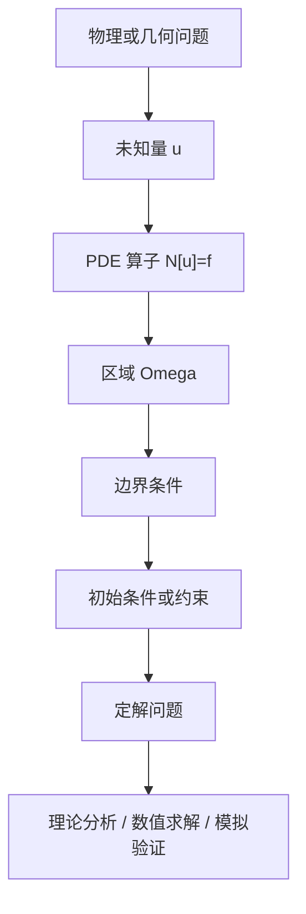

偏微分方程（Partial Differential Equation, PDE）研究的是含有多元未知函数及其偏导数的方程。它是数学分析、几何、概率、物理建模和科学计算交汇处的核心语言。

如果常微分方程描述的是“沿时间演化的一条轨迹”，那么 PDE 描述的往往是“空间和时间中的场”：温度场、速度场、电磁场、浓度场、形变场、概率密度、金融价值函数等。

## 1. PDE 是什么

设

$$
u:\Omega\subset\mathbb{R}^n\to\mathbb{R}
$$

是未知函数。一个 $k$ 阶 PDE 可以抽象写成

$$
F\left(x,u(x),Du(x),D^2u(x),\dots,D^ku(x)\right)=0.
$$

这里：

- $x=(x_1,\dots,x_n)$ 是自变量；
- $Du$ 是梯度；
- $D^2u$ 是 Hessian；
- $D^ku$ 表示 $k$ 阶偏导数组；
- $F$ 是给定的函数或算子。

例如一维热方程

$$
u_t-\kappa u_{xx}=0
$$

描述温度随时间扩散；波动方程

$$
u_{tt}-c^2\Delta u=0
$$

描述振动和传播；Poisson 方程

$$
-\Delta u=f
$$

描述静态势场、稳态温度、电势和压力等问题。

## 2. 只写 PDE 还不够

PDE 本身通常不能唯一确定解。必须配合区域、边界条件、初始条件或其他约束，形成定解问题。

一个典型初边值问题可以写为

$$
\mathcal{N}[u]=f,\qquad (x,t)\in\Omega\times(0,T],
$$

$$
\mathcal{B}[u]=g,\qquad (x,t)\in\partial\Omega\times(0,T],
$$

$$
u(x,0)=u_0(x),\qquad x\in\Omega.
$$

定解问题的核心问题是 Hadamard 意义下的适定性：

1. 是否存在解；
2. 解是否唯一；
3. 解是否连续依赖于数据。

如果一个问题不适定，即使写出了漂亮的 PDE，也可能无法稳定求解。

## 3. 三类经典二阶线性方程

二阶线性 PDE 常写成

$$
\sum_{i,j=1}^n a_{ij}(x)u_{x_ix_j}
+\sum_{i=1}^n b_i(x)u_{x_i}
+c(x)u=f.
$$

在二维常系数情形中，可以根据判别式

$$
B^2-AC
$$

把方程分为椭圆型、抛物型和双曲型。

| 类型 | 典型方程 | 直观含义 | 常见问题 |
|---|---|---|---|
| 椭圆型 | $-\Delta u=f$ | 稳态、平衡、势场 | 边值问题 |
| 抛物型 | $u_t-\Delta u=f$ | 扩散、耗散、平滑化 | 初边值问题 |
| 双曲型 | $u_{tt}-c^2\Delta u=f$ | 波传播、有限传播速度 | 初值或初边值问题 |

这个分类不是形式主义。它决定了解的性质，也决定了数值方法的稳定性要求。

## 4. 线性、半线性、拟线性、完全非线性

按非线性程度，PDE 常分为：

- 线性：最高阶导数和低阶项都线性出现；
- 半线性：最高阶部分线性，非线性只出现在低阶项；
- 拟线性：最高阶导数线性出现，但系数依赖于 $u$ 或低阶导数；
- 完全非线性：最高阶导数也非线性出现。

例如

$$
u_t-\Delta u=u^3
$$

是半线性反应扩散方程；

$$
u_t+u u_x=0
$$

是拟线性一阶方程；

$$
\det D^2u=f
$$

是完全非线性的 Monge-Ampere 型方程。

非线性 PDE 的困难在于叠加原理失效。线性方程中常用的 Fourier 分解、Green 函数和谱理论，在非线性问题中只能局部或间接使用。

## 5. 三个基本模型

### 5.1 热方程

$$
u_t-\kappa\Delta u=0.
$$

热方程体现扩散和平滑。即使初始数据不光滑，正时间后的解通常也会变得更光滑。这类方程中的关键词包括能量估计、最大值原理、半群、正则化效应。

### 5.2 波方程

$$
u_{tt}-c^2\Delta u=0.
$$

波方程体现传播。它有有限传播速度，局部扰动不会瞬间影响整个空间。研究波方程时常见工具包括能量守恒、特征锥、Duhamel 原理和 Strichartz 估计。

### 5.3 Laplace 与 Poisson 方程

$$
\Delta u=0,\qquad -\Delta u=f.
$$

Laplace 方程的解称为调和函数。它们具有平均值性质、最大值原理和强正则性。Poisson 方程则是椭圆理论的原型，在电磁学、流体压力、几何分析中反复出现。

## 6. PDE 学习路线图

入门阶段不必一开始就追求最抽象的理论。更稳妥的顺序是：

1. 先理解三大模型方程；
2. 学会分离变量、Fourier 变换、Green 函数；
3. 学会能量方法；
4. 进入弱解和 Sobolev 空间；
5. 再学习椭圆、抛物、双曲方程的一般理论；
6. 根据兴趣进入流体、几何分析、反应扩散、守恒律、随机 PDE 或数值 PDE。

## 7. PDE 研究在问什么

PDE 研究不只是“求解方程”。更常见的问题包括：

- 解是否存在；
- 解是否唯一；
- 解是否光滑；
- 如果数据小，解是否整体存在；
- 如果数据大，是否会爆破；
- 解的长期行为是什么；
- 奇性如何形成和传播；
- 数值方法是否稳定、收敛、保持结构；
- 模型参数如何从数据中识别。

这些问题构成了 PDE 理论、数值分析和科学计算的共同底层。

## 8. 入门时容易误解的点

第一，PDE 的“解”不一定是古典解。很多重要方程没有足够光滑的解，只能在弱解、粘性解、熵解或分布意义下理解。

第二，求出显式公式不是 PDE 研究的主要目标。大多数非线性 PDE 没有显式解，研究重点是估计、结构、定性行为和数值近似。

第三，数值解不是理论解的替代品。数值结果需要稳定性、收敛性和误差分析支撑，否则模拟可能只是漂亮的图像。

第四，PDE 的分类和边界条件必须匹配。给双曲方程加错边界条件，或者给椭圆方程加不合适的数据，都可能导致问题不适定。

## 9. 小结

PDE 是研究连续场的数学语言。入门时可以抓住四个核心问题：

$$
\text{模型从哪里来？}
\quad
\text{解是什么意思？}
\quad
\text{问题是否适定？}
\quad
\text{如何分析或近似？}
$$

后续学习可以分成三条线：理论求解、数值求解、数值模拟。理论线关注存在性、唯一性、正则性和定性行为；数值线关注离散、稳定、收敛和误差；模拟线关注建模、网格、算法、参数、验证和可重复实验。

## 参考资料

1. Lawrence C. Evans. [Partial Differential Equations](https://www.ams.org/gsm/019). American Mathematical Society, Graduate Studies in Mathematics, Vol. 19.
2. Michael E. Taylor. [Partial Differential Equations I: Basic Theory](https://link.springer.com/book/10.1007/978-1-4419-7055-8). Springer.
3. MIT OpenCourseWare. [Linear Partial Differential Equations: Analysis and Numerics](https://ocw.mit.edu/courses/18-303-linear-partial-differential-equations-analysis-and-numerics-fall-2014/).
4. 北京大学数学学院. [偏微分方程课程说明](https://math.pku.edu.cn/bks/sykc/148707.htm).
