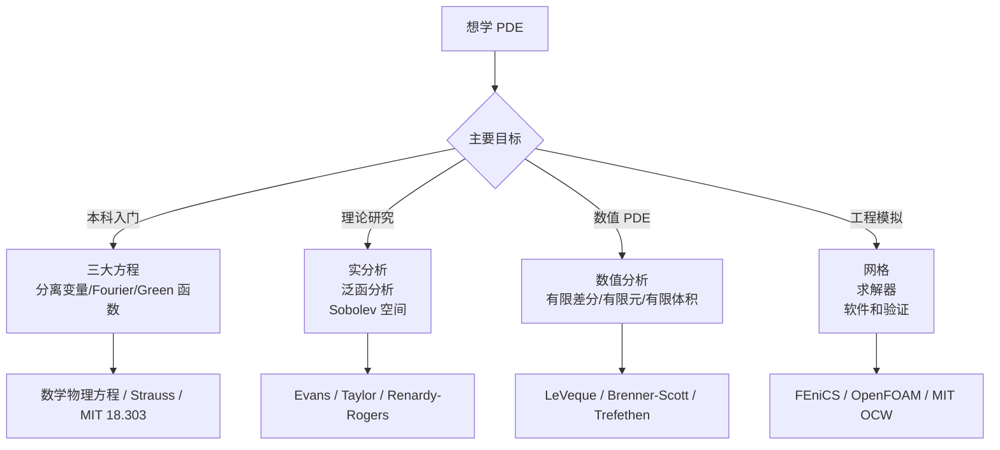

PDE 的教材很多，但它们面向的读者差异很大。有的偏数学物理和公式计算，有的偏现代分析和弱解，有的偏数值方法，有的偏工程模拟。选书时最重要的不是“哪本最权威”，而是先明确目标。

这篇文章按学习阶段和方向整理一条相对稳妥的路线。

## 1. 先判断自己的目标

如果你还没学过实分析、泛函分析和 Fourier 分析，不建议直接啃 Evans。可以先从三大方程、分离变量和能量方法建立直觉。

## 2. 国内教材推荐

### 2.1 《数学物理方程》

谷超豪、李大潜、陈恕行、郑宋穆、谭永基编写的《数学物理方程》是国内经典教材，适合本科阶段理解波动方程、热传导方程和调和方程。

它的优点是：

- 与国内数学系课程匹配；
- 强调三大典型方程；
- 适合建立分离变量、Fourier 级数、Green 函数等基本方法；
- 对物理背景和定解问题讲得比较自然。

适合读者：第一次系统学习 PDE 的数学、物理、工程学生。

### 2.2 陈祖墀《偏微分方程》

陈祖墀《偏微分方程》偏向数学系本科到研究生初步阶段，内容从一阶方程、二阶方程分类到古典理论与现代观点都有涉及。

适合读者：已经学过数学分析、高等代数、常微分方程，希望从本科 PDE 过渡到现代 PDE 的学生。

### 2.3 陈恕行《现代偏微分方程导论》

陈恕行《现代偏微分方程导论》更偏现代 PDE 理论，涉及广义函数、Sobolev 空间、椭圆边值问题、能量方法和半群方法。

适合读者：准备进入 PDE 理论研究，或者已经具备实分析、泛函分析基础的学生。

### 2.4 周蜀林《偏微分方程》

北京大学数学学院课程页列出的参考书包括周蜀林《偏微分方程》和 Evans 的教材。这个路线更接近数学系现代 PDE 入门：先理解经典方程，再逐步进入 Sobolev 空间和弱解。

适合读者：想按国内数学系课程路线系统学习的人。

## 3. 国外入门教材

### 3.1 Walter Strauss, Partial Differential Equations: An Introduction

Strauss 的书适合本科高年级或研究生初学者。它比 Evans 更友好，强调经典方程、Fourier 方法、波方程、热方程和 Laplace 方程。

适合读者：想先做题、看公式、理解模型，再进入抽象理论的人。

### 3.2 Fritz John, Partial Differential Equations

Fritz John 的书是经典的第二遍阅读材料。它不追求百科全书式覆盖，而是强调 PDE 的核心思想和方法。

适合读者：已经学过一门 PDE，希望补充理论深度的人。

### 3.3 Lawrence C. Evans, Partial Differential Equations

Evans 是现代 PDE 入门的标准教材之一。它覆盖一阶方程、Hamilton-Jacobi 方程、守恒律、椭圆方程、抛物方程、双曲方程、变分法和 Sobolev 空间等内容。

但它并不适合零基础。读 Evans 前最好具备：

- 实分析；
- 泛函分析基础；
- 测度与 $L^p$ 空间；
- Fourier 分析基本概念；
- 常微分方程和数学物理方程经验。

适合读者：准备做 PDE 理论、变分法、几何分析、流体方程或数学物理方向的研究生。

### 3.4 Taylor, Partial Differential Equations I-III

Michael Taylor 的三卷本覆盖面广，理论和背景都很丰富。第一卷适合现代 PDE 基础，后两卷进入更高级主题。

适合读者：需要长期查阅、希望系统补齐分析工具的研究生。

### 3.5 Gilbarg-Trudinger, Elliptic Partial Differential Equations of Second Order

这是椭圆方程正则性理论的经典专著。它不是第一本 PDE 入门书，而是进入椭圆 PDE、几何分析、非线性椭圆方程时的重要参考。

适合读者：已经学过弱解、Sobolev 空间和基础椭圆理论的人。

## 4. 数值 PDE 教材

### 4.1 LeVeque, Finite Difference Methods for ODEs and PDEs

Randall LeVeque 的有限差分教材非常适合入门数值 PDE。它重视稳定性、收敛性、时间相关问题和实际离散格式。

适合读者：想从差分法进入数值 PDE 的学生。

### 4.2 LeVeque, Finite Volume Methods for Hyperbolic Problems

如果关注守恒律、激波、流体和双曲问题，LeVeque 的有限体积书非常重要。它系统讲解 Godunov 方法、Riemann 问题、高分辨率格式和多维问题。

适合读者：学习 CFD、守恒律和双曲 PDE 数值方法的人。

### 4.3 Brenner and Scott, The Mathematical Theory of Finite Element Methods

这本书是有限元理论的重要教材，强调 Sobolev 空间、插值估计、Galerkin 方法和误差分析。

适合读者：想从数学角度理解有限元收敛性和误差估计的人。

### 4.4 Trefethen, Spectral Methods in MATLAB

Trefethen 的谱方法教材短小精悍，非常适合快速进入 Chebyshev 和 Fourier 谱方法。它强调用代码理解高精度计算。

适合读者：想做高精度数值实验、谱方法或光滑问题模拟的人。

### 4.5 Larsson and Thomee, Partial Differential Equations with Numerical Methods

这本书把基本 PDE 理论和数值方法结合起来，适合想同时理解分析与离散的人。

适合读者：希望在理论 PDE 和数值 PDE 之间搭桥的学生。

## 5. 在线课程和讲义

### 5.1 MIT 18.303

MIT OpenCourseWare 的 Linear Partial Differential Equations: Analysis and Numerics 很适合作为入门课程。它把线性 PDE 的分析和计算放在一起，覆盖热方程、波方程、Poisson 方程等基本模型。

### 5.2 MIT Numerical Methods for PDEs

MIT OCW 的 Numerical Methods for Partial Differential Equations 适合补充数值 PDE，尤其是已经学过基础数值分析和线性代数的人。

### 5.3 北京大学偏微分方程课程页

北大课程页给出国内数学系 PDE 课程的目标和参考书，适合对照国内培养方案安排学习路线。

### 5.4 FEniCS Tutorial

FEniCS Tutorial 适合从有限元理论走向实际 PDE 编程。它用 Python 和弱形式描述 PDE，适合做可复现实验。

### 5.5 OpenFOAM User Guide

OpenFOAM 更偏工程 CFD 和有限体积模拟。它不适合作为 PDE 理论入门，但适合学习有限体积求解器、边界条件、离散格式和实际案例组织。

## 6. 推荐学习路线

### 路线 A：本科入门

1. 多元微积分、常微分方程、线性代数；
2. 《数学物理方程》或 Strauss；
3. 学热方程、波方程、Laplace 方程；
4. 做分离变量、Fourier 级数、Green 函数题；
5. 用 Python 写一维热方程和波方程差分程序。

### 路线 B：理论 PDE

1. 实分析、测度论、泛函分析；
2. Sobolev 空间和弱收敛；
3. Evans 或 Taylor 第一卷；
4. 椭圆方程、抛物方程、双曲方程基础；
5. 根据方向读 Gilbarg-Trudinger、Dafermos、Ladyzhenskaya、Majda 等专门教材。

### 路线 C：数值 PDE

1. 数值线性代数；
2. 有限差分和稳定性；
3. 有限元弱形式和误差估计；
4. 有限体积和守恒律；
5. 谱方法和高阶方法；
6. 实现 Poisson、heat、wave、advection、Burgers 方程。

### 路线 D：工程模拟

1. 学会无量纲化和物理建模；
2. 学一种离散方法，例如 FVM 或 FEM；
3. 学一个软件栈，例如 OpenFOAM 或 FEniCS；
4. 做网格收敛和 benchmark；
5. 记录可重复实验；
6. 再进入湍流、多物理耦合、复杂边界或高性能计算。

## 7. 如何读 PDE 书

不要按“从第一页读到最后一页”的方式硬啃。更好的方法是按模型和工具交叉学习：

- 先把热、波、Laplace 方程各做一遍；
- 每个方程都问存在性、唯一性、能量、最大值原理或传播性质；
- 对每个方程写一个最小数值程序；
- 遇到弱解时回头补 Sobolev 空间；
- 遇到数值振荡时回头补稳定性分析；
- 遇到复杂几何时再学有限元软件。

PDE 学习最怕只读定义不做题，也怕只跑程序不看理论。理论和计算需要互相校验。

## 8. 小结

PDE 学习资源可以按目的选择：

| 目标 | 推荐起点 |
|---|---|
| 本科入门 | 《数学物理方程》、Strauss、MIT 18.303 |
| 现代 PDE 理论 | Evans、Taylor、Renardy-Rogers |
| 椭圆方程深入 | Gilbarg-Trudinger |
| 有限差分 | LeVeque FDM |
| 有限体积 | LeVeque FVM |
| 有限元理论 | Brenner-Scott |
| 谱方法 | Trefethen |
| 有限元编程 | FEniCS Tutorial |
| CFD 模拟 | OpenFOAM User Guide |

最实际的路线是：先用经典方程建立直觉，再用分析工具建立严谨性，最后用数值方法和模拟工具把问题落到计算实验中。

## 参考资料

1. 高等教育出版社. [《数学物理方程》第四版](https://mall.hep.com.cn/goods-41402.html).
2. 北京大学数学学院. [偏微分方程课程说明](https://math.pku.edu.cn/bks/sykc/148707.htm).
3. Lawrence C. Evans. [Partial Differential Equations](https://www.ams.org/gsm/019). AMS.
4. Michael E. Taylor. [Partial Differential Equations I: Basic Theory](https://link.springer.com/book/10.1007/978-1-4419-7055-8). Springer.
5. Fritz John. [Partial Differential Equations](https://link.springer.com/book/9780387906096). Springer.
6. Michael Renardy, Robert C. Rogers. [An Introduction to Partial Differential Equations](https://link.springer.com/book/10.1007/b97427). Springer.
7. Randall J. LeVeque. [Finite Difference Methods for Ordinary and Partial Differential Equations](https://epubs.siam.org/doi/10.1137/1.9780898717839). SIAM.
8. Randall J. LeVeque. [Finite Volume Methods for Hyperbolic Problems](https://www.cambridge.org/core/books/finite-volume-methods-for-hyperbolic-problems/97D5D1ACB1926DA1D4D52EAD6909E2B9). Cambridge University Press.
9. Susanne C. Brenner, L. Ridgway Scott. [The Mathematical Theory of Finite Element Methods](https://link.springer.com/book/10.1007/978-0-387-75934-0). Springer.
10. Lloyd N. Trefethen. [Spectral Methods in MATLAB](https://www.mathworks.com/academia/books/spectral-methods-in-matlab-trefethen.html). SIAM.
11. FEniCS Project. [Solving PDEs in Python: The FEniCS Tutorial](https://pub.fenicsproject.org/tutorial/pdf/fenics-tutorial-vol1.pdf).
12. OpenFOAM. [User Guide: Schemes](https://www.openfoam.com/documentation/guides/latest/doc/guide-schemes.html).
