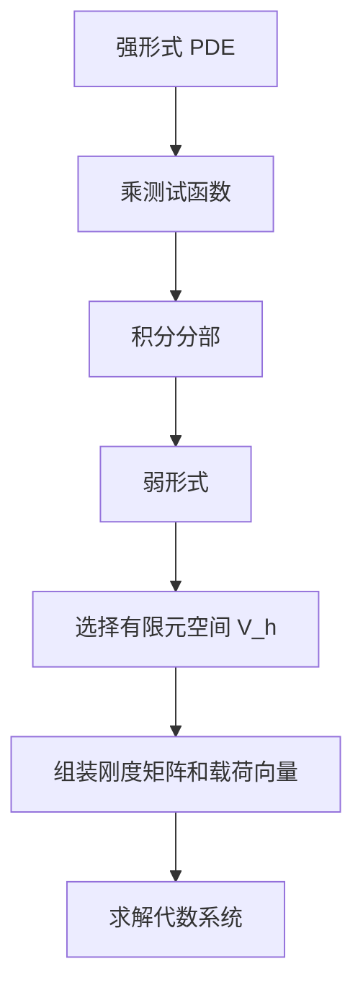

PDE 的数值求解目标是把连续定解问题转化为有限维代数问题。这个转化看似技术性很强，但背后的主线非常清晰：

$$
\text{连续方程}
\to
\text{离散空间}
\to
\text{代数系统}
\to
\text{误差与稳定性分析}.
$$

不同数值方法的差异，主要在于如何表示未知函数、如何近似微分算子、如何处理边界条件，以及是否保持守恒、稳定和几何结构。

## 1. 数值 PDE 的基本流程

例如 Poisson 方程

$$
-\Delta u=f,\qquad u|_{\partial\Omega}=0
$$

离散后常得到

$$
A_h u_h=f_h.
$$

其中 $A_h$ 是离散 Laplace 算子，$u_h$ 是有限维未知量，$f_h$ 是右端项离散。数值分析关心的是

$$
\|u-u_h\|
$$

如何随网格尺度 $h\to0$ 下降。

## 2. 有限差分法

有限差分法（Finite Difference Method, FDM）直接用网格函数近似导数。以一维二阶导数为例：

$$
u''(x_i)
\approx
\frac{u_{i-1}-2u_i+u_{i+1}}{h^2}.
$$

对热方程

$$
u_t=\kappa u_{xx}
$$

显式差分格式可以写成

$$
u_i^{n+1}
=u_i^n
\mu\left(u_{i-1}^n-2u_i^n+u_{i+1}^n\right),
\qquad
\mu=\frac{\kappa\Delta t}{h^2}.
$$

这个格式简单直观，但稳定性要求严格。在经典显式热方程格式中，$\mu$ 不能太大，否则数值解会振荡甚至爆炸。

有限差分法适合：

- 规则区域；
- 结构网格；
- 低维教学和原型验证；
- 对差分稳定性、截断误差和 Fourier 分析的学习。

它不太适合复杂几何和非结构网格，除非引入更复杂的坐标变换或嵌入边界技术。

## 3. 有限元法

有限元法（Finite Element Method, FEM）从弱形式出发。仍以 Poisson 方程为例：

$$
-\Delta u=f,\qquad u|_{\partial\Omega}=0.
$$

乘以测试函数 $v$ 并积分分部，得到弱形式：

$$
\int_\Omega \nabla u\cdot\nabla v\,dx
=
\int_\Omega f v\,dx,
\qquad
\forall v\in H_0^1(\Omega).
$$

有限元方法选择有限维子空间

$$
V_h\subset H_0^1(\Omega)
$$

并寻找

$$
u_h\in V_h
$$

使得

$$
\int_\Omega \nabla u_h\cdot\nabla v_h\,dx
=
\int_\Omega f v_h\,dx,
\qquad
\forall v_h\in V_h.
$$

若取基函数 $\{\phi_i\}_{i=1}^N$，写

$$
u_h=\sum_{j=1}^N U_j\phi_j,
$$

就得到线性系统

$$
KU=F,
$$

其中

$$
K_{ij}=\int_\Omega \nabla\phi_j\cdot\nabla\phi_i\,dx,
\qquad
F_i=\int_\Omega f\phi_i\,dx.
$$

有限元法适合复杂几何、变系数问题、椭圆和抛物问题，以及需要严谨误差估计的场景。它的数学基础是变分法、Sobolev 空间和 Galerkin 投影。

## 4. 有限体积法

有限体积法（Finite Volume Method, FVM）从守恒律出发。考虑守恒型方程

$$
u_t+\nabla\cdot F(u)=S(u).
$$

对控制体 $K$ 积分：

$$
\frac{d}{dt}\int_K u\,dx
+\int_{\partial K} F(u)\cdot n\,ds
=
\int_K S(u)\,dx.
$$

使用散度定理后，通量穿过单元边界的量成为核心。有限体积法的关键是构造数值通量

$$
\widehat{F}_{ij}
$$

近似相邻控制体之间的真实通量。

有限体积法特别适合：

- 流体力学；
- 双曲守恒律；
- 激波和间断；
- 守恒量必须精确保守的问题；
- 非结构网格上的工程 CFD。

有限体积法中最重要的思想之一是：不要只离散微分形式，而要离散积分守恒形式。这样可以在离散层面保持质量、动量、能量等守恒结构。

## 5. 谱方法

谱方法（Spectral Method）用全局基函数近似解，例如 Fourier 基、Chebyshev 多项式或 Legendre 多项式：

$$
u_N(x)=\sum_{k=0}^N a_k\phi_k(x).
$$

如果解足够光滑，谱方法可能具有非常快的收敛速度，常被称为谱精度。对周期问题，Fourier 谱方法尤其自然；对有限区间，Chebyshev 谱方法很常见。

谱方法适合：

- 光滑解；
- 简单几何；
- 高精度基准计算；
- 稳定性和湍流等需要高分辨率的研究问题。

它的缺点也明显：复杂几何、间断解和激波会带来 Gibbs 现象，需要滤波、谱元或其他技术处理。

## 6. 方法对比

| 方法 | 基本思想 | 优点 | 主要限制 |
|---|---|---|---|
| 有限差分 | 用差商近似导数 | 简单、直观、适合规则网格 | 复杂几何困难 |
| 有限元 | 弱形式 + 分片多项式空间 | 适合复杂区域，理论成熟 | 需要变分形式和网格组装 |
| 有限体积 | 控制体积分守恒 | 守恒性好，适合流体和激波 | 高阶重构和通量设计复杂 |
| 谱方法 | 全局高阶基展开 | 光滑问题高精度 | 复杂几何和间断困难 |

选择方法时，不应只问“哪个方法更高级”，而应问：

1. 方程是否守恒型；
2. 区域几何是否复杂；
3. 解是否光滑；
4. 是否存在激波或边界层；
5. 需要严格误差估计还是工程可用结果；
6. 计算规模和求解器成本是否可接受。

## 7. 稳定性、相容性、收敛性

数值 PDE 中最基本的三件事是：

- 相容性：离散方程是否逼近原方程；
- 稳定性：误差是否被算法放大；
- 收敛性：$h,\Delta t\to0$ 时数值解是否趋向真实解。

对线性初值问题，Lax 等价思想给出重要启发：在适当条件下，相容性加稳定性可以推出收敛性。

在实际计算中，稳定性往往比形式精度更重要。一个二阶但不稳定的方法不如一个一阶但稳定、守恒、鲁棒的方法。

## 8. 一个数值求解者的检查清单

每次写一个 PDE 求解器，都应该回答：

- 离散变量放在哪里；
- 边界条件如何进入离散系统；
- 时间步长是否满足稳定性条件；
- 非线性方程如何迭代；
- 线性系统用什么求解器和预条件；
- 是否做了网格加密测试；
- 是否与解析解、制造解或基准结果比较。

## 9. 小结

PDE 数值求解的核心不是“把公式写成代码”，而是构造一个可靠的离散问题。可靠意味着：

$$
\text{相容}
+\text{稳定}
+\text{收敛}
+\text{结构保持}
+\text{可验证}.
$$

有限差分适合建立直觉，有限元适合复杂几何和弱形式理论，有限体积适合守恒律和 CFD，谱方法适合光滑问题的高精度计算。真正的数值 PDE 学习，应在模型、离散、分析和实验之间来回走。

## 参考资料

1. Randall J. LeVeque. [Finite Difference Methods for Ordinary and Partial Differential Equations](https://epubs.siam.org/doi/10.1137/1.9780898717839). SIAM, 2007.
2. Susanne C. Brenner, L. Ridgway Scott. [The Mathematical Theory of Finite Element Methods](https://link.springer.com/book/10.1007/978-0-387-75934-0). Springer.
3. Randall J. LeVeque. [Finite Volume Methods for Hyperbolic Problems](https://www.cambridge.org/core/books/finite-volume-methods-for-hyperbolic-problems/97D5D1ACB1926DA1D4D52EAD6909E2B9). Cambridge University Press.
4. Lloyd N. Trefethen. [Spectral Methods in MATLAB](https://www.mathworks.com/academia/books/spectral-methods-in-matlab-trefethen.html). SIAM, 2000.
5. Stig Larsson, Vidar Thomee. [Partial Differential Equations with Numerical Methods](https://link.springer.com/book/10.1007/978-3-540-88706-5). Springer.
