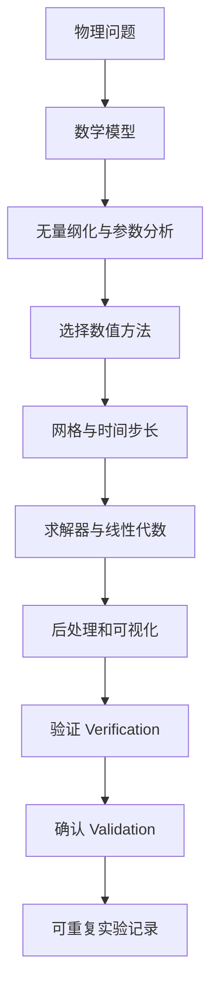
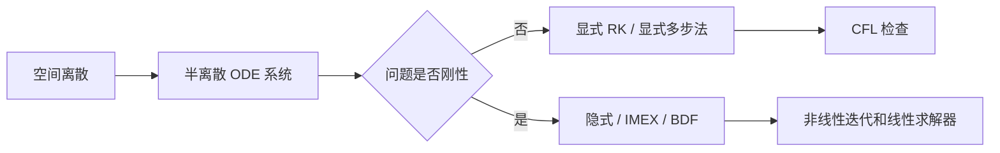

数值求解关注“算法是否正确”，数值模拟还要关注“计算实验是否可信”。一个 PDE 模拟项目通常不只是离散方程，还包括模型选择、参数标定、网格生成、求解器配置、后处理、误差评估和可重复性管理。

如果只得到一张漂亮图像，却不知道它是否收敛、是否守恒、是否对参数敏感，那么这还不是可靠的数值模拟。

## 1. PDE 模拟的整体流程

这里需要区分两个概念：

- Verification：方程求得对不对，代码和离散是否按预期工作；
- Validation：模型是否描述现实，模拟是否与实验或观测一致。

前者是数学和计算问题，后者是建模和科学问题。

## 2. 从物理问题到数学模型

一个模拟项目首先要明确未知量。例如：

- 热传导：温度 $u(x,t)$；
- 流体：速度 $v(x,t)$ 和压力 $p(x,t)$；
- 弹性：位移 $u(x,t)$；
- 反应扩散：浓度向量 $c(x,t)$；
- 电磁：电场 $E$、磁场 $B$。

然后写出守恒律或变分原理。例如标量输运方程可写为

$$
\frac{\partial u}{\partial t}
+\nabla\cdot F(u)
=S(u).
$$

如果通量包含对流和扩散，

$$
F(u)=vu-D\nabla u,
$$

就得到对流扩散反应模型

$$
u_t+\nabla\cdot(vu)-\nabla\cdot(D\nabla u)=S(u).
$$

建模阶段要明确：

1. 方程是否守恒；
2. 参数是否常数；
3. 是否存在源项；
4. 边界条件来自物理约束还是人为截断；
5. 初始条件是否可测。

## 3. 无量纲化为什么重要

无量纲化可以揭示主导机制，减少参数数量，也能改善数值条件数。

设长度尺度为 $L$，时间尺度为 $T$，量纲尺度为 $U$。令

$$
x=L\hat{x},\qquad t=T\hat{t},\qquad u=U\hat{u}.
$$

以对流扩散方程

$$
u_t+v u_x=D u_{xx}
$$

为例，无量纲化后会出现 Peclet 数

$$
\mathrm{Pe}=\frac{vL}{D}.
$$

当 $\mathrm{Pe}$ 很大时，对流占优，解可能出现边界层，中心差分容易产生非物理振荡；此时需要上风格式、稳定化有限元或有限体积通量限制器。

无量纲数通常比原始参数更能决定数值难度。

## 4. 网格不是细就好

网格决定了你能解析哪些空间尺度。过粗会漏掉关键结构，过细会带来巨大计算成本。

常见网格类型：

- 结构网格：实现简单，适合矩形或规则区域；
- 非结构网格：适合复杂几何，常用于 FEM/FVM；
- 自适应网格：在误差大或梯度大的区域加密；
- 谱网格：用于光滑解和简单区域的高精度计算。

网格质量也很重要。高扭曲单元、极小角、长细比过大的单元会让矩阵条件数变坏，并降低精度。

## 5. 时间推进

时间相关 PDE 离散后常得到半离散系统

$$
\frac{dU}{dt}=R(U,t).
$$

这时可以使用 ODE 时间积分方法：

- 显式 Euler；
- Runge-Kutta；
- 隐式 Euler；
- Crank-Nicolson；
- BDF；
- IMEX 方法。

显式方法每步便宜，但受 CFL 条件限制。隐式方法每步昂贵，需要解线性或非线性系统，但可以处理刚性扩散、反应项或大时间步。

## 6. 求解器与预条件

很多 PDE 模拟的计算瓶颈不在离散公式，而在线性代数。椭圆方程、隐式时间步、不可压流压力方程都会导致大型稀疏线性系统：

$$
A x=b.
$$

常见求解器包括：

- 直接法：LU、Cholesky，适合中小规模问题；
- Krylov 方法：CG、GMRES、BiCGSTAB；
- 多重网格：几何多重网格、代数多重网格；
- 预条件：Jacobi、ILU、Schwarz、AMG 等。

一个好的预条件器常常比更高阶的离散格式更重要。没有合适的线性求解器，复杂模型会卡在计算成本上。

## 7. 验证：不要跳过网格收敛

可靠模拟至少需要做以下检查：

### 7.1 制造解

选一个光滑函数 $u_{\mathrm{exact}}$，代入 PDE 反推出右端项 $f$，再检查数值方法能否收敛到该解析解。这叫 method of manufactured solutions。

### 7.2 网格收敛

使用 $h, h/2, h/4$ 等多组网格，观察误差是否按预期阶数下降：

$$
\|u-u_h\|\approx C h^p.
$$

### 7.3 守恒量检查

对守恒律问题，应检查质量、动量、能量或其他不变量。例如无源输运问题中，总质量应近似保持：

$$
\frac{d}{dt}\int_\Omega u(x,t)\,dx=0.
$$

### 7.4 基准算例

对 CFD、弹性、反应扩散等应用领域，应与公认 benchmark 比较，而不是只看图形合理。

## 8. 后处理与可视化

可视化不是装饰，而是诊断工具。常见后处理包括：

- 标量场等值线；
- 向量场箭头和流线；
- 残差随迭代变化；
- 守恒量随时间变化；
- 误差热图；
- 网格质量图；
- 参数扫描图。

可视化时要避免误导：

- 色标必须固定或明确；
- 不要只展示最漂亮的时刻；
- 不要忽略边界层和局部误差；
- 动画必须配合定量指标。

## 9. 可重复实验记录

一个可重复的 PDE 模拟至少应记录：

- 方程和边界条件；
- 参数和无量纲数；
- 网格文件或网格生成脚本；
- 离散格式；
- 时间步长和终止时间；
- 求解器、容差和预条件；
- 软件版本；
- 随机种子；
- 后处理脚本；
- 误差和守恒量表格。

建议把每次模拟看成一个实验，而不是一次随手运行。

## 10. 常用软件栈

不同问题适合不同工具：

| 场景 | 工具 |
|---|---|
| 教学和原型 | Python, NumPy, SciPy, Julia, MATLAB |
| 有限元研究 | FEniCS, Firedrake, deal.II, MFEM |
| CFD 和有限体积 | OpenFOAM, SU2, Clawpack |
| 高性能并行 | PETSc, Trilinos, hypre |
| 可视化 | ParaView, VisIt, matplotlib |

工具不是越复杂越好。初学阶段应先用小代码理解离散和稳定性，再逐步使用大型框架。

## 11. 小结

PDE 数值模拟的质量取决于整个链条：

$$
\text{模型}
\to
\text{离散}
\to
\text{求解器}
\to
\text{验证}
\to
\text{解释}.
$$

模拟不是“运行一个 solver”，而是构造一个可检验、可重复、可解释的计算实验。真正可靠的模拟结果，必须同时经得起数学误差分析、数值收敛测试和物理解释的检查。

## 参考资料

1. Anders Logg, Kent-Andre Mardal, Garth Wells, editors. [Automated Solution of Differential Equations by the Finite Element Method: The FEniCS Book](https://link.springer.com/book/10.1007/978-3-642-23099-8). Springer, 2012.
2. Hans Petter Langtangen, Anders Logg. [Solving PDEs in Python: The FEniCS Tutorial](https://pub.fenicsproject.org/tutorial/pdf/fenics-tutorial-vol1.pdf).
3. OpenFOAM Documentation. [Schemes and finite volume discretisation](https://www.openfoam.com/documentation/guides/latest/doc/guide-schemes.html).
4. MIT OpenCourseWare. [Numerical Methods for Partial Differential Equations](https://learn.mit.edu/c/unit/ocw?resource=4052).
5. MIT OpenCourseWare. [Linear Partial Differential Equations: Analysis and Numerics](https://ocw.mit.edu/courses/18-303-linear-partial-differential-equations-analysis-and-numerics-fall-2014/).
