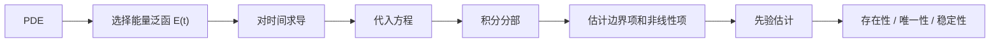
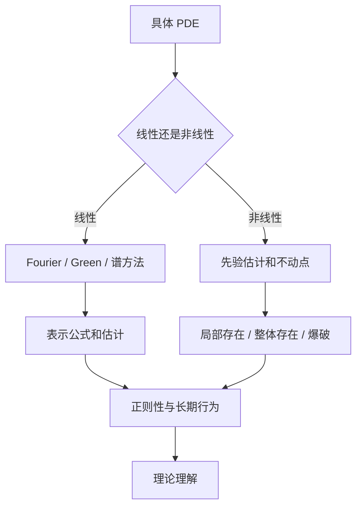

PDE 的理论求解不等于“找到显式公式”。在现代 PDE 中，显式解只是少数特殊问题的礼物。更多时候，理论求解意味着证明解存在、唯一、稳定、正则，并理解解的定性行为。

这篇文章整理几类最基础也最常用的方法。

## 1. 特征线方法

一阶 PDE 的原型是输运方程

$$
u_t+a u_x=0.
$$

它表示 $u$ 沿直线

$$
x-at=\text{constant}
$$

保持不变。因此解为

$$
u(x,t)=u_0(x-at).
$$

更一般的一阶拟线性方程

$$
a(x,t,u)u_x+b(x,t,u)u_t=c(x,t,u)
$$

可以转化为特征曲线上的 ODE 系统。特征线方法揭示了双曲方程的传播结构，也解释了为什么非线性输运方程会形成激波。

例如 Burgers 方程

$$
u_t+u u_x=0
$$

中，特征速度等于解本身。不同特征线可能相交，古典解在有限时间内失效，此时需要弱解和熵条件。

## 2. 分离变量

对规则区域上的线性 PDE，分离变量是一种经典方法。考虑区间 $(0,L)$ 上的热方程

$$
u_t=\kappa u_{xx},
\qquad
u(0,t)=u(L,t)=0.
$$

设

$$
u(x,t)=X(x)T(t).
$$

代入后得到

$$
\frac{T'}{\kappa T}
=
\frac{X''}{X}
=-\lambda.
$$

空间部分满足 Sturm-Liouville 问题

$$
X''+\lambda X=0,\qquad X(0)=X(L)=0.
$$

其特征函数为

$$
\sin\frac{n\pi x}{L}.
$$

因此解可展开为

$$
u(x,t)=\sum_{n=1}^{\infty}
b_n
e^{-\kappa(n\pi/L)^2t}
\sin\frac{n\pi x}{L}.
$$

分离变量的本质是谱分解：把 PDE 拆成空间算子的本征模态，再研究每个模态随时间的演化。

## 3. Fourier 变换

在全空间上，Fourier 变换把常系数线性 PDE 转化为频域中的代数方程或 ODE。

对热方程

$$
u_t-\kappa\Delta u=0
$$

取空间 Fourier 变换：

$$
\partial_t\widehat{u}(\xi,t)
+\kappa|\xi|^2\widehat{u}(\xi,t)=0.
$$

于是

$$
\widehat{u}(\xi,t)
=
e^{-\kappa|\xi|^2t}\widehat{u}_0(\xi).
$$

这直接展示了热方程的平滑效应：高频项被更快衰减。

对波方程，Fourier 变换会得到振荡因子；对 Schrodinger 方程，会得到色散相位。频域方法是现代线性 PDE 和色散方程分析的基础。

## 4. Green 函数和基本解

如果线性算子 $L$ 的基本解 $\Phi$ 满足

$$
L\Phi=\delta,
$$

那么方程

$$
Lu=f
$$

的解可以形式写成卷积

$$
u=\Phi*f.
$$

例如 Poisson 方程

$$
-\Delta u=f
$$

在 $\mathbb{R}^n$ 中的基本解给出势理论表示。Green 函数不仅用于求解，也用于证明正则性、最大值原理和边界估计。

Green 函数思想强调：线性 PDE 的解可以看成点源响应的叠加。

## 5. 最大值原理

椭圆和抛物方程中，最大值原理是非常强的工具。对调和函数

$$
\Delta u=0
$$

若 $\Omega$ 有界且 $u$ 连续到边界，则最大值和最小值在边界上取得。

这个原理可以推出：

- 解的唯一性；
- 比较原理；
- $L^\infty$ 估计；
- 非负性保持；
- 对边界数据的稳定依赖。

最大值原理的直觉是：没有内部源项时，椭圆方程不会在内部凭空产生峰值。

## 6. 能量方法

能量方法是 PDE 理论中最重要的思想之一。以波方程为例：

$$
u_{tt}-c^2\Delta u=0.
$$

定义能量

$$
E(t)
=
\frac12\int_\Omega
\left(
|u_t|^2+c^2|\nabla u|^2
\right)\,dx.
$$

在合适边界条件下，可以证明

$$
\frac{d}{dt}E(t)=0.
$$

这说明波方程能量守恒。对耗散方程，能量可能下降；对带源项方程，能量估计可以控制解的增长。

能量方法的核心是先得到先验估计，再通过逼近、紧性或极限过程证明解存在。

## 7. 弱解

很多 PDE 没有古典解。弱解的思想是把导数转移到测试函数上。

以 Poisson 方程为例：

$$
-\Delta u=f,\qquad u|_{\partial\Omega}=0.
$$

若 $u$ 不够光滑，不能逐点计算 $\Delta u$，但可以要求

$$
\int_\Omega \nabla u\cdot\nabla v\,dx
=
\int_\Omega f v\,dx,
\qquad
\forall v\in H_0^1(\Omega).
$$

这就是弱形式。它把问题放进 Sobolev 空间：

$$
u\in H_0^1(\Omega).
$$

弱解框架有两个巨大优点：

1. 允许更低正则性的解；
2. 与有限元法天然一致。

## 8. Lax-Milgram 定理

设 $V$ 是 Hilbert 空间，双线性型 $a(u,v)$ 连续且强制：

$$
|a(u,v)|\le C\|u\|_V\|v\|_V,
$$

$$
a(v,v)\ge \alpha\|v\|_V^2.
$$

若线性泛函 $F$ 连续，则存在唯一 $u\in V$ 使得

$$
a(u,v)=F(v),\qquad \forall v\in V.
$$

这是椭圆型 PDE 弱解存在唯一性的基本工具。对 Poisson 方程，

$$
a(u,v)=\int_\Omega \nabla u\cdot\nabla v\,dx.
$$

Poincare 不等式给出强制性，从而得到弱解。

## 9. 正则性问题

得到弱解只是第一步。接下来要问：弱解是否更光滑？

椭圆正则性理论大致告诉我们，如果

$$
-\Delta u=f
$$

且区域、边界和 $f$ 足够光滑，那么 $u$ 也会更光滑。粗略地说，二阶椭圆方程会让解比右端项多两个导数。

但正则性非常依赖：

- 方程类型；
- 系数光滑性；
- 区域边界；
- 边界条件；
- 非线性结构。

很多现代 PDE 研究的核心就是证明或否定正则性。

## 10. 理论求解路线图

入门阶段应优先掌握：

- 特征线；
- 分离变量；
- Fourier 变换；
- Green 函数；
- 最大值原理；
- 能量估计；
- 弱解；
- Sobolev 空间；
- Lax-Milgram 定理。

这些工具足以打开现代 PDE 的大门。

## 11. 小结

PDE 理论求解的目标是理解解，而不只是写出解。经典方法适合线性和规则问题；弱解、能量估计和泛函分析适合更一般的问题；非线性 PDE 则需要把先验估计、紧性、不动点、比较原理和结构条件结合起来。

可以把 PDE 理论学习概括为：

$$
\text{显式公式}
\to
\text{估计}
\to
\text{弱解}
\to
\text{正则性}
\to
\text{非线性结构}.
$$

这条路不短，但每一步都非常清楚。

## 参考资料

1. Lawrence C. Evans. [Partial Differential Equations](https://www.ams.org/gsm/019). AMS Graduate Studies in Mathematics.
2. Fritz John. [Partial Differential Equations](https://link.springer.com/book/9780387906096). Springer.
3. Michael E. Taylor. [Partial Differential Equations I: Basic Theory](https://link.springer.com/book/10.1007/978-1-4419-7055-8). Springer.
4. Michael Renardy, Robert C. Rogers. [An Introduction to Partial Differential Equations](https://link.springer.com/book/10.1007/b97427). Springer.
5. David Gilbarg, Neil S. Trudinger. [Elliptic Partial Differential Equations of Second Order](https://link.springer.com/book/10.1007/978-3-642-61798-0). Springer.
