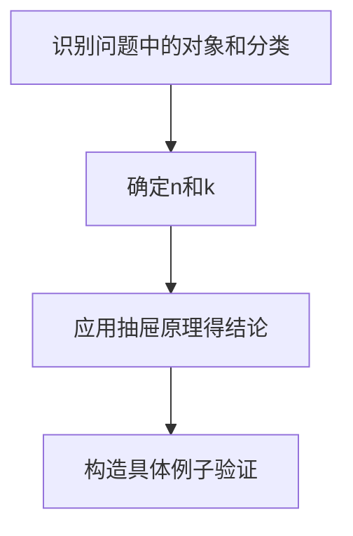

# 集合论中的抽屉原理

抽屉原理（又称鸽巢原理、Pigeonhole Principle）是组合数学中最基本却最强大的工具之一。本文将从严格的集合论视角出发，深入探讨这一原理。

---

## 一、基本形式

### 1.1 直观描述

:::important[抽屉原理（基本形式）]
如果将 $n+1$ 个物品放入 $n$ 个抽屉，则至少有一个抽屉包含两个或更多物品。
:::

### 1.2 集合论表述

设 $A$ 和 $B$ 是有限集合，$f: A \to B$ 是函数。若 $|A| > |B|$，则 $f$ 不是单射。

等价地：存在 $b \in B$，使得 $|f^{-1}(b)| \geq 2$。

### 1.3 严格证明

**反证法**：假设 $f$ 是单射，即 $\forall b \in B, |f^{-1}(b)| \leq 1$。

则：
$$
|A| = \sum_{b \in B} |f^{-1}(b)| \leq \sum_{b \in B} 1 = |B|
$$

这与 $|A| > |B|$ 矛盾。故假设不成立，$f$ 不是单射。 $\square$

---

## 二、一般化形式

### 2.1 加强版抽屉原理

:::important[加强版]
如果将 $n$ 个物品放入 $k$ 个抽屉，则至少有一个抽屉包含 $\lceil n/k \rceil$ 个或更多物品。
:::

**证明**：反证法。若每个抽屉最多 $\lceil n/k \rceil - 1$ 个物品，则总数：

$$
\text{总数} \leq k \cdot (\lceil n/k \rceil - 1) < k \cdot \frac{n}{k} = n
$$

矛盾！

### 2.2 无穷版本

设 $A$ 是无穷集，$B$ 是有限集，$f: A \to B$ 是函数。则存在 $b \in B$，使得 $f^{-1}(b)$ 是无穷集。

---

## 三、经典应用

### 3.1 数论应用

:::tip[例题 1]
证明：在任意 $n+1$ 个正整数中，必存在两个数，它们的差能被 $n$ 整除。
:::

**证明**：将这 $n+1$ 个数按模 $n$ 的余数分类，余数只有 $0, 1, \ldots, n-1$ 共 $n$ 种。

由抽屉原理，必有两个数 $a, b$ 余数相同，即 $a \equiv b \pmod{n}$，故 $n \mid (a-b)$。$\square$

### 3.2 几何应用

:::tip[例题 2]
在边长为 2 的等边三角形内任取 5 个点，证明存在两点距离不超过 1。
:::

**证明**：将三角形分成 4 个边长为 1 的小等边三角形。5 个点放入 4 个区域，由抽屉原理，至少有两点在同一小三角形内。

小三角形内任意两点的最大距离为边长 1，故存在两点距离 $\leq 1$。$\square$

### 3.3 Ramsey 理论入门

:::tip[例题 3]
证明：在任意 6 人聚会中，必存在 3 人两两相识或两两不相识。
:::

**证明**：任选一人 $A$，其他 5 人与 $A$ 的关系是"认识"或"不认识"。

由抽屉原理，至少 3 人与 $A$ 有相同关系。设 $B, C, D$ 都认识 $A$：

- 若 $B, C, D$ 中任两人相识，加上 $A$ 形成 3 人两两相识
- 若 $B, C, D$ 两两不相识，则这 3 人两两不相识

另一种情况类似。$\square$

---

## 四、进阶应用

### 4.1 循环小数

:::important[定理]
任意有理数 $\frac{p}{q}$（$\gcd(p,q)=1$，$q \nmid p$）的小数展开是循环的，且循环节长度不超过 $q-1$。
:::

**证明**：长除法中，余数只能是 $1, 2, \ldots, q-1$ 共 $q-1$ 种。

由抽屉原理，在不超过 $q$ 步内必出现重复余数，此后小数开始循环。$\square$

### 4.2 Erdős–Ginzburg–Ziv 定理

:::important[EGZ 定理]
任意 $2n-1$ 个整数中，必存在 $n$ 个整数，其和能被 $n$ 整除。
:::

这是抽屉原理在加法组合学中的深刻应用。

### 4.3 程序设计中的应用

**哈希冲突**：将 $n$ 个键映射到 $m$ 个槽位，若 $n > m$，必有冲突。

**生日悖论**：23 人中有两人同一天生日的概率超过 50%。

---

## 五、与基数理论的联系

### 5.1 有限基数

抽屉原理本质上刻画了有限集合的基数性质：

$$
|A| > |B| \Rightarrow \nexists \text{ 单射 } f: A \to B
$$

### 5.2 无穷基数

在无穷集合中，情况更为微妙：

- $|\mathbb{N}| = |\mathbb{Z}|$（可以建立双射）
- $|\mathbb{N}| < |\mathbb{R}|$（Cantor 对角线论证）

---

## 六、解题策略

**关键技巧**：

1. 明确"物品"和"抽屉"分别是什么
2. 正确计算物品数和抽屉数
3. 选择合适的分类方式

---

## 总结

抽屉原理虽然简单，却是解决"存在性"问题的利器。从数论到几何，从组合到计算机科学，它无处不在。理解其集合论本质，有助于我们在更抽象的层面运用这一工具。

:::note[延伸阅读]

- Ramsey 理论：抽屉原理的极大推广
- Dilworth 定理：偏序集上的抽屉原理
- Van der Waerden 定理：等差数列版本

:::
