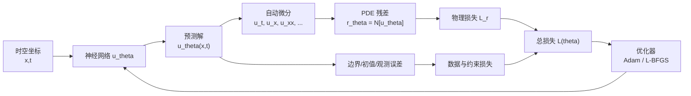
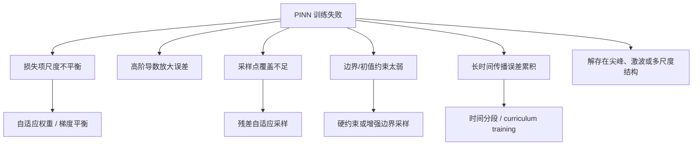

物理信息神经网络（Physics-Informed Neural Network, PINN）的核心思想很直接：用神经网络表示未知函数，同时把微分方程、边界条件、初始条件和少量观测数据一起写进损失函数。训练完成后，网络不仅拟合数据，还尽量满足给定的物理方程。

从数学上看，PINN 不是把 PDE “魔法般”交给深度学习，而是把一个连续问题转化为一个带物理残差的优化问题。它的优势、局限和调参困难，大多都能从这个转化过程里看出来。

## 1. 经典 PDE 问题设定

考虑一个定义在时空区域

$$
\mathcal{D} = \Omega \times [0,T]
$$

上的未知函数

$$
u:\mathcal{D}\to \mathbb{R}^m.
$$

一个典型的初边值问题可以写成

$$
\mathcal{N}[u](x,t;\lambda)=0,\qquad (x,t)\in \mathcal{D},
$$

$$
\mathcal{B}[u](x,t)=g(x,t),\qquad (x,t)\in \partial \mathcal{D},
$$

$$
u(x,0)=u_0(x),\qquad x\in\Omega.
$$

这里：

- $\mathcal{N}$ 是 PDE 算子，可以包含时间导数、空间导数、非线性项和未知物理参数；
- $\mathcal{B}$ 是边界算子，例如 Dirichlet、Neumann 或 Robin 条件；
- $\lambda$ 是可能已知也可能未知的物理参数；
- $g,u_0$ 是边界和初始数据。

传统数值方法通常先离散区域，再求解离散代数系统。PINN 的顺序不一样：先用一个可微神经网络

$$
u_\theta(x,t)
$$

近似未知解，然后在采样点上惩罚 PDE 残差。

## 2. PINN 的整体结构



PINN 中的“物理信息”通常并不直接改变网络结构，而是通过损失函数进入训练过程。最常见的形式是软约束（soft constraint）：允许网络暂时违反 PDE 和边界条件，但违反程度会被惩罚。

## 3. 残差与损失函数

令内部配置点（collocation points）为

$$
\{(x_r^i,t_r^i)\}_{i=1}^{N_r}\subset \mathcal{D},
$$

边界点为

$$
\{(x_b^i,t_b^i)\}_{i=1}^{N_b}\subset \partial\mathcal{D},
$$

初值点为

$$
\{x_0^i\}_{i=1}^{N_0}\subset \Omega.
$$

PDE 残差定义为

$$
r_\theta(x,t)=\mathcal{N}[u_\theta](x,t;\lambda).
$$

一个标准 PINN 损失可以写为

$$
\mathcal{L}(\theta,\lambda)
=w_r\mathcal{L}_r
+w_b\mathcal{L}_b
+w_0\mathcal{L}_0
+w_d\mathcal{L}_d,
$$

其中

$$
\mathcal{L}_r
=\frac{1}{N_r}\sum_{i=1}^{N_r}
\left\|r_\theta(x_r^i,t_r^i)\right\|^2,
$$

$$
\mathcal{L}_b
=\frac{1}{N_b}\sum_{i=1}^{N_b}
\left\|\mathcal{B}[u_\theta](x_b^i,t_b^i)-g(x_b^i,t_b^i)\right\|^2,
$$

$$
\mathcal{L}_0
=\frac{1}{N_0}\sum_{i=1}^{N_0}
\left\|u_\theta(x_0^i,0)-u_0(x_0^i)\right\|^2.
$$

如果有观测数据

$$
\{(x_d^i,t_d^i,y_d^i)\}_{i=1}^{N_d},
$$

还可以加入

$$
\mathcal{L}_d
=\frac{1}{N_d}\sum_{i=1}^{N_d}
\left\|u_\theta(x_d^i,t_d^i)-y_d^i\right\|^2.
$$

这里的 $w_r,w_b,w_0,w_d$ 是权重。它们不是无关紧要的超参数：很多 PINN 训练失败，本质上就是不同损失项的尺度和梯度贡献严重不平衡。

## 4. 自动微分为什么适合 PINN

只要网络 $u_\theta(x,t)$ 对输入坐标可微，就可以用自动微分计算偏导数。例如一维 Burgers 方程

$$
u_t+u u_x-\nu u_{xx}=0
$$

的残差可以写成

$$
r_\theta
=\frac{\partial u_\theta}{\partial t}
+u_\theta\frac{\partial u_\theta}{\partial x}
-\nu\frac{\partial^2 u_\theta}{\partial x^2}.
$$

自动微分的关键点是：导数是对网络输出关于输入坐标求导，而不是对离散网格差分。于是 PINN 在形式上是无网格的，可以在散乱点上训练。

这也是 PINN 吸引人的原因之一：如果数据点不规则、边界形状复杂、观测稀疏，PINN 仍然可以直接构造损失函数。

## 5. 正问题与反问题

PINN 可以处理两类常见任务。

### 正问题

正问题中，方程参数 $\lambda$ 已知，目标是求解 $u$。例如热方程

$$
u_t-\kappa u_{xx}=0
$$

中 $\kappa$ 已知，PINN 只训练网络参数 $\theta$：

$$
\theta^\*=\arg\min_\theta \mathcal{L}(\theta).
$$

### 反问题

反问题中，某些物理参数未知，需要从数据中识别。例如

$$
u_t-\kappa u_{xx}=0
$$

里 $\kappa$ 未知，可以把 $\kappa$ 也作为可训练参数：

$$
(\theta^\*,\kappa^\*)
=\arg\min_{\theta,\kappa}\mathcal{L}(\theta,\kappa).
$$

这正是 PINN 相比纯数值求解器很有价值的一点：它天然把“求解 PDE”和“识别参数”放在同一个优化框架中。

## 6. 一个具体例子：热方程 PINN

考虑

$$
u_t-\kappa u_{xx}=0,\qquad x\in(0,1),\ t\in(0,T),
$$

初值和边界条件为

$$
u(x,0)=u_0(x),\qquad u(0,t)=a(t),\qquad u(1,t)=b(t).
$$

PINN 的训练流程可以写成：

1. 采样内部点 $\{(x_r^i,t_r^i)\}$；
2. 采样边界点 $\{(0,t_b^i),(1,t_b^i)\}$；
3. 采样初值点 $\{(x_0^i,0)\}$；
4. 用网络 $u_\theta(x,t)$ 预测所有点上的值；
5. 用自动微分计算 $u_t,u_{xx}$；
6. 构造残差

$$
r_\theta=u_{\theta,t}-\kappa u_{\theta,xx};
$$

7. 最小化

$$
\mathcal{L}
=w_r\|r_\theta\|_2^2
+w_0\|u_\theta(x,0)-u_0(x)\|_2^2
+w_b\|u_\theta(0,t)-a(t)\|_2^2
+w_b\|u_\theta(1,t)-b(t)\|_2^2.
$$

这个例子展示了 PINN 的基本形态：网络输出是函数值，PDE 算子通过自动微分作用在网络上，损失函数把物理方程和数据统一起来。

## 7. 软约束与硬约束

上面的写法属于软约束。边界条件不是严格满足的，而是通过 $\mathcal{L}_b$ 惩罚。

对于简单边界条件，有时可以构造硬约束网络。例如在一维区间上要求

$$
u(0,t)=u(1,t)=0,
$$

可以令

$$
u_\theta(x,t)=x(1-x)N_\theta(x,t).
$$

这样无论 $N_\theta$ 如何变化，边界条件都严格成立。硬约束能减少优化压力，但通常需要针对问题手工设计 trial function；复杂几何、多物理耦合或混合边界条件下并不总是方便。

## 8. 为什么 PINN 会训练困难

PINN 的目标函数通常是多目标优化：

$$
\mathcal{L}=w_r\mathcal{L}_r+w_b\mathcal{L}_b+w_0\mathcal{L}_0+w_d\mathcal{L}_d.
$$

这些项可能有完全不同的尺度、频率特征和梯度方向。训练时常见的问题包括：

- PDE 残差下降了，但边界条件没有学好；
- 数据误差下降了，但物理残差仍很大；
- 总损失很小，但真实解误差仍然很大；
- 长时间演化问题中，后期解严重漂移；
- 对流占优、激波、尖峰、边界层等问题很难收敛。

从优化角度看，PINN 并不是一个普通监督学习问题。PDE 残差中包含高阶导数，可能放大网络的高频误差；不同损失项的梯度也可能出现刚性和不平衡。



因此，PINN 的难点往往不在“写出残差”，而在“让优化器真正找到正确的解”。

## 9. 实践中的训练策略

常用经验包括：

- 输入坐标归一化到 $[-1,1]$ 或 $[0,1]$；
- 输出量也进行无量纲化或尺度归一化；
- 先用 Adam 训练，再用 L-BFGS 精修；
- 对边界、初值、残差点分别监控损失，而不是只看总损失；
- 对难区域增加采样，例如边界层、尖峰附近、残差大的区域；
- 对长时间问题使用时间分段训练；
- 对强约束问题优先考虑硬约束或混合约束；
- 使用双精度时常能改善部分刚性问题，但会增加计算成本。

这些策略并不保证成功，但能显著减少“损失看起来下降、解却不对”的情况。

## 10. PINN 与传统数值方法的关系

PINN 不应该被理解为有限差分、有限元、有限体积的简单替代品。

传统方法的优势是误差理论成熟、稳定性分析清楚、工程软件生态强。PINN 的优势更多体现在：

- 数据稀疏但物理方程已知；
- 需要同时做状态估计和参数反演；
- 几何或观测点不规则；
- 希望得到一个可微的连续 surrogate；
- 需要把 PDE 约束嵌入机器学习系统。

如果目标只是高精度求解一个规则网格上的标准 PDE，传统数值方法通常更可靠、更高效。PINN 更像是科学计算和机器学习之间的桥梁，而不是所有 PDE 的通用替代求解器。

## 11. 最小实现清单

一个标准 PINN 至少需要以下模块：


伪代码可以写成：

```text
for epoch in training:
    x_r, t_r = sample_collocation_points()
    x_b, t_b = sample_boundary_points()
    x_0 = sample_initial_points()

    u_r = net(x_r, t_r)
    u_t = autograd(u_r, t_r)
    u_x = autograd(u_r, x_r)
    u_xx = autograd(u_x, x_r)

    residual = u_t - kappa * u_xx

    loss_r = mean(residual ** 2)
    loss_b = boundary_loss(net, x_b, t_b)
    loss_0 = initial_loss(net, x_0)

    loss = w_r * loss_r + w_b * loss_b + w_0 * loss_0
    optimizer.step(loss)
```

## 12. 小结

PINN 的数学本质是：用神经网络参数化未知函数，用自动微分计算 PDE 算子，在配置点上最小化物理残差和数据误差。

它的优点是灵活、无网格、容易融合观测数据，并且天然适合反问题。它的难点也很明确：优化问题可能病态，损失项权重敏感，高阶导数和复杂动力学会让训练变得不稳定。

理解 PINN 时，最重要的是不要只看网络结构，而要看整个优化问题：

$$
\text{函数逼近}+\text{微分算子}+\text{物理约束}+\text{多目标优化}.
$$

这四件事合在一起，才是真正的 PINN。

## 参考文献

1. Maziar Raissi, Paris Perdikaris, George Em Karniadakis. [Physics-informed neural networks: A deep learning framework for solving forward and inverse problems involving nonlinear partial differential equations](https://doi.org/10.1016/j.jcp.2018.10.045). Journal of Computational Physics, 378:686-707, 2019.
2. Maziar Raissi, Paris Perdikaris, George Em Karniadakis. [Physics Informed Deep Learning (Part I): Data-driven Solutions of Nonlinear Partial Differential Equations](https://arxiv.org/abs/1711.10561). arXiv:1711.10561, 2017.
3. Sifan Wang, Yujun Teng, Paris Perdikaris. [Understanding and mitigating gradient pathologies in physics-informed neural networks](https://arxiv.org/abs/2001.04536). arXiv:2001.04536, 2020.
4. Sifan Wang, Xinling Yu, Paris Perdikaris. [When and why PINNs fail to train: A neural tangent kernel perspective](https://arxiv.org/abs/2007.14527). arXiv:2007.14527, 2020.
5. Aditi S. Krishnapriyan, Amir Gholami, Shandian Zhe, Robert M. Kirby, Michael W. Mahoney. [Characterizing possible failure modes in physics-informed neural networks](https://arxiv.org/abs/2109.01050). NeurIPS, 2021.
