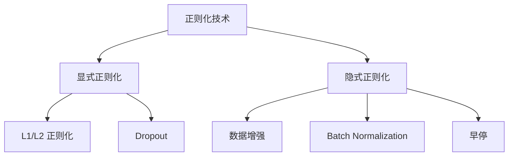

# 正则化与深度学习

正则化是防止模型过拟合的核心技术。本文从数学原理出发，系统介绍深度学习中的各种正则化方法。

---

## 一、过拟合与正则化

### 1.1 偏差-方差权衡

模型的泛化误差可以分解为：

$$
\mathbb{E}[(y - \hat{f}(x))^2] = \underbrace{\text{Bias}^2}_{\text{偏差}} + \underbrace{\text{Variance}}_{\text{方差}} + \underbrace{\sigma^2}_{\text{噪声}}
$$

- **高偏差**：欠拟合，模型过于简单
- **高方差**：过拟合，模型过于复杂

正则化通过限制模型复杂度来减少方差。

### 1.2 正则化的统一视角

从优化角度，正则化将原问题：

$$
\min_\theta \mathcal{L}(\theta)
$$

转化为：

$$
\min_\theta \mathcal{L}(\theta) + \lambda R(\theta)
$$

其中 $R(\theta)$ 是正则化项，$\lambda$ 是正则化强度。

---

## 二、L1 和 L2 正则化

### 2.1 L2 正则化（Ridge / Weight Decay）

$$
R(\theta) = \|\theta\|_2^2 = \sum_i \theta_i^2
$$

**梯度更新**：

$$
\theta \leftarrow \theta - \eta \left( \nabla_\theta \mathcal{L} + 2\lambda \theta \right) = (1 - 2\eta\lambda)\theta - \eta \nabla_\theta \mathcal{L}
$$

:::note[几何解释]
L2 正则化使权重向原点收缩，但不会变为精确的零。等价于对权重施加高斯先验 $\theta \sim \mathcal{N}(0, 1/2\lambda)$。
:::

### 2.2 L1 正则化（Lasso）

$$
R(\theta) = \|\theta\|_1 = \sum_i |\theta_i|
$$

**关键性质**：产生稀疏解，部分权重精确为零。

| 特性 | L1 | L2 |
|:-----|:---|:---|
| 稀疏性 | ✓ 产生稀疏解 | ✗ 权重趋近但不等于零 |
| 可微性 | 在零点不可微 | 处处可微 |
| 鲁棒性 | 对异常值更鲁棒 | 对大权重惩罚更大 |
| 贝叶斯解释 | Laplace 先验 | Gaussian 先验 |

### 2.3 弹性网络（Elastic Net）

结合 L1 和 L2：

$$
R(\theta) = \alpha \|\theta\|_1 + (1-\alpha) \|\theta\|_2^2
$$

---

## 三、Dropout

### 3.1 原理

训练时，以概率 $p$ 随机将神经元输出置零：

$$
\tilde{h}_i = \begin{cases}
0 & \text{with probability } p \\
h_i / (1-p) & \text{with probability } 1-p
\end{cases}
$$

除以 $(1-p)$ 保证期望不变。

### 3.2 数学理解

:::important[贝叶斯近似]
Dropout 可以理解为对模型参数的近似贝叶斯推断。每次前向传播相当于从参数后验分布中采样。
:::

**集成学习视角**：训练 $2^n$ 个共享权重的子网络，测试时取平均。

### 3.3 实现

```python
import torch
import torch.nn as nn

class DropoutLayer(nn.Module):
    def __init__(self, p=0.5):
        super().__init__()
        self.p = p
    
    def forward(self, x):
        if self.training:
            mask = torch.bernoulli(torch.ones_like(x) * (1 - self.p))
            return x * mask / (1 - self.p)
        return x
```

---

## 四、Batch Normalization

### 4.1 前向传播

对每个 mini-batch，计算均值和方差并归一化：

$$
\hat{x}_i = \frac{x_i - \mu_B}{\sqrt{\sigma_B^2 + \epsilon}}
$$

然后进行缩放和平移：

$$
y_i = \gamma \hat{x}_i + \beta
$$

其中 $\gamma, \beta$ 是可学习参数。

### 4.2 为什么有效？

1. **减少内部协变量偏移**：稳定每层的输入分布
2. **允许更大学习率**：梯度更稳定
3. **正则化效果**：mini-batch 统计量引入噪声

### 4.3 变体

| 方法 | 归一化维度 | 适用场景 |
|:-----|:-----------|:---------|
| Batch Norm | 沿 batch 维度 | CNN |
| Layer Norm | 沿特征维度 | RNN, Transformer |
| Instance Norm | 每个样本独立 | 风格迁移 |
| Group Norm | 分组归一化 | 小 batch size |

---

## 五、数据增强

### 5.1 图像增强

```python
from torchvision import transforms

transform = transforms.Compose([
    transforms.RandomHorizontalFlip(p=0.5),
    transforms.RandomRotation(15),
    transforms.ColorJitter(brightness=0.2, contrast=0.2),
    transforms.RandomCrop(224, padding=4),
])
```

### 5.2 Mixup

混合两个样本及其标签：

$$
\tilde{x} = \lambda x_i + (1-\lambda) x_j, \quad \tilde{y} = \lambda y_i + (1-\lambda) y_j
$$

其中 $\lambda \sim \text{Beta}(\alpha, \alpha)$。

### 5.3 CutMix

将一个样本的矩形区域替换为另一个样本：

$$
\tilde{x} = M \odot x_i + (1-M) \odot x_j
$$

其中 $M$ 是二值掩码。

---

## 六、早停（Early Stopping）

### 6.1 原理

监控验证集损失，当连续 $k$ 个 epoch 不再下降时停止训练。

```python
class EarlyStopping:
    def __init__(self, patience=10, min_delta=0):
        self.patience = patience
        self.min_delta = min_delta
        self.counter = 0
        self.best_loss = float('inf')
    
    def __call__(self, val_loss):
        if val_loss < self.best_loss - self.min_delta:
            self.best_loss = val_loss
            self.counter = 0
            return False
        self.counter += 1
        return self.counter >= self.patience
```

### 6.2 理论分析

早停的效果类似于 L2 正则化：限制参数从初始值移动的距离。

---

## 七、正则化策略总结



---

## 总结

正则化是深度学习成功的关键因素之一：

| 技术 | 优势 | 注意事项 |
|:-----|:-----|:---------|
| L2 正则化 | 简单有效 | 不产生稀疏解 |
| Dropout | 强大的正则化 | 增加训练时间 |
| Batch Norm | 加速训练 | 依赖 batch size |
| 数据增强 | 无需修改模型 | 需要领域知识 |
| 早停 | 自动调节 | 需要验证集 |

:::note[实践建议]

1. 从 Batch Norm + 适度 Dropout 开始
2. 配合数据增强（尤其是图像任务）
3. 使用 AdamW（解耦的 L2 正则化）
4. 监控训练/验证曲线，必要时调整正则化强度

:::
