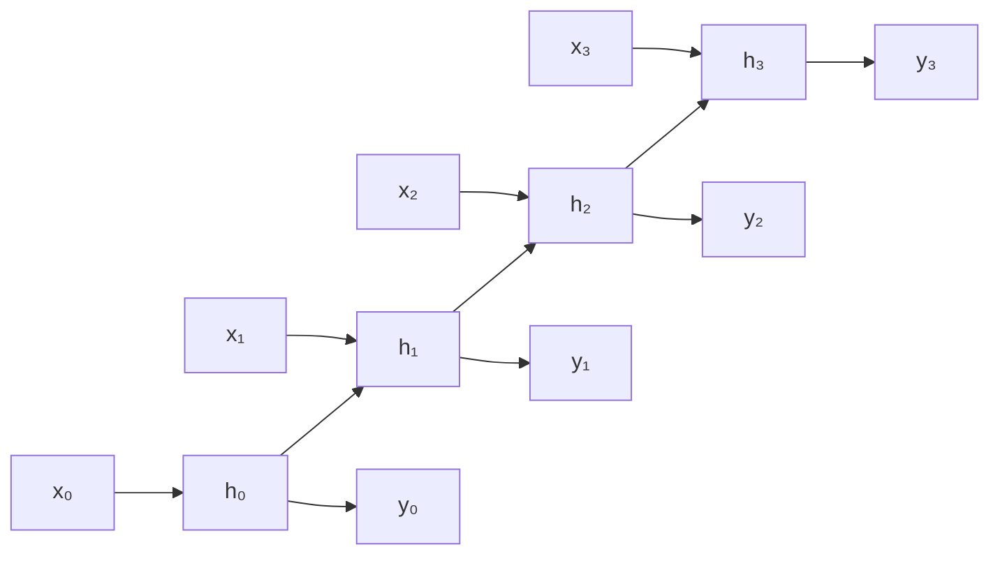
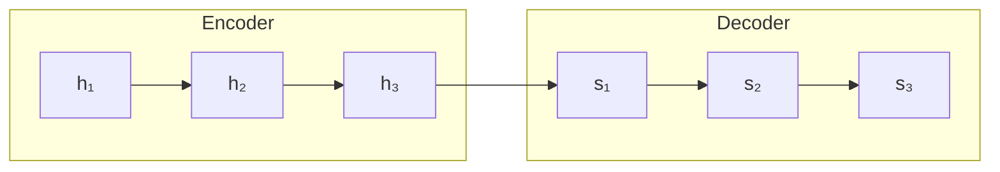

# 循环神经网络 (RNN) 深度解析

循环神经网络 (Recurrent Neural Network, RNN) 是处理序列数据的核心架构。本文深入探讨 RNN 的原理、变体和实际应用。

---

## 一、序列建模的挑战

### 1.1 序列数据的特点

- **可变长度**：句子、时间序列长度不固定
- **时序依赖**：当前输出依赖历史信息
- **上下文关联**：词义依赖于上下文

### 1.2 为什么不用全连接网络？

| 问题 | 说明 |
|:-----|:-----|
| 固定输入长度 | 无法处理可变长序列 |
| 无参数共享 | 不同位置使用不同参数 |
| 无记忆机制 | 无法捕获时序依赖 |

---

## 二、RNN 基本结构

### 2.1 核心公式

:::important[RNN 递归公式]
$$
h_t = \tanh(W_{hh} h_{t-1} + W_{xh} x_t + b_h)
$$
$$
y_t = W_{hy} h_t + b_y
$$

其中：

- $x_t$: 时刻 $t$ 的输入
- $h_t$: 时刻 $t$ 的隐藏状态（记忆）
- $y_t$: 时刻 $t$ 的输出

:::

### 2.2 计算图展开



### 2.3 PyTorch 实现

```python
import torch
import torch.nn as nn

class SimpleRNN(nn.Module):
    def __init__(self, input_size, hidden_size, output_size):
        super().__init__()
        self.hidden_size = hidden_size
        # 输入到隐藏
        self.i2h = nn.Linear(input_size + hidden_size, hidden_size)
        # 隐藏到输出
        self.h2o = nn.Linear(hidden_size, output_size)
    
    def forward(self, x, hidden):
        combined = torch.cat([x, hidden], dim=1)
        hidden = torch.tanh(self.i2h(combined))
        output = self.h2o(hidden)
        return output, hidden
    
    def init_hidden(self, batch_size):
        return torch.zeros(batch_size, self.hidden_size)
```

---

## 三、梯度问题

### 3.1 BPTT (时间反向传播)

梯度沿时间展开的链式法则：

$$
\frac{\partial L}{\partial W} = \sum_{t=1}^{T} \frac{\partial L_t}{\partial W}
$$

$$
\frac{\partial L_t}{\partial h_k} = \frac{\partial L_t}{\partial h_t} \prod_{i=k+1}^{t} \frac{\partial h_i}{\partial h_{i-1}}
$$

### 3.2 梯度消失

当 $\|W_{hh}\| < 1$ 时：

$$
\prod_{i=k}^{t} \frac{\partial h_i}{\partial h_{i-1}} \approx \prod_{i=k}^{t} W_{hh} \to 0
$$

**后果**：无法学习长距离依赖。

### 3.3 梯度爆炸

当 $\|W_{hh}\| > 1$ 时，梯度指数增长。

**解决方案**：梯度裁剪

```python
torch.nn.utils.clip_grad_norm_(model.parameters(), max_norm=5.0)
```

---

## 四、LSTM (长短期记忆)

### 4.1 核心思想

引入**门控机制**和**细胞状态**，解决长距离依赖问题。

### 4.2 三个门

:::important[LSTM 门控机制]
**遗忘门** (Forget Gate)：决定丢弃哪些历史信息
$$
f_t = \sigma(W_f \cdot [h_{t-1}, x_t] + b_f)
$$

**输入门** (Input Gate)：决定添加哪些新信息
$$
i_t = \sigma(W_i \cdot [h_{t-1}, x_t] + b_i)
$$
$$
\tilde{C}_t = \tanh(W_C \cdot [h_{t-1}, x_t] + b_C)
$$

**输出门** (Output Gate)：决定输出什么
$$
o_t = \sigma(W_o \cdot [h_{t-1}, x_t] + b_o)
$$
:::

### 4.3 状态更新

$$
C_t = f_t \odot C_{t-1} + i_t \odot \tilde{C}_t
$$
$$
h_t = o_t \odot \tanh(C_t)
$$

### 4.4 PyTorch LSTM

```python
# 单层 LSTM
lstm = nn.LSTM(
    input_size=128,      # 输入维度
    hidden_size=256,     # 隐藏层维度
    num_layers=2,        # 层数
    batch_first=True,    # 输入格式 (batch, seq, feature)
    dropout=0.2,         # Dropout
    bidirectional=True   # 双向 LSTM
)

# 前向传播
# x: (batch, seq_len, input_size)
# h0, c0: (num_layers * num_directions, batch, hidden_size)
output, (hn, cn) = lstm(x, (h0, c0))
```

---

## 五、GRU (门控循环单元)

### 5.1 简化的门控

GRU 合并了遗忘门和输入门，参数更少：

$$
z_t = \sigma(W_z \cdot [h_{t-1}, x_t])  \quad \text{(更新门)}
$$
$$
r_t = \sigma(W_r \cdot [h_{t-1}, x_t])  \quad \text{(重置门)}
$$
$$
\tilde{h}_t = \tanh(W \cdot [r_t \odot h_{t-1}, x_t])
$$
$$
h_t = (1 - z_t) \odot h_{t-1} + z_t \odot \tilde{h}_t
$$

### 5.2 LSTM vs GRU

| 特性 | LSTM | GRU |
|:-----|:-----|:-----|
| 门数量 | 3 (遗忘、输入、输出) | 2 (更新、重置) |
| 参数量 | 较多 | 较少 (~75%) |
| 性能 | 复杂任务更好 | 简单任务足够 |
| 训练速度 | 较慢 | 较快 |

```python
gru = nn.GRU(input_size=128, hidden_size=256, num_layers=2, batch_first=True)
```

---

## 六、变体架构

### 6.1 双向 RNN

同时从前向后和从后向前处理：

```
→ h₁ → h₂ → h₃ →
← h₁ ← h₂ ← h₃ ←
```

```python
bilstm = nn.LSTM(128, 256, bidirectional=True, batch_first=True)
# 输出维度: hidden_size * 2
```

### 6.2 多层 RNN

堆叠多层以增加模型容量：

```python
deep_lstm = nn.LSTM(128, 256, num_layers=4, dropout=0.3, batch_first=True)
```

### 6.3 Encoder-Decoder

用于序列到序列任务（翻译、摘要）：



---

## 七、实际应用示例

### 7.1 文本分类

```python
class TextClassifier(nn.Module):
    def __init__(self, vocab_size, embed_dim, hidden_dim, num_classes):
        super().__init__()
        self.embedding = nn.Embedding(vocab_size, embed_dim)
        self.lstm = nn.LSTM(embed_dim, hidden_dim, batch_first=True, bidirectional=True)
        self.fc = nn.Linear(hidden_dim * 2, num_classes)
        self.dropout = nn.Dropout(0.5)
    
    def forward(self, x):
        # x: (batch, seq_len)
        embedded = self.embedding(x)  # (batch, seq_len, embed_dim)
        output, (hn, cn) = self.lstm(embedded)
        # 取最后时刻的隐藏状态
        hidden = torch.cat([hn[-2], hn[-1]], dim=1)  # 双向拼接
        hidden = self.dropout(hidden)
        return self.fc(hidden)
```

### 7.2 序列生成

```python
class CharRNN(nn.Module):
    def __init__(self, vocab_size, hidden_size):
        super().__init__()
        self.hidden_size = hidden_size
        self.embed = nn.Embedding(vocab_size, hidden_size)
        self.lstm = nn.LSTM(hidden_size, hidden_size, batch_first=True)
        self.fc = nn.Linear(hidden_size, vocab_size)
    
    def forward(self, x, hidden=None):
        x = self.embed(x)
        output, hidden = self.lstm(x, hidden)
        output = self.fc(output)
        return output, hidden
    
    def generate(self, start_char, length, temperature=1.0):
        """生成文本"""
        hidden = None
        char = start_char
        result = [char]
        
        for _ in range(length):
            x = torch.tensor([[char]])
            output, hidden = self.forward(x, hidden)
            probs = F.softmax(output[0, -1] / temperature, dim=0)
            char = torch.multinomial(probs, 1).item()
            result.append(char)
        
        return result
```

---

## 八、训练技巧

### 8.1 梯度裁剪

```python
for epoch in range(num_epochs):
    for batch in dataloader:
        optimizer.zero_grad()
        loss = criterion(model(batch), targets)
        loss.backward()
        
        # 💡 梯度裁剪防止爆炸
        torch.nn.utils.clip_grad_norm_(model.parameters(), max_norm=5.0)
        
        optimizer.step()
```

### 8.2 学习率调度

```python
scheduler = torch.optim.lr_scheduler.ReduceLROnPlateau(
    optimizer, mode='min', factor=0.5, patience=3
)
```

### 8.3 Teacher Forcing

训练时使用真实标签而非模型预测：

```python
use_teacher_forcing = random.random() < 0.5

if use_teacher_forcing:
    # 使用真实目标作为下一步输入
    for t in range(target_len):
        output, hidden = decoder(target[t], hidden)
else:
    # 使用模型输出作为下一步输入
    for t in range(target_len):
        output, hidden = decoder(input, hidden)
        input = output.argmax(1)
```

---

## 总结

| 模型 | 优势 | 适用场景 |
|:-----|:-----|:---------|
| **Vanilla RNN** | 简单 | 短序列 |
| **LSTM** | 长距离依赖 | 机器翻译、语言模型 |
| **GRU** | 参数少、快速 | 一般序列任务 |
| **Bi-RNN** | 双向上下文 | 文本分类、NER |

:::note[推荐阅读]

- Hochreiter & Schmidhuber. *LSTM* (1997)
- Cho et al. *GRU* (2014)
- [Understanding LSTM Networks](https://colah.github.io/posts/2015-08-Understanding-LSTMs/)

:::

:::tip[现代趋势]
Transformer 和注意力机制已在许多任务上超越 RNN，但 RNN 在某些场景（如实时流处理）仍有优势。
:::
