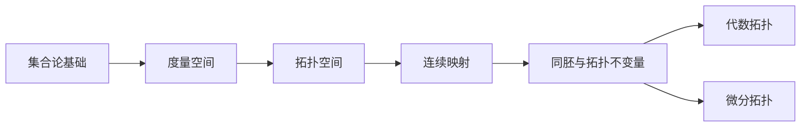

# 数学拓扑学入门介绍

拓扑学是现代数学的核心分支之一，研究在连续变形下保持不变的几何性质。本文将从基础概念出发，带你走进拓扑学的世界。

---

## 一、什么是拓扑学？

拓扑学常被称为"橡皮几何学"——在拓扑学中，咖啡杯和甜甜圈是"相同的"，因为它们都只有一个孔，可以通过连续变形互相转换。

:::note[拓扑等价]
两个图形如果可以通过拉伸、弯曲（但不能撕裂或粘合）相互转换，则称它们**拓扑等价**或**同胚**。
:::

---

## 二、拓扑空间的定义

### 2.1 开集公理

设 $X$ 是一个集合，$\tau$ 是 $X$ 的子集族。如果 $\tau$ 满足以下条件，则称 $(X, \tau)$ 为**拓扑空间**：

1. **空集和全集属于 $\tau$**：$\emptyset \in \tau$，$X \in \tau$
2. **任意并封闭**：若 $\{U_\alpha\}_{\alpha \in I} \subseteq \tau$，则 $\bigcup_{\alpha \in I} U_\alpha \in \tau$
3. **有限交封闭**：若 $U_1, U_2, \ldots, U_n \in \tau$，则 $\bigcap_{i=1}^n U_i \in \tau$

$\tau$ 中的元素称为**开集**。

### 2.2 常见拓扑

| 拓扑类型 | 定义 | 特点 |
|:---------|:-----|:-----|
| **离散拓扑** | $\tau = \mathcal{P}(X)$，所有子集都是开集 | 最精细 |
| **平凡拓扑** | $\tau = \{\emptyset, X\}$ | 最粗糙 |
| **标准拓扑** | $\mathbb{R}$ 上由开区间生成 | 最常用 |
| **余有限拓扑** | 开集的补集是有限集 | 用于代数几何 |

---

## 三、连续映射

### 3.1 拓扑学中的连续性

设 $(X, \tau_X)$ 和 $(Y, \tau_Y)$ 是两个拓扑空间，映射 $f: X \to Y$ 是**连续的**，当且仅当：

$$
\forall V \in \tau_Y, \quad f^{-1}(V) \in \tau_X
$$

即**开集的原像仍是开集**。

:::important[与分析中连续性的关系]
这个定义与 $\varepsilon$-$\delta$ 定义等价，但更加抽象和普适。
:::

### 3.2 同胚映射

如果 $f: X \to Y$ 满足：

- $f$ 是双射
- $f$ 连续
- $f^{-1}$ 连续

则称 $f$ 是**同胚映射**，$X$ 和 $Y$ 是**同胚的**，记作 $X \cong Y$。

---

## 四、拓扑不变量

### 4.1 连通性

**连通空间**：不能表示为两个非空不相交开集的并。

$$
X \text{ 连通} \iff \nexists U, V \in \tau: U \cap V = \emptyset, U \cup V = X, U \neq \emptyset, V \neq \emptyset
$$

**道路连通**：任意两点之间存在连续路径。

:::tip[关系]
道路连通 $\Rightarrow$ 连通，但反之不成立。
:::

### 4.2 紧致性

**紧致空间**：任何开覆盖都有有限子覆盖。

$$
\text{若 } X = \bigcup_{\alpha \in I} U_\alpha, \text{ 则存在有限子集 } J \subseteq I, \text{ 使得 } X = \bigcup_{\alpha \in J} U_\alpha
$$

在 $\mathbb{R}^n$ 中：**紧致 $\Leftrightarrow$ 有界闭集**（Heine-Borel 定理）

### 4.3 基本群

基本群 $\pi_1(X, x_0)$ 描述空间中"圈"的本质结构：

| 空间 | 基本群 | 含义 |
|:-----|:-------|:-----|
| $\mathbb{R}^n$ | $\{e\}$ | 单连通，任何圈可收缩 |
| $S^1$（圆） | $\mathbb{Z}$ | 圈绑定整数"圈数" |
| $T^2$（环面） | $\mathbb{Z} \times \mathbb{Z}$ | 两个独立方向的圈 |

---

## 五、重要定理

### 5.1 Brouwer 不动点定理

:::important[Brouwer 不动点定理]
设 $D^n$ 是 $n$ 维闭球，$f: D^n \to D^n$ 是连续映射，则 $f$ 必有不动点：

$$
\exists x \in D^n, \quad f(x) = x
$$
:::

**应用**：证明非线性方程存在解。

### 5.2 Borsuk-Ulam 定理

对于任何连续映射 $f: S^n \to \mathbb{R}^n$，存在对径点 $x$ 使得：

$$
f(x) = f(-x)
$$

**趣味解读**：地球上存在两个对径点，在同一时刻温度和气压都相同。

---

## 六、学习路径建议

---

## 总结

拓扑学提供了一种研究空间本质结构的强大工具。从开集公理出发，通过连续映射保持的性质（连通性、紧致性、基本群等），我们可以深入理解几何对象的内在特征。

:::note[推荐教材]

- James R. Munkerta. *Topology* (经典教材)
- Allen Hatcher. *Algebraic Topology* (代数拓扑入门)
- 尤承业. *基础拓扑学讲义* (中文经典)

:::
