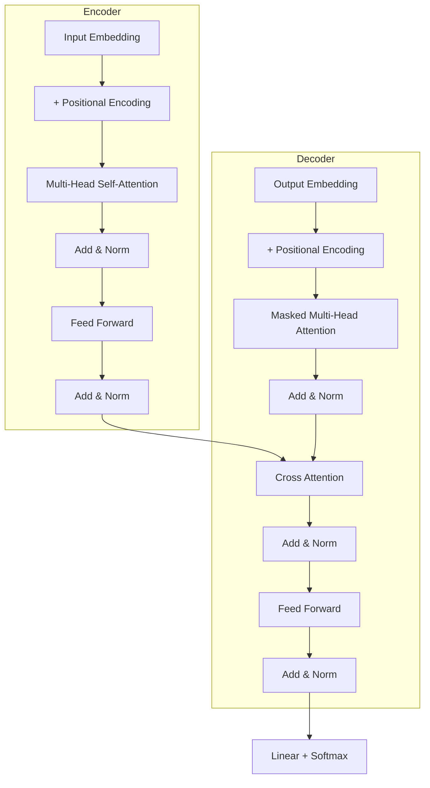

# Transformer 与注意力机制详解

Transformer 是现代深度学习最重要的架构之一，彻底改变了 NLP 和计算机视觉领域。本文从注意力机制出发，深入解析 Transformer 的完整设计。

---

## 一、注意力机制的起源

### 1.1 为什么需要注意力？

传统 Encoder-Decoder 的问题：

$$
\text{Context Vector } \mathbf{c} = h_T
$$

所有信息压缩到单一向量，成为**信息瓶颈**。

### 1.2 注意力的直觉

> "注意力就是加权平均，权重由相关性决定"

人类阅读时会关注句子的不同部分——注意力机制模拟这种行为。

---

## 二、注意力机制

### 2.1 一般形式

给定查询 (Query) $\mathbf{q}$ 和一组键值对 (Key-Value) $\{(\mathbf{k}_i, \mathbf{v}_i)\}$：

$$
\text{Attention}(\mathbf{q}, K, V) = \sum_i \alpha_i \mathbf{v}_i
$$

其中注意力权重：

$$
\alpha_i = \text{softmax}(f(\mathbf{q}, \mathbf{k}_i))
$$

### 2.2 常见注意力函数

| 类型 | 公式 | 特点 |
|:-----|:-----|:-----|
| **加性注意力** | $\mathbf{v}^T \tanh(W_q\mathbf{q} + W_k\mathbf{k})$ | 灵活，参数多 |
| **点积注意力** | $\mathbf{q}^T \mathbf{k}$ | 高效，无参数 |
| **缩放点积** | $\frac{\mathbf{q}^T \mathbf{k}}{\sqrt{d_k}}$ | 防止梯度消失 |

---

## 三、自注意力 (Self-Attention)

### 3.1 核心公式

:::important[Scaled Dot-Product Attention]
$$
\text{Attention}(Q, K, V) = \text{softmax}\left(\frac{QK^T}{\sqrt{d_k}}\right)V
$$

- $Q \in \mathbb{R}^{n \times d_k}$: 查询矩阵
- $K \in \mathbb{R}^{n \times d_k}$: 键矩阵
- $V \in \mathbb{R}^{n \times d_v}$: 值矩阵

:::

### 3.2 为什么除以 $\sqrt{d_k}$？

当 $d_k$ 较大时，$QK^T$ 的方差较大，softmax 会趋于 one-hot：

$$
\text{Var}(q \cdot k) = d_k \quad \text{(假设 } q_i, k_i \sim \mathcal{N}(0,1)\text{)}
$$

缩放后方差稳定为 1。

### 3.3 PyTorch 实现

```python
import torch
import torch.nn as nn
import torch.nn.functional as F
import math

class ScaledDotProductAttention(nn.Module):
    def __init__(self, d_k):
        super().__init__()
        self.scale = math.sqrt(d_k)
    
    def forward(self, Q, K, V, mask=None):
        # Q, K, V: (batch, seq_len, d_k/d_v)
        scores = torch.matmul(Q, K.transpose(-2, -1)) / self.scale
        
        if mask is not None:
            scores = scores.masked_fill(mask == 0, -1e9)
        
        attn = F.softmax(scores, dim=-1)
        output = torch.matmul(attn, V)
        return output, attn
```

---

## 四、多头注意力 (Multi-Head Attention)

### 4.1 动机

单一注意力只能学习一种关联模式。多头注意力让模型关注不同位置的不同表示子空间。

### 4.2 公式

$$
\text{MultiHead}(Q, K, V) = \text{Concat}(\text{head}_1, \ldots, \text{head}_h)W^O
$$

$$
\text{head}_i = \text{Attention}(QW_i^Q, KW_i^K, VW_i^V)
$$

### 4.3 实现

```python
class MultiHeadAttention(nn.Module):
    def __init__(self, d_model, n_heads):
        super().__init__()
        assert d_model % n_heads == 0
        
        self.d_model = d_model
        self.n_heads = n_heads
        self.d_k = d_model // n_heads
        
        self.W_q = nn.Linear(d_model, d_model)
        self.W_k = nn.Linear(d_model, d_model)
        self.W_v = nn.Linear(d_model, d_model)
        self.W_o = nn.Linear(d_model, d_model)
    
    def forward(self, Q, K, V, mask=None):
        batch_size = Q.size(0)
        
        # 线性变换并分头
        Q = self.W_q(Q).view(batch_size, -1, self.n_heads, self.d_k).transpose(1, 2)
        K = self.W_k(K).view(batch_size, -1, self.n_heads, self.d_k).transpose(1, 2)
        V = self.W_v(V).view(batch_size, -1, self.n_heads, self.d_k).transpose(1, 2)
        
        # 注意力计算
        scores = torch.matmul(Q, K.transpose(-2, -1)) / math.sqrt(self.d_k)
        if mask is not None:
            scores = scores.masked_fill(mask == 0, -1e9)
        attn = F.softmax(scores, dim=-1)
        output = torch.matmul(attn, V)
        
        # 合并多头
        output = output.transpose(1, 2).contiguous().view(batch_size, -1, self.d_model)
        return self.W_o(output)
```

---

## 五、Transformer 架构

### 5.1 整体结构



### 5.2 位置编码 (Positional Encoding)

Transformer 没有循环结构，需要显式注入位置信息：

$$
PE_{(pos, 2i)} = \sin\left(\frac{pos}{10000^{2i/d_{model}}}\right)
$$
$$
PE_{(pos, 2i+1)} = \cos\left(\frac{pos}{10000^{2i/d_{model}}}\right)
$$

```python
class PositionalEncoding(nn.Module):
    def __init__(self, d_model, max_len=5000):
        super().__init__()
        pe = torch.zeros(max_len, d_model)
        position = torch.arange(0, max_len).unsqueeze(1).float()
        div_term = torch.exp(torch.arange(0, d_model, 2).float() * 
                            -(math.log(10000.0) / d_model))
        pe[:, 0::2] = torch.sin(position * div_term)
        pe[:, 1::2] = torch.cos(position * div_term)
        self.register_buffer('pe', pe.unsqueeze(0))
    
    def forward(self, x):
        return x + self.pe[:, :x.size(1)]
```

### 5.3 前馈网络 (FFN)

$$
\text{FFN}(x) = \text{ReLU}(xW_1 + b_1)W_2 + b_2
$$

通常 $d_{ff} = 4 \times d_{model}$。

```python
class FeedForward(nn.Module):
    def __init__(self, d_model, d_ff=2048, dropout=0.1):
        super().__init__()
        self.linear1 = nn.Linear(d_model, d_ff)
        self.linear2 = nn.Linear(d_ff, d_model)
        self.dropout = nn.Dropout(dropout)
    
    def forward(self, x):
        return self.linear2(self.dropout(F.gelu(self.linear1(x))))
```

### 5.4 残差连接与层归一化

```python
class TransformerBlock(nn.Module):
    def __init__(self, d_model, n_heads, d_ff, dropout=0.1):
        super().__init__()
        self.attention = MultiHeadAttention(d_model, n_heads)
        self.ffn = FeedForward(d_model, d_ff, dropout)
        self.norm1 = nn.LayerNorm(d_model)
        self.norm2 = nn.LayerNorm(d_model)
        self.dropout = nn.Dropout(dropout)
    
    def forward(self, x, mask=None):
        # Self-Attention with residual
        attn_out = self.attention(x, x, x, mask)
        x = self.norm1(x + self.dropout(attn_out))
        
        # FFN with residual
        ffn_out = self.ffn(x)
        x = self.norm2(x + self.dropout(ffn_out))
        
        return x
```

---

## 六、预训练模型

### 6.1 BERT (双向)

- **预训练任务**：Masked LM + Next Sentence Prediction
- **特点**：双向上下文，适合理解任务

### 6.2 GPT (单向)

- **预训练任务**：自回归语言模型
- **特点**：从左到右生成，适合生成任务

### 6.3 对比

| 特性 | BERT | GPT |
|:-----|:-----|:----|
| 方向 | 双向 | 单向 (左到右) |
| 预训练 | MLM | CLM |
| 适用任务 | 理解 (分类、QA) | 生成 (对话、续写) |
| 注意力 | 完全可见 | Causal Mask |

---

## 七、Vision Transformer (ViT)

将图像切分为 patches，作为"视觉词元"：

```python
class PatchEmbed(nn.Module):
    def __init__(self, img_size=224, patch_size=16, in_chans=3, embed_dim=768):
        super().__init__()
        self.num_patches = (img_size // patch_size) ** 2
        self.proj = nn.Conv2d(in_chans, embed_dim, patch_size, stride=patch_size)
    
    def forward(self, x):
        # (B, C, H, W) -> (B, num_patches, embed_dim)
        x = self.proj(x)  # (B, embed_dim, H/P, W/P)
        x = x.flatten(2).transpose(1, 2)
        return x
```

---

## 八、高效 Transformer

### 8.1 复杂度问题

标准自注意力：$O(n^2 \cdot d)$

对于长序列（n > 1000），计算量过大。

### 8.2 优化方案

| 方法 | 复杂度 | 思想 |
|:-----|:-------|:-----|
| Sparse Attention | $O(n\sqrt{n})$ | 稀疏注意力模式 |
| Linear Attention | $O(n)$ | 核近似 |
| Flash Attention | $O(n^2)$ but faster | 内存优化 |
| Sliding Window | $O(nw)$ | 局部注意力 |

---

## 总结

Transformer 的核心创新：

1. **自注意力**：并行处理序列，捕获全局依赖
2. **多头机制**：学习多种关联模式
3. **位置编码**：注入位置信息
4. **残差 + LayerNorm**：稳定深层训练

:::note[推荐阅读]

- Vaswani et al. *Attention Is All You Need* (2017)
- Devlin et al. *BERT* (2019)
- Dosovitskiy et al. *ViT* (2020)
- [The Illustrated Transformer](https://jalammar.github.io/illustrated-transformer/)

:::
